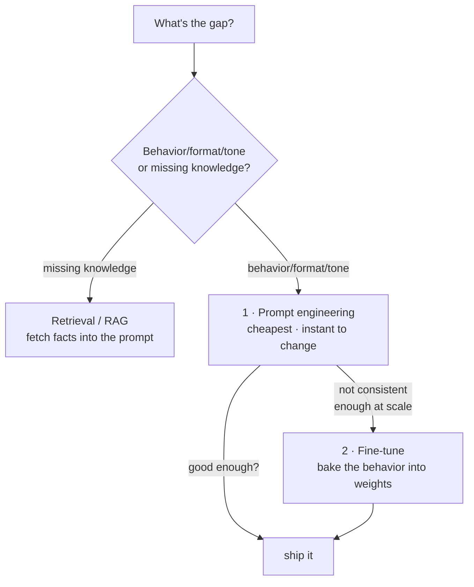

# Fine-tuning

## The problem it solves

You have a capable general-purpose model, and it's *almost* right for your product — but not quite. It answers correctly yet in the wrong voice; it ignores your required output format half the time; it handles your niche domain like a smart generalist rather than a specialist; you're propping it up with a 2,000-word system prompt that you paste into every single request and still don't fully trust. Prompting has taken you as far as it can, and the gap that's left isn't about *what the model knows* — it's about *how it behaves*.

Fine-tuning is the lever for that gap. It means taking a model that has already been [pretrained and post-trained](../foundations/pretraining-vs-posttraining.md) — already fluent, already an assistant — and **training it a little further on a smaller, targeted dataset** so it internalizes a specific behavior, style, or format instead of you having to ask for that behavior on every call. You are not building a model; you are adjusting an existing one at the margin. This is the umbrella concept for a whole family of techniques (this is category 02's opening lesson), and the family shares one defining property that a PM has to get right: fine-tuning reliably reshapes *behavior*, and unreliably injects *facts*. Miss that and you'll spend a budget teaching a model to "know" things it was never going to durably learn this way.

> [!NOTE]
> **Model, weights, training, dataset, GPU** — this lesson leans on all of them. If any are fuzzy, the one-line versions live in the [ML vocabulary primer](../primers/ml-vocabulary.md). The short version: a *model* is a huge pile of numbers (*weights*); *training* nudges those weights by showing the model examples from a *dataset*; it all runs on *GPUs (Graphics Processing Units)*. Fine-tuning is just more training — a short, cheap, targeted burst of it — applied to a model that's already been trained.

## The one analogy to remember

**The picture:** A veteran journalist — decades of experience, knows the world, writes beautifully — joins a new magazine and goes through a week of onboarding. They read a stack of the magazine's back issues until they've absorbed its house style: its voice, its structure, what it emphasizes, how it opens and closes a piece.

**The mapping:** the veteran journalist = the already-pretrained, already-capable model; the week of onboarding = fine-tuning; the stack of back issues = the small targeted dataset; the house style they pick up = the behavior/format/tone you're specializing; the magazine's confidential internal numbers = fresh facts you *wish* you could train in but can't reliably.

**Why it holds:** onboarding works by immersing an already-skilled writer in consistent examples of a *style*, which reshapes how they express things far more effectively than it loads new facts into their memory — and that's exactly what a small fine-tuning dataset does to a model's weights. It's a strong signal about *patterns of expression* and a weak, unreliable channel for *isolated facts*, which is precisely fine-tuning's real-world profile.

**Say it like this:** "Fine-tuning is onboarding an experienced hire to your house style — it changes how they work, not what they fundamentally know."

*Where it breaks:* a journalist can memorize a new fact after one reading; a model won't reliably retain a new fact from a fine-tuning pass — so don't push the "they learn during onboarding" image toward *facts*, only toward *style*.

## What fine-tuning actually does — and where it sits

Start from the two-stage picture in [Pretraining vs. post-training](../foundations/pretraining-vs-posttraining.md): pretraining bakes in knowledge, post-training shapes behavior. **Fine-tuning is post-training you run yourself, after the provider is done.** The provider already turned a base model into a helpful assistant; you take that assistant and give it one more, much smaller round of training on examples of exactly the behavior you want — 500 support tickets answered in your brand voice, 2,000 documents converted to your exact JSON schema, a few thousand examples of your legal team's summarization style.

Mechanically, each example nudges the model's weights toward reproducing the pattern in that example. Do this over a consistent dataset and the pattern gets absorbed into the weights, so you no longer have to spell it out in the prompt — the behavior comes "for free" at inference time.

This is the point to connect back to architecture. Recall from [Transformers](../foundations/transformers.md) that a model's learned facts live mostly in its dense feed-forward weights, while much of what fine-tuning most easily moves is the *style and format* of the output. A small fine-tuning dataset is a strong, repeated signal about *how* to respond and a weak, sparse signal about *new individual facts* — which is the mechanical reason behind the failure mode we'll keep returning to.

## The PM's real decision: prompt, retrieve, or fine-tune

This is the decision you'll actually be asked to defend, so hold it as a ladder you climb only as far as you must. Each rung costs more effort and more lock-in than the last.

- **Prompt first.** Prompting is free to change, instant to iterate, and needs no data or training run. Most behavior problems should be solved here. See [Prompt engineering](../prompting/prompt-engineering.md). Reach past it only when prompting can't get you *consistent enough* behavior, or when the prompt you'd need is so long it's expensive on every call.
- **Fine-tune when the behavior is stable, high-volume, and prompting isn't enough.** Fine-tuning shines when you want a fixed behavior applied millions of times: it can move a long, repeated instruction out of the per-request prompt and into the weights (cheaper and more reliable per call), enforce a rigid format, or nail a specialized style. The catch is it's slow to iterate — every change means assembling data and running another training job.
- **If the gap is missing knowledge, neither of the above is your first tool — retrieval is.** This is the crossover most teams get wrong, so it gets its own section below.

The sharp framing: **prompting and fine-tuning both address *behavior*; the difference is whether the behavior lives in the prompt (flexible, per-call cost) or in the weights (baked in, iterate slowly). Neither one is how you add knowledge.**

## Full fine-tuning vs. the parameter-efficient variants

There are two broad ways to run a fine-tune, and the distinction is mostly about cost.

- **Full fine-tuning** updates *all* of the model's weights. It's the most thorough and the most expensive: you need enough GPU memory to hold and update the entire model, you get a complete new copy of the model to store and serve, and the bill scales with the model's full size. For a large model this is out of reach for most teams.
- **Parameter-efficient fine-tuning** freezes the original weights and trains only a tiny set of new or added parameters — a fraction of a percent of the model — which is dramatically cheaper, faster, and produces a small artifact you can swap in. The umbrella term is **PEFT (Parameter-Efficient Fine-Tuning)**, and its most common method is **LoRA (Low-Rank Adaptation)**. These have their own lessons — [PEFT](peft.md) and [LoRA](lora.md) — so here just hold the shape: *same idea, far less compute, because you touch almost none of the weights.* In practice, when someone says "we fine-tuned it," they almost always mean a PEFT/LoRA fine-tune, not a full one.

Two members of this family are specialized enough to have earned their own lessons rather than being folded in here: [Instruction tuning](instruction-tuning.md) (fine-tuning specifically to make a model follow instructions) and [RLHF (Reinforcement Learning from Human Feedback)](rlhf.md) (shaping a model using human preferences rather than fixed target examples). Both are fine-tuning in the broad sense; how each works is its own topic.

## Catastrophic forgetting: the failure mode of over-specializing

Fine-tuning has a signature way of biting back, and it has a name: **catastrophic forgetting.** When you train a model hard on a narrow dataset, it can get better at your task while getting measurably *worse* at things it used to do well — because the same weights that encode general capability are being pulled toward your narrow distribution. Push a general assistant too far toward "only ever writes terse legal summaries" and it may start writing everything that way, lose range, and degrade on reasoning or formats that weren't in your data.

Back to the analogy: onboard the veteran journalist too aggressively into one rigid house style and they start writing *everything* in that voice, even when it's wrong for the piece — they've narrowed. The general skill didn't vanish, but it got crowded out.

This is a major reason the parameter-efficient variants are attractive beyond cost: because they leave the original weights frozen and train only a small add-on, they tend to disturb the base model's general abilities less. It's also why fine-tuning is not a free lunch you'd apply "just in case" — you're always trading some generality for specialization, and the more you specialize, the more you risk. The sayable version: **fine-tuning doesn't just add a skill; it can quietly subtract others.**

## Data quality and volume: the part that actually decides success

The most common reason a fine-tune disappoints isn't the algorithm — it's the data. A few principles a PM should carry:

- **Consistency beats volume.** Fine-tuning learns the *pattern* in your examples, so a few hundred clean, consistent, on-target examples routinely beat tens of thousands of noisy or contradictory ones. If your examples disagree about the right format or tone, you're teaching the model to be inconsistent.
- **The data *is* the spec.** Whatever behavior is latent in your examples is what the model absorbs — including mistakes, quirks, and biases you didn't intend. Garbage examples produce a garbage fine-tune, confidently. Curating and reviewing the dataset is the real work.
- **How much you need depends on how far the behavior is from the model's defaults.** Nudging format or tone can take surprisingly few examples; teaching a genuinely unusual behavior takes more. There's no universal number — treat "how much data?" as a question you answer with a small pilot, not a fixed rule.

## The failure mode that matters most: behavior, not fresh knowledge

Here is the framing to walk in with, because it's the one teams most reliably get wrong. **Fine-tuning is dependable for shaping behavior, style, tone, and format. It is *not* a reliable way to teach a model new facts.**

Why? Knowledge, from the [pretraining lesson](../foundations/pretraining-vs-posttraining.md), is overwhelmingly a pretraining phenomenon, and facts live in the dense feed-forward weights of the network. A small fine-tuning dataset is a strong signal about *patterns of expression* but a weak, sparse channel for *individual facts*. So if you fine-tune a model on your company's internal documents hoping it will "learn" them, what actually happens is it gets fluent at *sounding* like your docs — the vocabulary, the structure, the tone — while still confidently making up specifics in the gaps. It absorbs the style and hallucinates the facts.

The right tool for injecting fresh, private, or frequently-changing facts at answer-time is retrieval — fetch the relevant passages and put them in the prompt so the model reads them each time, rather than trying to write them into the weights. That's **RAG (Retrieval-Augmented Generation)**, covered in [RAG](../retrieval-knowledge/rag.md).

So the decision heuristic, said cleanly: **behavior gap → fine-tune; knowledge gap → retrieve.** It's a strong default, not an absolute law — fine-tuning *can* nudge some facts in, and the line between "teaching style" and "teaching facts" is genuinely blurry at the edges — but it will steer you right far more often than not, and it's the sentence that separates a PM who's shipped this from one who's read about it.

## Cost: what you're really paying for

Fine-tuning has three cost lines a PM should price out, not just the obvious one:

- **The training run** — one-time compute to do the fine-tune. Full fine-tuning of a large model is expensive; a PEFT/LoRA run is a fraction of that. This is the cost people think of first, and often the smallest.
- **Iteration and maintenance** — the recurring, easy-to-miss cost. A fine-tune is a frozen snapshot: when the base model improves, when your requirements change, or when your data drifts, you retrain. A prompt, by contrast, you edit in seconds. Fine-tuning trades per-call flexibility for a standing maintenance commitment.
- **Serving** — a full fine-tune produces a whole separate model to host; PEFT/LoRA adapters are small and can often be served more cheaply alongside a shared base model. For the broader pricing picture, see [Cost and unit economics](../production-ops/cost-unit-economics.md).

The offsetting benefit: a good fine-tune can *shrink* your per-request prompt (behavior lives in the weights, not in a giant system prompt you resend every call) and can let a smaller, cheaper model hit quality a larger model needed prompting to reach. So the honest cost story is a trade — upfront and maintenance cost, in exchange for cheaper, more consistent inference at scale.

## Summary / Points to Remember

- **Fine-tuning is further-training an already-capable model on a small, targeted dataset** to bake in a specific behavior, style, or format — it's post-training you run yourself, not model-building.
- The tightest framing of the failure mode: **fine-tuning reliably shapes *behavior*; it does not reliably inject *knowledge*.** Behavior gap → fine-tune; knowledge gap → retrieve ([RAG](../retrieval-knowledge/rag.md)). Fine-tune a model on your docs and it learns to *sound* like them while still inventing the specifics.
- **Climb the ladder: prompt first, fine-tune only when prompting can't get consistent-enough behavior at scale.** Prompting keeps behavior in the prompt (flexible, per-call cost); fine-tuning moves it into the weights (baked in, slow to change).
- **Full fine-tuning updates all weights (expensive); the parameter-efficient variants ([PEFT](peft.md), [LoRA](lora.md)) touch a tiny fraction (cheap)** — and in practice "we fine-tuned it" almost always means the cheap kind.
- **Catastrophic forgetting:** over-specializing on a narrow dataset can make the model *worse* at things it used to do — fine-tuning can subtract skills, not just add them.
- **Data quality beats volume:** a few hundred clean, consistent examples beat tens of thousands of noisy ones — the dataset *is* the spec, quirks and all.
- **Cost is three lines, not one:** the training run (often the smallest), ongoing iteration/maintenance (retrain when anything changes), and serving — traded against cheaper, more consistent inference and shorter prompts.

## Interview Questions That Stump People

**Q (clarify-back): "Our system prompt is enormous and we pay for it on every call. Should we fine-tune the behavior in to cut cost?"**

**Interviewer:** We've got a 2,000-word system prompt going out on every request and the token bill is adding up. Could we fine-tune that behavior into the model and drop the prompt?

**You (clarify back):** Possibly — but first, how stable are those instructions, and how much traffic are we talking? Do the requirements in that prompt change often, or have they settled?

**Interviewer:** They've been stable for months, and it's high volume — millions of calls.

**You:** Then fine-tuning is a strong candidate. When behavior is stable and traffic is high, baking it into the weights means you stop resending that huge instruction block on every call — cheaper and more consistent per request — and the one-time training cost amortizes fast across millions of calls. If you'd told me the instructions change every week, I'd have said keep it in the prompt: a fine-tune is a frozen snapshot, so you'd be retraining constantly, and the maintenance cost would swamp the token savings. The deciding variables are *stability* and *volume*, which is why I asked before answering.

> [!TIP]
> **Why this works:** "Fine-tune to cut prompt cost?" has opposite answers depending on how often the behavior changes and how much traffic amortizes the training run — answering immediately would expose you as someone reciting a rule. Clarifying stability and volume pins down the two variables that actually decide it and signals you've weighed the real trade: per-call prompt cost versus one-time-plus-maintenance training cost. Once "stable and high-volume" is on the table, fine-tuning follows directly — and naming the opposite case (frequently-changing → stay in the prompt) proves you understand *why*, not just *which*.

---

**Q: "We fine-tuned on our entire knowledge base and the model still makes up facts about our product. What went wrong?"**

**Interviewer:** We fine-tuned the model on thousands of our internal documents specifically so it would know our product. It sounds exactly like our docs now — but it still invents details. Why?

**You:** Because fine-tuning shapes behavior far more reliably than it installs knowledge, and "sounds exactly like our docs" is the tell that it worked *as a fine-tune* — it absorbed your style, structure, and vocabulary. What it didn't do is durably learn your individual facts, because facts live in the model's dense feed-forward weights that pretraining built, and a small fine-tuning dataset is a strong signal about *how to write* and a weak, sparse one about *specific facts*. So it fluently produces doc-shaped text and confidently fills the factual gaps with plausible inventions. The fix isn't more fine-tuning — it's retrieval: fetch the relevant passages and put them in the prompt at answer-time so the model reads the real facts each time, rather than trying to memorize them into the weights.

> [!TIP]
> **Why this answer works:** The naive response is "the fine-tune failed" or "we need more data." The strong move is to reframe the symptom as *evidence the fine-tune succeeded at what fine-tuning does* — style — and to explain the mechanism (facts live in feed-forward weights; a small dataset is a weak channel for them) rather than just asserting the heuristic. Pointing to retrieval as the actual fix shows you know the behavior/knowledge split determines the tool, which is exactly the misconception this question is built to expose.

---

**Q: "After fine-tuning, our model got better at our task but noticeably worse at general reasoning. Is that expected?"**

**Interviewer:** We fine-tuned pretty hard on our narrow use case. It nails that now, but it's gotten worse at the general stuff it used to handle fine. Bug, or expected?

**You:** Expected — that's catastrophic forgetting. The same weights that hold the model's general capability are being pulled toward your narrow data distribution, so specializing on one thing can crowd out others. It's the classic tradeoff of fine-tuning: you're not purely adding a skill, you're rebalancing the model toward your data, and generality can pay the price. Two levers: train less aggressively — fewer passes over the data, or a lighter touch — and prefer a parameter-efficient method like LoRA, which freezes the base weights and trains only a small add-on, so it tends to disturb the general abilities less. And I'd always evaluate the fine-tune on a *broad* test set, not just my task, precisely to catch this regression before it ships.

> [!TIP]
> **Why this answer works:** Many candidates treat degraded general performance as a mysterious bug. Naming catastrophic forgetting and explaining *why* it happens — shared weights pulled toward a narrow distribution — shows you understand fine-tuning as a rebalancing act with a cost, not a pure upgrade. Adding the mitigations (lighter training, PEFT, broad evals) turns a piece of trivia into a decision you'd actually make, which is what separates someone who's run a fine-tune from someone who's only heard of one.

---

**Q: "We've got 50 great examples. Is that enough to fine-tune, or do we need thousands?"**

**Interviewer:** We want to fine-tune for a specific output format. We have about 50 hand-crafted examples. Not enough, right?

**You:** It genuinely might be enough — it depends on how far the behavior is from the model's defaults. Fine-tuning learns the *pattern* in your examples, so a narrow, well-defined behavior like a fixed output format can sometimes be taught with surprisingly few, as long as those 50 are clean and perfectly consistent with each other. The instinct that "more is always better" is a trap here: 50 pristine, agreeing examples will beat 10,000 noisy or contradictory ones, because inconsistency in the data teaches the model to be inconsistent. What I'd actually do is treat the number as an empirical question — run a small pilot with the 50, evaluate, and only invest in gathering more if the pilot shows the behavior isn't landing. Quality and consistency are the levers I'd protect before volume.

> [!TIP]
> **Why this answer works:** The question invites a confident number ("you need thousands"), and giving one signals you're reciting folklore. The strong answer refuses the premise: volume is the wrong first question, consistency and distance-from-default are what decide it, and a pilot beats a rule of thumb. Saying "clean beats plentiful" and backing it with *why* (inconsistent data teaches inconsistency) shows you understand the dataset is the real spec — the single most common reason fine-tunes disappoint.

---

**Q: "Isn't fine-tuning just strictly better than prompting? It's trained in, so it should be more reliable."**

**Interviewer:** If fine-tuning bakes the behavior into the model, why wouldn't we always fine-tune instead of fussing with prompts?

**You:** Because "baked in" cuts both ways — it's more consistent *and* far harder to change. A prompt you edit in seconds; a fine-tune you retrain, which means assembling data and running a job every time your requirements shift or the base model improves. So fine-tuning trades flexibility for consistency, and it carries real costs prompting doesn't: a training run, ongoing maintenance, sometimes a whole separate model to serve, and the risk of catastrophic forgetting. It's the right call when behavior is stable and high-volume enough to amortize all that; it's the wrong call when you're still iterating on what the behavior should even be. And critically, neither one adds knowledge — if the real gap is missing facts, fine-tuning isn't "better than prompting," it's the wrong category of tool entirely, and you want retrieval. So it's a ladder, not a hierarchy: prompt until you can't, then fine-tune when it earns its cost.

> [!TIP]
> **Why this answer works:** The question smuggles in "trained in = strictly better," and the weak candidate agrees. The strong move is to show the tradeoff has a downside — lost iteration speed, maintenance, forgetting risk — so fine-tuning is *situationally* better, gated on stability and volume. Closing on "neither adds knowledge" reframes the whole comparison and demonstrates you don't confuse the behavior tools with the knowledge tool, which is the deeper competence the interviewer is probing.
