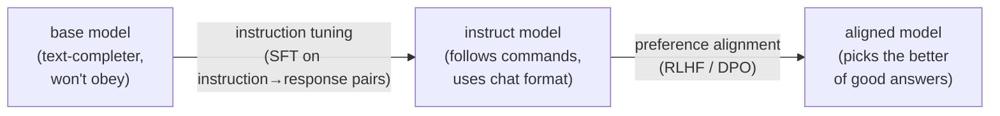

# Instruction tuning

## The problem it solves

A freshly pretrained model is a spectacular text-completer and nothing more. Ask a raw **base model** — the artifact that comes out of pretraining, covered in [Pretraining vs. post-training](../foundations/pretraining-vs-posttraining.md) — to "Summarize this article in three bullets," and it may cheerfully continue your sentence: "…and explain why the author is wrong. Summarize the counter-argument too." It isn't broken and it isn't dumb. It has simply learned, over trillions of words, that a line like that is the kind of thing that appears *inside* a document, so the statistically natural move is to write more document. It has no concept that you issued a *command* and are waiting for it to *comply*.

That is the gap instruction tuning closes. The base model already holds the knowledge and the language ability; what it lacks is the reflex to read an input as a task to perform and to answer *you* rather than autocomplete the page. Instruction tuning is the step that installs that reflex — the one that turns a text-completer into something you can actually instruct. It is why every provider ships a "base" and an "instruct" version of the same model, and why only the instruct one feels like an assistant.

## The one analogy to remember

**The picture:** A brilliant new hire on their first day who has read every manual in the building but keeps *finishing your sentences* instead of doing the job. So you sit them down with a thick binder of worked examples — hundreds of real "customer wrote this → here is the ideal reply we sent" pairs — and have them study it until the habit flips: now, when a request comes in, they *do the task* and answer in the house format.

**The mapping:** the new hire's existing knowledge = everything the base model learned in pretraining; the binder of (request → ideal reply) pairs = the instruction-tuning dataset; studying it until the habit changes = supervised fine-tuning on those pairs; the flipped reflex ("a request means *do the task and reply*") = instruction-following plus the user/assistant chat format.

**Why it holds:** the model learns instruction-following by *imitation* — it is shown many (instruction, good response) pairs and trained to reproduce the response given the instruction. "Study a binder of ideal worked examples until you copy the behavior" is exactly that mechanism, not a decoration on top of it.

**Say it like this:** "You take a genius who only ever finishes your sentences, hand them a binder of 'when asked this, the good answer is that,' and drill it until they answer instead of autocomplete."

*Where it breaks:* the binder only ever shows *one* ideal reply per request — it never tells the hire "this answer was better than that one." Teaching that finer judgment is a *later* step (preference alignment), not instruction tuning.

## What the training actually changes

Instruction tuning is a specific application of **supervised fine-tuning (SFT)** — the general practice of continuing to train a model on a curated set of labeled examples, covered in [Fine-tuning](fine-tuning.md). "Supervised" just means every training example comes with the target answer attached, so the model is nudged toward reproducing it. Here the examples all share one shape: an **instruction** paired with a **good response** to it.

```
Instruction:  "Summarize this email in one sentence: <email text>"
Response:     "The client wants the proposal by Friday and asked to move the call to Tuesday."
```

Thousands upon thousands of such pairs — summarize, translate, rewrite, classify, answer, extract, refuse — across a wide span of task types. The model is trained to produce the response when it sees the instruction, and the effect generalizes: it doesn't just memorize these tasks, it learns the *general habit* of treating an input as a directive to be carried out. Nothing new is added to what the model *knows*; what changes is what it *does* with a prompt. That is why this sits in the post-training family — it shapes behavior, not knowledge.

Two behaviors get installed at once, and it's worth keeping them distinct:

- **Instruction-following** — reading "Summarize this" as a command to obey rather than a phrase to continue.
- **The chat format** — the notion that there is a *user* who speaks and an *assistant* (the model) who replies in turn. This isn't a special architecture; the model learns it because the training examples are laid out in that role-structured format, so it absorbs "when I see the user's turn, I produce the assistant's turn." The turn-taking you experience in any chat interface is a *learned* convention from this data, not something baked into the transformer.

The sharp framing: **instruction tuning doesn't make the model smarter — it makes the model *addressable*.** The intelligence was already there after pretraining; instruction tuning gives you a handle to direct it.

## Why it's the pivotal first post-training step

Post-training is a *sequence* of techniques, not one move, and instruction tuning almost always goes first. The reason is dependency: every later alignment step assumes the model can already follow an instruction and speak in the assistant role. You cannot meaningfully teach a model *which* of two answers a human prefers if the model won't produce a coherent on-task answer in the first place. Instruction tuning is what earns the label change from **base** to **instruct** — it is the step that makes the thing usable at all, and everything after it is refinement.



Read the diagram left to right as a difference in *what each step teaches*. The first arrow crosses the big divide — from "won't obey" to "obeys." The second arrow is a smaller, later polish that assumes the first already happened.

## Instruction tuning vs. preference alignment: the line people blur

This is the distinction that separates someone who has read the words from someone who understands the pipeline. Instruction tuning and the alignment methods that follow it — **RLHF (Reinforcement Learning from Human Feedback)** and **DPO (Direct Preference Optimization)**, each with its own lesson ([RLHF](rlhf.md), [DPO](dpo.md)) — are often lumped together as "the alignment stuff." They answer two different questions:

- **Instruction tuning asks: does it obey *at all*?** It teaches the model to produce a good, on-task, correctly-formatted response to an instruction — by showing it demonstrations of exactly that. Its training signal is *imitation of one ideal answer per prompt*.
- **Preference alignment asks: of several answers that all obey, *which is best*?** It teaches the model finer judgment — more helpful, more honest, safer, better-toned — by learning from *comparisons between answers* (a human, or a model, saying "response A is better than response B"). Its training signal is *ranking*, not imitation.

The reason the ordering and the distinction matter: demonstrations have a ceiling. A binder of single ideal answers can teach the *behavior* of answering, but it struggles to express the many shades of "this answer is a bit better than that one" that separate a decent assistant from a great one. That preference information is naturally captured by *comparisons*, which is precisely what the later steps consume. So the clean way to say it: **instruction tuning teaches the model to obey; preference alignment shapes which obedient answer it prefers to give.** Obedience first, taste second.

## Why quality and diversity beat raw volume

The intuition most people bring — "more training data is better" — is the wrong reflex for instruction data, and this is a genuine, repeatedly-observed finding rather than folklore. What the model learns here is a *behavior* (how to respond to an instruction), and behavior is taught far more effectively by a modest set of clean, diverse, high-quality demonstrations than by a mountain of mediocre ones.

Two forces drive this:

- **Diversity teaches the general habit.** The goal is for instruction-following to *generalize* to tasks never seen in training. That comes from covering a wide *range* of instruction types — summarize, translate, reason step by step, refuse, extract structured data — not from thousands of near-duplicate examples of the same task. Breadth of task shape matters more than depth of any one.
- **Quality is imitated literally.** Because training is imitation, the model copies whatever it's shown — including the flaws. Sloppy, incorrect, or badly-formatted "good responses" don't average out at scale; they teach the model to be sloppy. A small set of carefully-written responses produces a better-behaved model than a large set of scraped, unvetted ones.

The consequence that surprises teams: strong instruction-following has been achieved with data on the order of thousands to tens of thousands of *well-curated* examples, and simply piling on more automatically-generated pairs often adds cost without adding capability — sometimes it actively degrades the model by teaching it the noise. The sayable version: **for instruction data, curation is the lever, not volume — a clean, diverse binder beats a huge, messy one.**

## Summary / Points to Remember

- **A base model won't obey — it continues text.** Instruction tuning is the step that teaches it to treat a prompt as a command and answer *you* instead of autocompleting the page.
- It works by **supervised fine-tuning on many (instruction, good-response) pairs** — the model learns instruction-following by *imitating* demonstrated answers. It changes behavior, not knowledge (it's post-training).
- It installs two things at once: **instruction-following** and **the user/assistant chat format** — and the chat format is *learned from the data's structure*, not a special architecture.
- **It's the pivotal first post-training step** — the one that turns *base → instruct* and makes the model usable at all. Everything after it assumes the model can already follow an instruction.
- **Instruction tuning vs. preference alignment is the key line:** instruction tuning teaches *whether it obeys* (from demonstrations of one ideal answer); RLHF/DPO shape *which obedient answer is best* (from comparisons between answers). Obedience first, taste second.
- **For instruction data, quality and diversity beat raw volume** — the model imitates what it's shown, flaws included, and generalization comes from breadth of task types, not from piles of near-duplicates.

## Interview Questions That Stump People

**Q (clarify-back): "Our assistant's answers aren't good enough. Should we do more instruction tuning, or move to RLHF?"**

**Interviewer:** The team's unhappy with response quality. We've done instruction tuning already. More of it, or jump to RLHF?

**You (clarify back):** What does "not good enough" look like — is it *ignoring* instructions or getting the format/task wrong, or is it obeying fine but the answers are just weaker than a competitor's on tone, helpfulness, or judgment?

**Interviewer:** It actually does the task correctly. It's more that the answers feel flat and sometimes pick a technically-fine but unhelpful framing.

**You:** Then more instruction tuning is the wrong lever — that fixes *whether it obeys*, and it already obeys. What you're describing is a *preference* problem: among several on-task answers, it's not choosing the one people like best. That's exactly what preference alignment is for — RLHF or DPO learn from *comparisons* between answers, which is how you teach "this framing is better than that one." I'd only reach back for more instruction data if the failure had been the model ignoring instructions or botching the format. Since it's "obeys but underwhelms," the signal you need is rankings, not more demonstrations.

> [!TIP]
> **Why this works:** "More instruction tuning or RLHF?" has opposite answers depending on whether the model fails to *obey* or obeys-but-underwhelms, and the symptom "not good enough" hides which one it is. Answering immediately risks prescribing more demonstrations for a problem demonstrations can't fix. Clarifying pins down the one variable that decides it and signals you know the two steps consume different training signals — imitation vs. comparison. Once "it obeys but the answers are flat" is on the table, preference alignment follows directly, because only comparisons can express "better of two good answers."

---

**Q: "Isn't instruction tuning just fine-tuning? Why does it get its own name?"**

**Interviewer:** You keep saying instruction tuning is a kind of supervised fine-tuning. So why bother with a separate term?

**You:** Because the name marks the *goal*, not a different mechanism. Mechanically, yes — it's supervised fine-tuning: train on labeled input-output pairs. What makes it its own thing is *what* those pairs are and *what behavior* they install: they're (instruction, good-response) pairs whose whole purpose is to flip a text-completer into an instruction-follower and teach the chat format. That specific outcome — turning a *base* model into an *instruct* model — is the pivotal first post-training step, which is why it earns a name of its own. Plain fine-tuning is the general tool; instruction tuning is the specific, load-bearing use of it that makes a model usable at all.

> [!TIP]
> **Why this answer works:** The question invites you to either over-separate them (implying a different algorithm) or collapse them (implying the name is pointless). The strong move is to hold both truths: same *mechanism* (SFT), distinct *purpose* (base→instruct). Naming the outcome — the shift from completing text to following commands — shows you understand why the field bothers to distinguish it, and it demonstrates you can tell a technique apart from its application, which is a recurring source of confusion in this space.

---

**Q: "If instruction tuning already makes the model helpful, why do we even need RLHF or DPO on top?"**

**Interviewer:** After instruction tuning the thing follows instructions and answers well. What's left for the alignment steps to do?

**You:** Instruction tuning teaches the model to produce *a* good answer by imitating demonstrations — but demonstrations have a ceiling. Each example shows one ideal response; it can't express the finer judgment of "between these two perfectly on-task answers, humans clearly prefer this one." A lot of what separates a decent assistant from a great one lives in exactly those shades — tone, helpfulness, honesty, how it handles a borderline request. That information is captured by *comparisons*, not demonstrations, and comparisons are what RLHF and DPO learn from. So instruction tuning gets you obedience; the preference steps refine which obedient answer it actually gives. You need both because they teach different things from different signals.

> [!TIP]
> **Why this answer works:** The trap is treating "helpful" as a single finish line that instruction tuning crosses. The insight that impresses is the *ceiling of imitation*: demonstrations teach behavior but can't encode preference ordering between good answers, which is why a second, comparison-based step exists at all. Framing it as "obedience vs. taste, imitation vs. ranking" shows you understand the pipeline as a sequence of distinct training signals rather than a vague pile of "alignment," and it sets up any deeper probe into how RLHF or DPO actually consume those comparisons.

---

**Q: "We auto-generated five million instruction pairs. Why isn't our tuned model beating a competitor who reportedly used about fifteen thousand?"**

**Interviewer:** We scraped and synthesized five million instruction examples. A competitor used a fraction of that and their model follows instructions better. What gives?

**You:** Because for instruction data, volume isn't the lever — quality and diversity are. The model learns by *imitation*, so it copies whatever your responses actually demonstrate, flaws and all. Five million auto-generated pairs are almost certainly noisy, repetitive, and clustered around a few task shapes — so you're teaching the model your noise and over-fitting it to a narrow range, while the competitor's smaller, hand-curated, *diverse* set teaches clean behavior that generalizes across task types. More mediocre demonstrations don't average out to good behavior; they can actively drag it down. I'd stop measuring the dataset by row count and start auditing it for response quality and task diversity — I'd bet the fix is curation, not more scraping.

> [!TIP]
> **Why this answer works:** The question bakes in the universal wrong intuition — "more data wins" — and expects you to look for a bug elsewhere. Naming the *imitation* mechanism explains precisely why volume backfires here: the model reproduces demonstrated quality, so garbage in is garbage learned, and near-duplicates teach a narrow habit that won't generalize. Pivoting from "count the rows" to "audit quality and diversity" turns a repeated research finding into the concrete action a PM would actually take, and shows you reason from *how the training works* rather than from a rule of thumb.

---

**Q: "Where does the chat format — the user-and-assistant turn-taking — actually come from? Is it something in the transformer?"**

**Interviewer:** The model clearly understands there's a user and an assistant taking turns. Is that built into the architecture?

**You:** No — that's a common misconception. The transformer has no built-in notion of "user" or "assistant"; it just predicts the next token. The turn-taking is *learned*, and it's learned during instruction tuning, because the training examples are laid out in that role-structured format. Show the model enough "user says X, assistant replies Y" examples and it absorbs the convention: when it sees the user's turn, it produces the assistant's turn. So the chat experience is a behavior installed by the *data's structure*, not a feature of the architecture. That's also why a raw base model, which never saw that format in a post-training step, will happily talk as *both* sides or ignore the roles entirely — it never learned the convention.

> [!TIP]
> **Why this answer works:** The question tempts you to attribute an observed behavior to the architecture, which sounds sophisticated but is wrong. Correctly locating the chat format in the *training data* — and using the base model's role-confusion as evidence — shows you separate what the transformer *is* from what post-training *taught it*. That distinction (mechanism vs. learned behavior) is exactly what an interviewer probing this is testing, and it's the same reasoning that explains why behavior, not knowledge, is what these post-training steps change.
