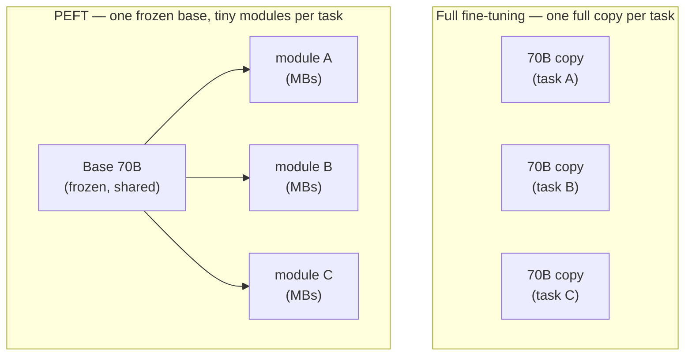
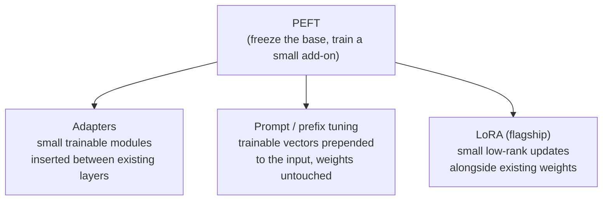

# PEFT (Parameter-Efficient Fine-Tuning)

## The problem it solves

[Fine-tuning](fine-tuning.md) works — you take a capable base model and keep training it on your own examples until it behaves the way your product needs. But done the obvious way, it is brutally expensive, and the expense shows up in three separate places.

Start with the training itself. To adjust a model's weights, you don't just store the weights — you also have to hold, for **every single parameter**, the gradient (which direction to nudge it) plus the optimizer's running bookkeeping. In practice that means keeping several times the model's own size in fast memory while you train.

> [!NOTE]
> **Weights, gradients, and optimizer state** — the model's *weights* (also called parameters) are the numbers it learned; there are billions of them (see the [ML vocabulary primer](../primers/ml-vocabulary.md)). To train, for each weight you also track a *gradient* — which way to push it to reduce error — and the optimizer keeps one or two more running numbers per weight to smooth those pushes. So updating a weight costs several times the memory of merely storing it. That multiplier is why full fine-tuning needs far more GPU memory (Graphics Processing Unit — the chip models run on) than just serving the model does.

Then storage. Fine-tune a 70-billion-parameter model for task A and you get a *complete new 70-billion-parameter model* — on the order of a hundred-plus gigabytes on disk. Do it again for task B and you have a second full copy. Ten tasks, ten copies. You are storing the same enormous, mostly-identical model over and over, differing only in the small ways each task nudged it.

Finally serving. Ten fine-tuned copies means ten separate large models to load onto expensive hardware. You cannot cheaply keep them all warm, and you cannot mix them on one machine — each is its own monolith.

**PEFT (Parameter-Efficient Fine-Tuning)** is the family of methods that attacks all three at once by refusing to touch most of the model. You **freeze** the base model's weights entirely and train only a tiny fraction of parameters — often well under 1% — or bolt on small new trainable modules. The base never changes; only the sliver does.

## The one analogy to remember

**The picture:** A pair of expensive prescription glasses, ground once to your exact eyes, plus a drawer of tiny snap-on clip filters — a sunglass tint, a blue-light filter, a magnifier for fine print. You keep the one pair of glasses and snap on whichever little clip the moment calls for.

**The mapping:** the ground prescription lenses = the frozen base model (huge, costly to make, never re-ground); a snap-on clip = a PEFT module trained for one task (tiny, cheap, made per task); the drawer of clips = many task adaptations of one base model; swapping clips = hot-swapping adapters at serving time.

**Why it holds:** the base model's knowledge is the expensive part you don't want to rebuild for every task, so PEFT leaves it untouched and trains only a small, removable layer that *steers* the output — which is exactly why you store megabytes per task instead of gigabytes, and can serve many adaptations off one loaded base.

**Say it like this:** "Instead of buying a whole new pair of prescription glasses for every situation, you keep one pair and snap on tiny clip-on filters — PEFT trains a little snap-on per task and leaves the huge base model alone."

*Where it breaks:* clips only sit in front of the lens, but real PEFT modules often plug *inside* the model's layers, not just at the output — and a clip can't fix a fundamentally wrong prescription, which mirrors PEFT's real ceiling on the most demanding adaptations.

## Why training a sliver can work at all

The move sounds too good: how can nudging under 1% of the parameters rival retraining all of them? The intuition is that a strong base model already *has* the capability you want — it can write, reason, follow formats. Adapting it to your task is mostly a matter of **steering** what it already knows into a particular lane, and that steering turns out to live in a much smaller space than the full model. You are not teaching a new brain; you are adjusting the dials on an existing one. Freeze the brain, train the dials.

That framing also buys a bonus: because the base weights never move, PEFT largely sidesteps **catastrophic forgetting** — the tendency of full fine-tuning to overwrite general ability while learning the new task (the model gets good at your thing and quietly worse at everything else). Freeze the base and its general knowledge is preserved by construction.

Here is the before/after in structure:

The payoff reads straight off the picture: storage per task drops from gigabytes to megabytes, training memory drops because frozen weights need no gradients or optimizer state, and at serving time you load the base once and swap small modules — so one machine can host many task-specific behaviors instead of one.

## The family: three ways to add a little without touching a lot

PEFT is a *family*, not a single method. The members differ in *where* they inject the trainable sliver, but all share the freeze-the-base principle.

- **Adapters** — insert small new trainable layers *between* the model's existing (frozen) layers. The base computation flows through as normal, and the little adapter modules learn the task-specific adjustment. This was the early, canonical PEFT approach.

- **Prompt tuning / prefix tuning** — don't touch the model's weights at all. Instead, learn a short sequence of trainable vectors that get prepended to the input, effectively a "soft prompt" optimized by training rather than hand-written in words. The model is fully frozen; only these prepended vectors are learned. (This is a *learned* input, distinct from the hand-written [prompt engineering](../prompting/prompt-engineering.md) a user does.)

- **LoRA (Low-Rank Adaptation)** — the flagship, and the one you'll be asked about by name. Rather than inserting separate layers or prefixes, it learns small, compact "update" matrices that sit *alongside* the frozen weights and adjust their behavior. It became the default because it hits the quality-versus-cost sweet spot and adds no extra cost at inference time. The mechanism — why "low-rank" is the trick that makes the update tiny — is its own lesson: **[LoRA](lora.md)**. Here, just place it as the leading member of the family.

One combination worth naming: **QLoRA (Quantized LoRA)** stacks LoRA on top of a base model that's been shrunk with [quantization](quantization.md) — compressing the numbers so the frozen base fits in even less memory — which lets people fine-tune very large models on a single consumer GPU. Treat it as "PEFT plus compression"; the compression half is the quantization lesson's job.

## The tradeoff: near-full quality, at a fraction of the cost — with a ceiling

The honest summary of the research and practice: for the large majority of adaptations — teaching a tone, a format, a domain style, a task the base already half-knows — PEFT lands close enough to full fine-tuning that the cost savings dominate the decision. That is why it is the default starting point, not the exotic option.

But "close enough" is doing real work in that sentence. Because you're only steering a frozen base, PEFT has a **ceiling** on the most demanding adaptations — a large behavior shift, or squeezing out the last few points of quality on a hard task where full fine-tuning's freedom to move every weight genuinely helps. When someone needs the absolute maximum and has the budget, full fine-tuning can still edge it out.

And a boundary that trips people up: PEFT adapts *behavior*, it doesn't reliably stuff in large amounts of *new factual knowledge*. If the base model simply doesn't know your company's current data, the fix is usually retrieval, not any flavor of fine-tuning — that argument lives in [Fine-tuning](fine-tuning.md) and [RAG](../retrieval-knowledge/rag.md), and PEFT doesn't change it.

So the sharp framing: **PEFT trades a modest quality ceiling for order-of-magnitude savings in training memory, storage, and serving flexibility — and for most tasks that's a trade you take without thinking twice.**

## Summary / Points to Remember

- **Full fine-tuning is expensive in three places** — training memory (gradients and optimizer state for *every* weight), storage (a whole new model copy per task), and serving (each copy is its own monolith). PEFT attacks all three by freezing the base.
- **The core move:** freeze the base model, train only a tiny sliver (often <1%) or small add-on modules. You're not rebuilding the brain, you're adjusting its dials.
- **Why a sliver suffices:** a strong base already has the capability; adaptation is mostly *steering*, which lives in a small space. Say it as "freeze the brain, train the dials."
- **PEFT is a family:** adapters (modules between layers), prompt/prefix tuning (learned vectors prepended, weights untouched), and **[LoRA](lora.md)** — the flagship you name by default. Don't conflate PEFT (the family) with LoRA (one member).
- **The operational win is bigger than the training win:** megabytes per task instead of gigabytes, and one loaded base serving many hot-swappable adaptations — multi-tenant serving off a single model.
- **Freezing the base sidesteps catastrophic forgetting** — general ability is preserved because the base weights never move.
- **The ceiling:** near-full quality for most adaptations, but full fine-tuning can still win on the most demanding ones — and neither reliably injects large new *knowledge* (that's retrieval's job).

## Interview Questions That Stump People

**Q (clarify-back): "We want to adapt a model to our product. Full fine-tuning or PEFT?"**

**Interviewer:** We've decided to fine-tune rather than just prompt. Should we do it fully, or use one of the parameter-efficient methods?

**You (clarify back):** Two things decide it for me — how many *different* task-specific behaviors we'll need to serve, and how big a behavior shift each one is versus what the base already does?

**Interviewer:** Probably a dozen customer-specific variants, and each is mostly tone and formatting on top of what the model already handles.

**You:** Then PEFT, clearly. A dozen variants under full fine-tuning is a dozen full model copies to store and serve — that's the expensive part, and it scales linearly with the number of variants. With PEFT you store one frozen base plus a dozen tiny modules and hot-swap them on one machine. And since the adaptations are tone and formatting — steering, not new capability — you're squarely in the range where PEFT matches full fine-tuning anyway. I'd only reach for full fine-tuning if we had a single, extremely demanding adaptation where squeezing out the last few points of quality justified the cost.

> [!TIP]
> **Why this works:** "Full or PEFT?" has no universal answer — it hinges on how many adaptations you serve and how large each behavior shift is. Answering immediately would expose you as someone reciting a default. The number of variants is the variable that dominates, because full fine-tuning's storage and serving cost scales with it while PEFT's doesn't; the size of the shift decides whether PEFT's quality ceiling even matters. Once "a dozen variants, mostly tone" is on the table, PEFT follows directly — and naming the one case that would flip you (a single, maximally demanding task) shows you know where the tradeoff actually breaks.

---

**Q: "How can training under 1% of the parameters possibly match retraining all of them?"**

**Interviewer:** It sounds like a free lunch. If you only touch a sliver, how is that as good as full fine-tuning?

**You:** Because you're not building a new capability — you're steering one the base model already has. A strong base can already write, follow formats, reason; adapting it to your task is mostly redirecting that existing ability into a particular lane, and that redirection turns out to live in a much smaller space than the full parameter count. So freezing the brain and training a small set of dials captures most of what full fine-tuning would do. The "free lunch" instinct is right to be suspicious, though — it's *not* free when the task demands a genuinely large behavior change or brand-new knowledge, and that's where the sliver runs out of room.

> [!TIP]
> **Why this answer works:** The naive answer either over-claims ("PEFT is just as good, always") or dismisses it ("it can't be, it's a hack"). The strong move is to explain the *mechanism* — adaptation is steering, and steering lives in a low-dimensional space — which makes the result believable rather than magical, and then to name the boundary where it stops holding. Showing both why it works *and* where it breaks is what separates understanding from a memorized talking point.

---

**Q: "Everyone frames PEFT as saving GPU cost during training. Is that the main point?"**

**Interviewer:** So PEFT is basically a way to fine-tune on cheaper hardware?

**You:** That's the headline, but I'd argue the bigger win is operational, on the serving side. The training saving is real — no gradients or optimizer state for frozen weights — but the storage and serving story is what changes product economics. A full fine-tune is a whole new model copy per task; PEFT is a few megabytes per task on top of one shared frozen base. That means you can keep one base loaded and hot-swap dozens of task-specific or customer-specific adaptations on the same machine, instead of running a separate large model for each. For a multi-tenant product, that's the difference between viable and not — it's not just a cheaper training run.

> [!TIP]
> **Why this answer works:** The question baits you into agreeing with the common, half-right framing that PEFT is a training-cost trick. Reframing to the serving side — one base, many swappable adapters, multi-tenant economics — shows you've thought about PEFT as a *deployment* pattern, which is where a PM actually feels it. Naming "storage per task in megabytes vs. gigabytes" and "hot-swap on one machine" makes the point concrete instead of hand-wavy.

---

**Q: "When would you tell a team PEFT is the wrong tool?"**

**Interviewer:** Give me a case where you'd actively steer someone away from PEFT.

**You:** Two cases. First, when the problem is *missing knowledge*, not behavior — if the model just doesn't know our current, changing data, no fine-tuning flavor reliably fixes that; that's a retrieval problem, and PEFT would be effort spent on the wrong lever. Second, when the adaptation is a genuinely large behavior shift and the team needs the absolute maximum quality with the budget to match — full fine-tuning's freedom to move every weight can edge out PEFT there, and its quality ceiling stops being a good trade. Outside those, PEFT is usually the right default, so I'd frame it as "PEFT unless you have a specific reason" rather than the other way around.

> [!TIP]
> **Why this answer works:** A weaker candidate treats PEFT as universally good and can't name a limit, which reads as sales rather than judgment. Naming the two real boundaries — knowledge gaps belong to retrieval, and a hard maximum-quality adaptation can justify full fine-tuning — proves you understand what PEFT *is* (behavior steering with a ceiling) by showing where it isn't the answer. Ending with "PEFT unless you have a reason" gives the interviewer the decision rule, not just a caveat.

---

**Q: "Isn't PEFT just another name for LoRA?"**

**Interviewer:** People say PEFT and LoRA almost interchangeably. Same thing?

**You:** No — PEFT is the family, LoRA is one member of it, and it happens to be the dominant one. The family is defined by the shared principle: freeze the base, train only a small add-on. Adapters do that by inserting little modules between layers; prompt and prefix tuning do it by learning input vectors and touching no weights at all; LoRA does it with compact low-rank update matrices alongside the frozen weights. LoRA won the popularity contest because it hits the quality-versus-cost sweet spot and adds nothing at inference time, so in practice "PEFT" often *means* LoRA in a given shop — but they're not synonyms, and knowing the other members signals you understand the design space rather than one recipe.

> [!TIP]
> **Why this answer works:** The question is a categorization trap — agreeing flattens a whole family into one method and signals shallow exposure. Correctly placing LoRA as *a* member (the flagship) and naming the sibling approaches shows you know the shape of the space. Acknowledging that people often use the terms interchangeably in practice keeps you from sounding pedantic while still making the distinction that matters.
