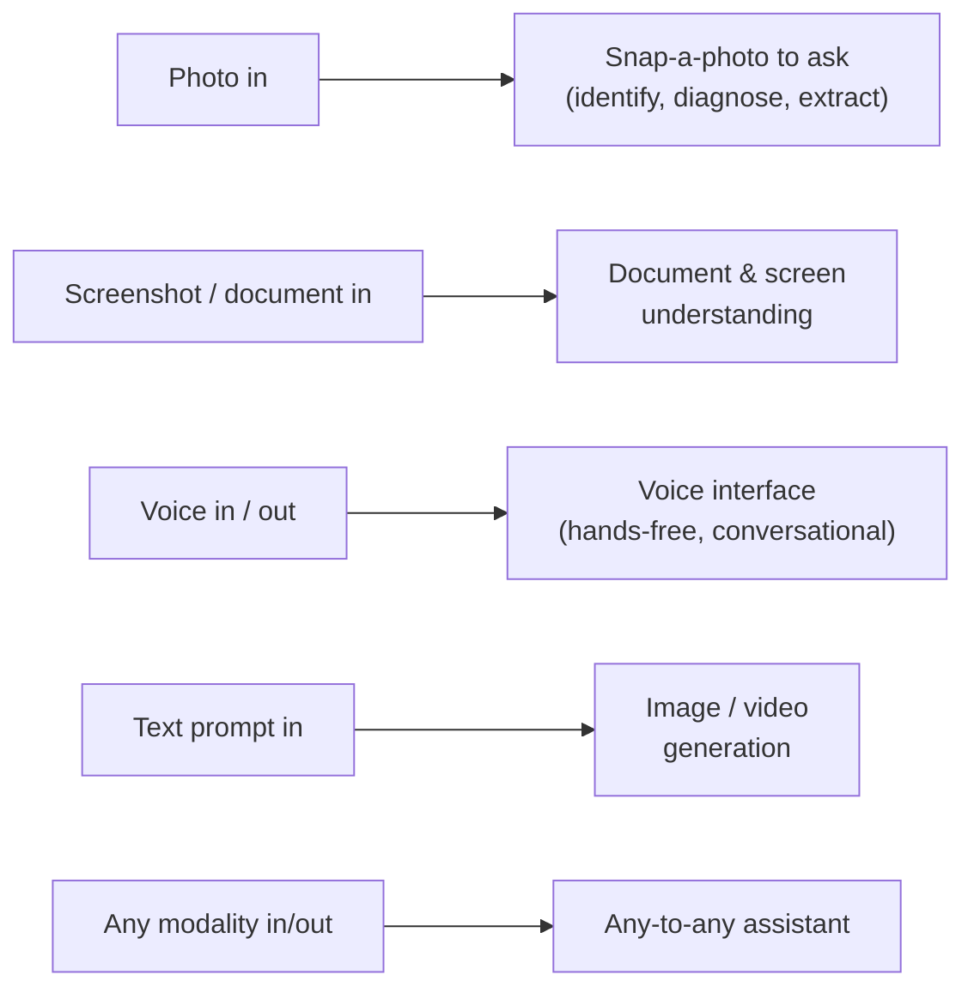
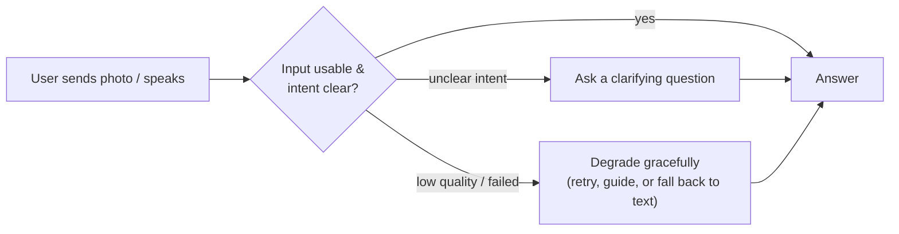
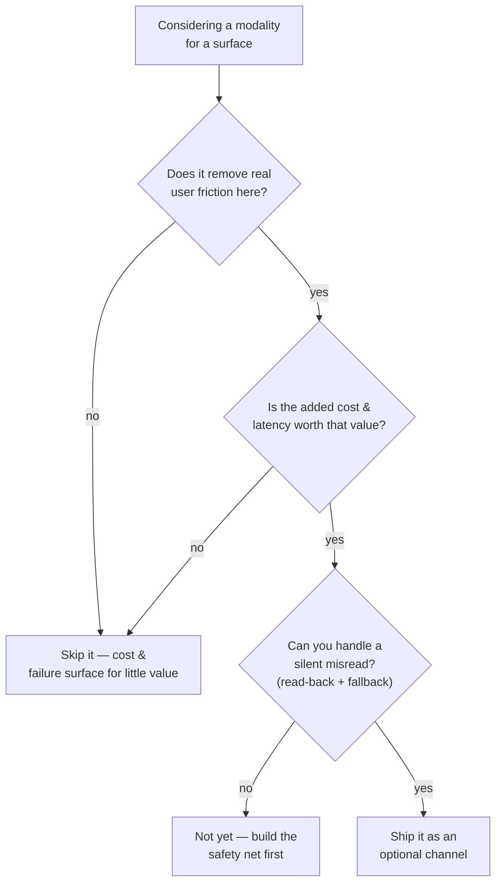

# Multimodal Product Surfaces

## The problem it solves

Once a model can read images and hear speech — the machinery of the two lessons before this one, [vision-language models](vision-language.md) and [audio and speech](audio-speech.md) — a product manager (PM) is handed a new and dangerous kind of freedom: you can now let users *point a camera*, *talk*, *drop in a screenshot*, or ask for a *generated image* instead of typing. The pressure that follows is real and usually badly aimed. Leadership says "make it multimodal." A competitor ships a "snap a photo to ask" feature and now it's on your roadmap. Someone demos voice and the room lights up. The instinct is to treat every modality as a free upgrade — more input channels, more magic, obviously better.

It is not free, and it is not obviously better. Every modality you add is a channel you now have to build, pay for, evaluate, and defend when it silently gets something wrong. Images and audio cost far more and run far slower than text. They are harder to evaluate. They carry privacy weight that text often doesn't. And they fail in a uniquely damaging way — the model confidently *misreads* the input and answers the wrong question fluently, with the user none the wiser. This lesson is the product lens on all of that: not *how* a modality works under the hood (that's 38 and 39), but *where multimodal capability actually shows up in products*, and how a PM decides whether a given modality earns its place. It's the closer of the multimodal category and the most product-flavored of the three — the "so what do I do with this" lesson.

## The one analogy to remember

**The picture:** A restaurant deciding how customers can place an order. You can walk up to the **counter**, **call it in**, tap through the **app**, or pull up and shout into the **drive-thru speaker**. Each new ordering channel you open lets some customers order with less effort — but each one costs money to staff and equip, and the drive-thru speaker in particular is famous for one thing: the crackly voice reads your order back wrong, and sometimes doesn't even ask — it just rings up a large when you said a small.

**The mapping:** each ordering channel = a **modality / product surface** (typed text, photo, voice, screenshot, generated image); the reliable counter = your **text baseline**; the drive-thru speaker = a **low-effort but noisy modality** like voice or a snapped photo; the speaker confidently ringing up the wrong order = a **modality silently misreading input**; staffing and equipping each channel = the **cost and latency** of supporting a modality; opening a channel nobody uses = **a modality that adds cost without removing real friction**; being able to pull forward and correct it, or just go inside to the counter = **graceful degradation and fallback**.

**Why it holds:** a channel is worth opening only when it removes enough real friction for enough customers to justify what it costs to run *and* the mistakes it introduces — which is exactly the multimodal product decision. And critically, opening a new channel doesn't change the kitchen (the underlying model); it only changes how the order gets *in*, how much it costs to take, and how it can go wrong.

**Say it like this:** "Each modality is another ordering channel — great when it genuinely saves the customer effort, but every channel you open costs money to run and can mishear the order, so you only add the ones that earn their keep."

*Where it breaks:* a drive-thru worker who's unsure usually asks "did you say a large?" — a human knows when they didn't catch it. A model often won't flag its own uncertainty; it rings up the wrong thing with full confidence. So the "read it back to confirm" step that a good employee does by instinct is something you have to *design in* — it doesn't come for free with the channel.

## Where multimodality actually shows up in products

"Multimodal" is an abstraction; users never meet it directly. They meet specific **surfaces** — concrete places in a product where a non-text modality goes in or comes out. Knowing the common ones by name, and what each is really *for*, is most of the PM job here.

- **Image input — "snap a photo to ask."** The user photographs a thing — a rash, a plant, a broken part, a wine label, a math problem — and asks about it. The product value is *removing the translation step*: the user no longer has to describe in words something they can't name. This is the single highest-leverage multimodal surface because it turns "I don't know what to type" into "point at it."
- **Document and screenshot understanding.** The input is a page, a form, a receipt, a chart, or a screenshot of another app. The model reads layout and text together — which is why this beats plain optical character recognition (OCR, the older tech that just extracts characters): the model understands the *structure*, not just the letters. Expense capture, "explain this error screen," and contract review all live here.
- **Voice interfaces.** Speech in, and often speech out. The value is *hands-free and lower-friction* — driving, cooking, walking, or users who find typing slow. The mechanism (speech-to-text and back) belongs to [audio and speech](audio-speech.md); the product point is that voice trades typing effort for a new set of failure modes (accents, noise, misheard homophones).
- **Image generation.** Text in, image out. The surface is anything from marketing assets to product mockups to avatars. The PM tension here is less "does it work" and more "is the output *usable and safe to ship* without a human in the loop."
- **Video.** Emerging as both input (understanding a clip) and output (generating one). Costlier and slower than everything above by a wide margin; today it's a surface you adopt deliberately, not casually.
- **"Any-to-any" assistants.** The general assistant that accepts any modality and can respond in several. Powerful, but the hardest to set expectations for, because the user can't easily tell *which* inputs it handles well and which it merely tolerates.

> [!NOTE]
> **Modality** just means a *channel of information* — text, image, audio, video. "Multimodal" means a single model handles more than one. Throughout this lesson, treat a modality as a product *surface*: a place where a channel enters or leaves your product, each with its own cost, latency, and failure profile.

The trap this framing defuses: teams talk about "adding multimodality" as one decision. It never is. It's a *separate* decision per surface — snap-a-photo, voice, and image generation are three different products with three different economics and three different failure modes. A PM who reasons surface-by-surface will out-decide one who reasons about "multimodal" as a monolith.

## The core user-experience consequence: less effort in, more ambiguity to resolve

Here is the one dynamic that governs almost every multimodal design choice. **Non-text input lowers the user's effort but raises the system's ambiguity.** Typing forces the user to commit to specific words — which is *work*, but it also disambiguates. A photo says nothing about what the user actually wants to know: a picture of a plant could mean "what is this," "is it dying," "is it toxic to my cat," or "how often do I water it." Voice is easy to speak but arrives noisy, accented, and full of homophones. So every bit of effort you save the user on the way *in* becomes a bit of ambiguity you must resolve *after*.

This has three direct product consequences a PM owns:

- **Set expectations at the surface.** The user cannot see what the model can and can't do with their photo or their voice. If you promise "ask me anything about this image" and it flubs handwriting or fine print, you've manufactured distrust. Scope the prompt, the placeholder text, and the examples to what the modality actually handles well.
- **Design the disambiguation, don't hope for it.** Because low-effort input under-specifies intent, the product often needs to *ask back* — "Do you want to identify this plant or check if it's pet-safe?" — rather than guess and answer confidently. The counter to ambiguity is a clarifying turn, and that turn is a design decision.
- **Plan for graceful degradation.** Modalities fail more often and more variably than text: blurry photo, background noise, an unsupported file, a timeout on a slow image call. The product must *fall back* — to a text box, to "try again in better light," to a partial answer — rather than dead-end. A failed modality should never be a failed task.

The sharp framing: **multimodal input moves work from the user to the system.** That's the win *and* the bill. The user does less; your product must now do the disambiguation and the failure-handling the user's typed words used to do for free.

## The decision: does this modality earn its place?

The most common multimodal mistake is adding a modality because it's *possible* and *impressive*, not because it *improves the product*. A PM needs a defensible test. The question is never "can we do voice?" — of course you can. It's "does voice remove enough real friction here to justify what it costs and how it fails?"

Walk the gates:

1. **Does it remove *real* friction?** A modality earns its place when it collapses a genuine pain — "describe the thing you can't name" (photo), "answer while my hands are full" (voice), "I have a document, not a paragraph" (screenshot). If the user could just as easily type, the modality is decoration.
2. **Is the cost and latency worth it?** Image and audio inputs are dramatically more expensive and slower to process than text — this is not a rounding error, it's often an order of magnitude, and it hits *every single call*. That trades directly against the value from gate 1 and against your [cost and unit economics](../production-ops/cost-unit-economics.md) and the [iron triangle](../product-strategy/iron-triangle.md) of cost, latency, and quality.
3. **Can you survive a silent misread?** If the modality confidently misreads the input and you can't catch it — no read-back, no confidence signal, no fallback — the failure lands straight on the user in a high-trust moment. For low-stakes surfaces that's tolerable; for anything consequential, the safety net has to exist *before* you ship.

The design rule that falls out of this — and the one to say out loud in an interview: **default to text; add a modality only where it removes friction that text can't, and only once you can handle how that modality fails.** Multimodality is a set of deliberate, surface-by-surface bets, not a blanket upgrade.

## The cross-cutting tradeoffs a PM owns

Beyond the per-surface decision, multimodality changes five things that cut across the whole product. These are the ones a PM is accountable for and an interviewer will probe.

- **Cost and latency blow up.** Images and audio are expensive and slow relative to text, on every call, forever. A feature that's a delight in a demo can be economically unviable at scale, or too laggy to feel good. Model this early; it shapes what you can ship. (See [cost and unit economics](../production-ops/cost-unit-economics.md).)
- **Evaluation gets harder.** Text answers are relatively easy to score. "Did the model read this chart right?", "Is this generated image acceptable?", "Did it transcribe this accent correctly?" are far harder to measure, and you need real coverage across the *variability* of real inputs — lighting, accents, layouts, languages. Weak evaluation on a multimodal surface means you're flying blind on quality. (See [evaluation methods](../evaluation/evaluation-methods.md) and [AI product metrics](../product-strategy/ai-product-metrics.md).)
- **Accessibility is a real win *and* a real risk.** Voice input helps users who can't type easily; image description helps users who can't see. These are genuine inclusion gains and often the strongest case for a modality. But the flip side is that when an accessibility-relied-upon modality misreads, the user who depends on it is the *least* able to catch the error — so the reliability bar for these paths is higher, not lower.
- **Privacy weight goes up.** A photo can contain faces, documents, locations, and a home's interior; a voice clip is biometric and reveals who's in the room. Users hand over far more than they intend when they snap or speak. This raises the stakes on retention, consent, and what leaves the device — squarely in [privacy and PII](../safety-trust/privacy-pii.md) (personally identifiable information) territory.
- **Trust breaks on silent misreads.** The signature multimodal failure isn't "it errored" — it's "it confidently answered the wrong question because it misread the input," a close cousin of [hallucination](../reasoning-generation/hallucination.md). The user asked about the *left* chart; the model read the *right* one and gave a fluent, wrong answer. Because the input was theirs and the answer sounds sure, this erodes trust faster than a visible failure. Confidence signaling, read-backs, and citing what it saw ("I'm reading the label as…") are the countermeasures.

## Summary / Points to Remember

- **Multimodality is not one decision — it's a separate bet per *surface*.** Snap-a-photo, document understanding, voice, image generation, video, and any-to-any assistants are different products with different economics and failure modes. Reason surface-by-surface, not about "multimodal" as a monolith.
- **The *mechanisms* live in other lessons** — [vision-language models](vision-language.md) and [audio and speech](audio-speech.md). This lesson is the product lens on top: where the capability shows up and whether it earns its place.
- **Non-text input lowers user effort but raises system ambiguity.** Every bit of effort you save on the way in becomes ambiguity you must resolve after — with expectation-setting, clarifying turns, and graceful fallback. Multimodal input *moves work from the user to the system*.
- **The decision test:** does the modality remove real friction text can't, is the extra cost/latency worth it, and can you survive a silent misread? If any answer is no, don't ship it yet. **Default to text; add a modality only where it clears all three.**
- **The five cross-cutting tradeoffs a PM owns:** cost/latency blow-ups, harder evaluation, accessibility (a real win *and* a higher reliability bar), heightened privacy weight of images/voice, and the trust-killing *silent misread*.
- **The signature failure is confident misreading, not a visible error** — the model answers the wrong question fluently because it misread the input. Read-backs, confidence signals, and "here's what I saw" are the design countermeasures.

## Interview Questions That Stump People

**Q (clarify-back): "Our competitor just launched 'snap a photo to ask.' Leadership wants us to add multimodal input across the board. How do you approach it?"**

**Interviewer:** There's a directive from the top: go multimodal, add image and voice input to the product. Where do you start?

**You (clarify back):** Before I scope it — can we go feature by feature rather than "across the board"? Which specific user tasks are we trying to improve, and for each, what's the friction a user hits today with plain text?

**Interviewer:** Fair. The clearest one is our support flow — users struggle to describe a product defect in words.

**You:** Then that's a strong case for image input specifically, and I'd start there rather than everywhere. "Describe a defect you can't name" is exactly the friction a photo removes — it turns a frustrating typing task into pointing a camera. But I'd treat it as its own bet, not a template for the whole product: I'd check the cost and latency of image calls against our per-ticket economics, and — because a misread photo could send a user down the wrong troubleshooting path — I'd design a read-back ("I'm seeing a cracked hinge, is that right?") and a fallback to text before shipping. "Multimodal across the board" is the wrong unit of decision; each surface is a separate product with its own economics and failure mode. Voice, image generation, document upload — those get evaluated on their own merits and their own friction, not bundled in because photo tested well.

> [!TIP]
> **Why this works:** The prompt is a buzzword directive ("go multimodal") baited to make you enthusiastically bundle every modality at once. Clarifying reframes from the label to the *task and its friction*, which is the only thing that justifies a modality. The strong move is decomposing "multimodal" into per-surface bets, then applying the earns-its-place test (real friction, acceptable cost, survivable failure) to the one surface that clears it — signaling you treat multimodality as a set of deliberate decisions, not a blanket upgrade.

---

**Q: "We shipped photo input and users love it in demos, but satisfaction dropped in production. The model's vision benchmarks are great. What happened?"**

**Interviewer:** The vision model scores well on standard benchmarks, the demo was a hit, yet real users are less satisfied than before. Explain the gap.

**You:** The gap is almost certainly between benchmark inputs and *real* inputs, plus the silent-misread failure mode. Benchmarks use clean, well-lit, well-framed images; production gets blurry photos, bad lighting, glare, weird angles, and — the bigger issue — ambiguous *intent*, because a photo doesn't say what the user wants to know about it. So two things are hurting you. First, on messy real inputs the model misreads more often, and when it misreads it doesn't error — it answers the wrong question confidently, which erodes trust faster than a visible failure because the answer sounds sure and the input was the user's own. Second, you've probably under-designed the disambiguation and fallback: no clarifying turn when intent is unclear, no "here's what I saw" read-back, no graceful path when the image is unusable. I'd instrument it — sample real failing sessions, separate "misread the image" from "read it fine but guessed wrong intent" — and I'd fix it with read-backs, a clarifying question on ambiguous asks, and a fallback to text. The benchmark score was never the product; it measured the model on inputs your users don't send.

> [!TIP]
> **Why this answer works:** The trap is trusting the benchmark and blaming the model or the users. The strong answer locates the failure in the *product surface*: real-world input variability plus the signature multimodal failure — confident misreading — plus missing disambiguation and fallback. Naming the distinction between "misread the pixels" and "misread the intent," and proposing to instrument for it, shows you understand that a good vision model does not equal a good multimodal product; the UX around ambiguity and failure is what was missing.

---

**Q: "Voice input is trivial to add now. Any reason not to just turn it on everywhere?"**

**Interviewer:** The capability's basically free to wire up. Why wouldn't we enable voice across the whole product?

**You:** "Easy to wire up" and "earns its place" are different questions. Voice pays off where it removes real friction — hands-free contexts, users for whom typing is slow or hard, genuinely conversational flows. Turned on everywhere, it mostly adds cost, latency, and a new failure surface for little value: audio processing is slower and more expensive than text on every call, and speech arrives noisy — accents, background noise, homophones — so you inherit a class of misrecognition errors you didn't have. There's also an expectation cost: a voice affordance implies "talk to me naturally," and if the surface can't actually handle open-ended speech, you've promised something you don't deliver. And it's a privacy step-up — a voice clip is biometric and captures whoever else is in the room, so "on everywhere" quietly widens what you're collecting and must protect. So I'd enable it on the surfaces where hands-free or accessibility value is real, with a fallback to text when recognition fails, and leave it off where text is already the low-friction path. Cheap to build is not the bar; removing friction that justifies the cost and the failures is.

> [!TIP]
> **Why this answer works:** The premise smuggles in "low build cost = should ship." The strong move separates build cost from *total* cost — latency, per-call expense, misrecognition, expectation-setting, and the privacy step-up of biometric audio. Landing on "enable where the friction is real, fall back where it isn't" shows you apply the earns-its-place test even when the engineering is trivial, which is exactly the judgment that separates a PM who ships modalities deliberately from one who adds them because they can.

---

**Q: "How would you set the quality bar and evaluation for an accessibility feature that describes images aloud for blind users?"**

**Interviewer:** We're adding spoken image descriptions for visually impaired users. How do you think about the quality bar and how you'd evaluate it?

**You:** The key insight is that this is a *higher* reliability bar than a normal feature, not a lower one, precisely because it's an accessibility path. A sighted user who gets a wrong image description can glance and catch it; a blind user relying on this description is the least able to detect that it's wrong, so a confident misdescription does real harm and they have no way to sense-check it. That reframes evaluation: I can't just measure average-case accuracy on clean images. I need coverage across the messy, high-variability inputs these users actually send, and I especially need to measure the *silent-misread* rate — how often it describes something confidently and wrongly — because that's the failure that hurts most. I'd also build in honesty about uncertainty: the system should signal low confidence ("this looks like it might be…") rather than assert, and degrade gracefully when it can't tell. And I'd evaluate with the actual user population in the loop, not just internal testers, since their inputs and needs differ. The accessibility win is real and worth pursuing, but the evaluation has to be held to the standard of "what happens to the user who can't verify this themselves," which is stricter than our normal bar.

> [!TIP]
> **Why this answer works:** The naive take treats accessibility as a feel-good add-on with a normal quality bar. The strong answer flips it: the very reason it's valuable — users depend on it and can't verify it — is why the reliability and evaluation bar must be *higher*, and why the silent-misread rate (not average accuracy) is the metric that matters. Pairing the genuine inclusion win with the elevated risk, and proposing uncertainty signaling plus evaluation with the real population, shows you hold both edges of the accessibility tradeoff instead of only the applause.
