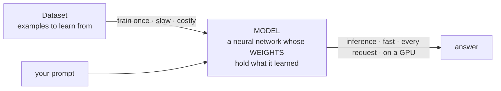

# ML Vocabulary Primer

The background terms the lessons lean on. Plain-English, PM-level — enough to follow the thread, not to build the thing. Read once; jump back here when a lesson assumes one of these.

## How these fit together

Training happens once, to *make* the model. Inference happens on every single request — which is why inference speed and cost are the everyday product concern.

## The thing itself

| Term | What it means (PM-level) | Example |
|------|--------------------------|---------|
| **Model** | The trained program that turns your input into an output. "The model" and "the AI" mean the same thing. Under the hood: a very large pile of numbers plus the rules for using them. | Claude, GPT-4, and Gemini are each a model. |
| **Neural network** | The kind of program modern models are. An input passes through a huge grid of numbers ("weights") that transform it step by step into an output. It *learns* the weights from examples rather than being hand-coded with rules. | A transformer — the design under today's LLMs — is a neural network. |
| **Weights / parameters** | The numbers inside the model that hold everything it has learned. More = more capacity to learn and more compute to run. "Weights" and "parameters" are the same thing. | "Llama 3 70B" means the model has 70 billion parameters. |
| **Parameter count vs. capability** | Bigger models are generally more capable but slower and costlier. Much of AI product work is finding the *smallest* model that's good enough — it's the cheapest and fastest. | A small model may summarize an email fine; a large one is worth it for hard reasoning. |

## The numbers it works with

| Term | What it means (PM-level) | Example |
|------|--------------------------|---------|
| **Vector** | An ordered list of numbers, like `[0.12, -0.98, 0.44, …]`. A 2-number vector is a point on a graph (an x and a y); the vectors models use hold hundreds or thousands of numbers — a point in a space with that many dimensions. "How close are two vectors" is a calculation that works the same however many numbers they hold, which is how a model compares meanings numerically. | An **embedding** — the numeric representation of a word or sentence's meaning — is a vector. |

## What transformers replaced

| Term | What it means (PM-level) | Example |
|------|--------------------------|---------|
| **RNN (Recurrent Neural Network)** | The pre-2017 standard for handling text. It reads **one word at a time**, left to right, carrying a small running summary forward — like reading through a keyhole while rewriting one sticky note. Two fatal flaws: it **forgets** early words by the end, and it **can't be parallelized** (word 100 must wait for word 99), so it can't use a GPU's full power. The transformer fixed both by reading every word at once. | "Why were transformers a breakthrough?" is really "why did reading all-at-once beat the RNN's one-at-a-time?" |
| **LSTM (Long Short-Term Memory)** | A more elaborate RNN that stretched how many earlier words could be remembered, but never fixed the can't-parallelize flaw. It was the last major pre-transformer architecture. | LSTMs powered translation and speech before ~2017. |

## Making it

| Term | What it means (PM-level) | Example |
|------|--------------------------|---------|
| **Training** | Showing the model millions of examples and nudging its weights after each mistake until it's good. Expensive, done once (or occasionally). It's how the model is *made*. | Training a frontier model reportedly costs tens of millions of dollars in compute. |
| **Dataset** | The collection of examples a model learns from in training. Data quality and coverage shape what the model is good and bad at. | A large crawl of public web text is a common training dataset. |

## Using it

| Term | What it means (PM-level) | Example |
|------|--------------------------|---------|
| **Inference** | Actually *using* the trained model to get an answer. Every prompt-and-reply is one inference. It's what you pay for per-use in production, so its speed and cost are central. | Each reply the assistant sends you is one inference call. |

## What it runs on

| Term | What it means (PM-level) | Example |
|------|--------------------------|---------|
| **GPU (Graphics Processing Unit)** | A chip that does thousands of calculations at once. The math behind neural networks has the same shape, so GPUs run both training and inference. They're scarce and expensive — the reason AI compute is a real cost line. | NVIDIA's data-center GPUs (e.g. the H100) are the standard for running models. |
