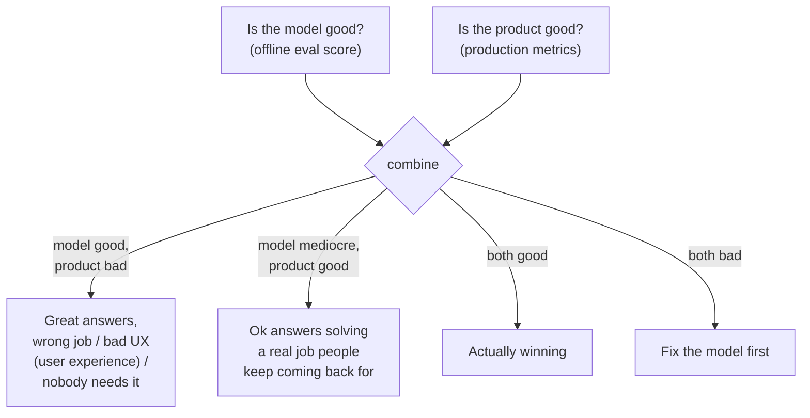
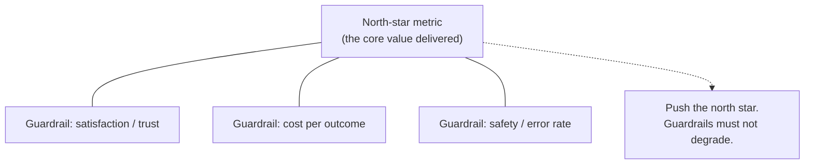
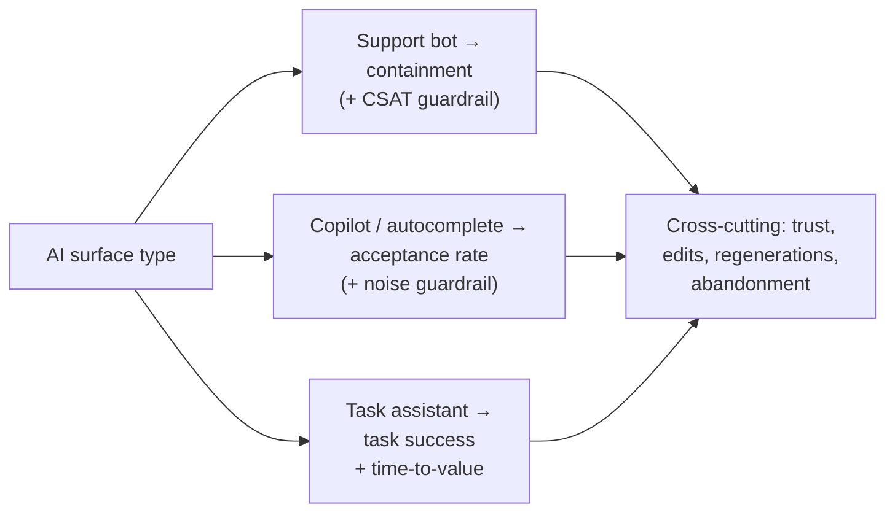

# AI product metrics

## The problem it solves

Your model team is thrilled. On the offline evaluation set, the new assistant scores 94% — up from 88% last quarter, beating the benchmark you set, better than the competitor's published number. The demo is flawless. You ship it.

Three months later the feature is a ghost town. People tried it once, a few thousand of them, and never came back. The support team is quietly routing around it. Nobody can point to a single thing the model got *wrong* — the answers are genuinely good — and yet the product is not succeeding. Meanwhile, two floors down, a scrappier team shipped a dumber model with a worse eval score and their feature is the most-used thing in the app.

Here is the trap. **A model-quality metric and a product metric are different measurements of different things, and a great score on the first tells you almost nothing about the second.** Eval score measures how good the outputs are on a fixed set of questions, in a lab. A product metric measures whether real people, in the mess of real life, got value and came back. The two can move in opposite directions — a brilliant model wrapped in a confusing feature nobody needs, or a mediocre model solving a job so well that people forgive its flaws. As a product manager (PM) your job is to measure the *second* thing, and to know exactly how it connects back to the first. A team that confuses "the model is good" with "the product is good" ships beautiful failures.

## The one analogy to remember

**The picture:** a car's spec sheet versus your actual morning commute. The sheet brags: 500 horsepower, 0-to-60 in 3.2 seconds, top speed 200 mph. Impressive numbers, measured on a track. But the question that decides whether the car is any good *for you* is: did it get you to work on time, every day, without drama?

**The mapping:** the horsepower and 0-to-60 figures = model-quality metrics (eval score, accuracy, benchmark rank); the track they were measured on = the offline eval set; "did I actually get to work on time, in traffic, in the rain, with the kids in the back" = product-outcome metrics (task success, retention, trust); the daily commute in real conditions = production, with real users and messy inputs.

**Why it holds:** horsepower is a real, honestly-measured property of the engine — and it is measured in isolation, on a track, decoupled from potholes, red lights, and school runs, which is exactly why a 500-hp car can still be a terrible commuter (no cargo room, stalls in cold, costs a fortune to run). The eval score is real and honestly measured too, and it is decoupled from the messy conditions that actually decide whether the product delivers, in the very same way.

**Say it like this:** "The eval score is the car's horsepower — a real number measured on a track. The product metric is whether it actually gets people to work on time. A monster engine that never delivers the outcome is worthless."

*Where it breaks:* horsepower and commute time are only loosely linked, but a genuinely broken model *will* eventually drag product metrics down — so the two aren't independent, they're connected by a lagging, noisy chain you have to actively trace, not a wall between them.

## Two different measurements, and why you need both

Start by naming the split cleanly, because interviewers live in the gap between these two.

> [!NOTE]
> **Offline evaluation** — scoring a model's outputs against a *fixed, curated set* of test cases, in a lab, before or independent of shipping. It answers "how good are the outputs on these known questions?" The methods (golden sets, large language model (LLM)-as-judge, and so on) are their own topic — see [evaluation methods](../evaluation/evaluation-methods.md) and [benchmarks](../evaluation/benchmarks.md). Treat the *score* it produces as an input here, not something to re-derive.

A **model-quality metric** comes from that lab: accuracy, faithfulness, an eval or benchmark number. A **product metric** comes from production: it measures whether real users, with inputs you never anticipated, actually got their job done and came back for more. The reason you cannot substitute one for the other is that each is blind to the other's failure:

The top two branches are the ones that ruin careers. "Model good, product bad" is the beautiful demo nobody uses — the eval set never contained the question "will a busy user in a hurry understand this feature and trust it?" "Model mediocre, product good" is the humbling one: a modest model, aimed at a job people genuinely have, wins. The offline score could not see either outcome because it was measured on a fixed set of questions, disconnected from real users getting value. You need both instruments for the same reason a car needs both a dyno *and* a commute: they measure different things, and the one you sell is the commute.

## The layered metric stack: north star and guardrails

A serious product doesn't watch one number; it watches a small, deliberately-structured stack. The centerpiece is the **north-star metric** — the single measure that best captures the core value your feature delivers to users. For a support assistant it might be *issues fully resolved without a human*; for a writing copilot, *documents completed with its help*. The discipline is picking one that genuinely moves only when users get real value, so the whole team can point at it.

But a north star chased alone gets gamed — you can pump almost any single metric by degrading something else. So you pair it with **guardrail metrics**: measures that must *not* get worse while you push the north star. If the north star is resolution rate, a guardrail is customer satisfaction — because you can "resolve" more tickets by bullying people into giving up, and the guardrail is what catches that.

Cutting across this stack is a second distinction: **leading versus lagging** indicators. A *lagging* indicator confirms value after the fact and is what the business ultimately cares about — retention, revenue, thirty-day return rate. It is trustworthy but slow: by the time retention drops, the damage is months old. A *leading* indicator moves early and predicts the lagging one — day-one task success, first-session acceptance rate, time-to-first-value. It is faster but noisier. The PM craft is watching leading indicators to *steer* week to week, while holding yourself accountable to lagging ones to prove the steering worked. A team that only watches lagging metrics is driving by the rear-view mirror; a team that only watches leading ones can fool itself for a quarter.

## The AI-feature-specific outcome metrics

Generic product metrics (adoption, retention) apply to any feature. But AI features have a handful of outcome metrics that are specific to how they deliver value, and the skill is knowing *when each one applies* — using the wrong one is how you end up optimizing the wrong behavior.

**Task success / task completion rate** — did the user actually get their job done? This is the most universal AI outcome metric and usually the closest thing to a north star, because it measures the *job*, not the *output*. It applies almost everywhere, but it's the hardest to instrument, because "success" often has no clean signal — you infer it from whether the user stopped (satisfied) or kept struggling.

**Containment / deflection rate** — for support bots: the share of conversations resolved without escalating to a human. It applies specifically to assistive/support surfaces where a human fallback exists and each handoff has a cost. **Its trap is the single most important thing to know about it:** you can inflate containment by making it hard to reach a human — the bot "contained" the user by exhausting them into giving up, which registers as success while actively destroying trust. Containment is *only* meaningful paired with a satisfaction guardrail (CSAT — Customer Satisfaction, a direct user rating). Containment up, CSAT down means you are deflecting by frustrating people. That is fake success, and it is a textbook example of a metric that looks like value and isn't.

**Acceptance rate** — for copilots and autocomplete (code completion, suggested replies): the share of suggestions the user actually keeps. It applies specifically to *suggest-and-accept* interactions where the AI proposes and the human disposes. It's a strong, dense signal because every interaction produces one — but it needs its own guardrail, because a copilot that suggests constantly will rack up accepted suggestions while annoying the user with noise, so pair it with something like suggestion frequency or user-reported helpfulness.

**Adoption, engagement, retention, and time-to-value** — the standard product funnel, applied to the AI feature specifically (not the whole app): did people try it (adoption), keep using it (engagement), come back over weeks (retention), and how fast did a new user get their first win (**time-to-value**)? Retention is the ultimate lagging proof that the feature delivers value people want repeatedly; time-to-value is the leading indicator that most predicts it.

**Trust and user-reported quality** — explicit signals like CSAT and thumbs up/down, plus the *implicit* quality signals that are often more honest because every user emits them for free: edit distance (how much the user rewrote the AI's output before using it), regeneration rate (asking for another try — a quiet thumbs-down), and abandonment (leaving mid-task). A rising edit distance or regeneration rate is quality decaying in a way no offline eval would show, because it's real users reacting to real outputs. Where these production signals come from is [observability](../production-ops/observability.md); here the point is that they are *product* signals, not just system health.

## Why offline eval score is not a product metric

This is the thesis, so make it precise rather than sloganeering. Three concrete reasons the eval score cannot stand in for a product metric:

1. **Fixed set versus open world.** The eval set is a curated, frozen list of questions. Production is an open, shifting distribution of inputs — including ones no one thought to test. A model can be perfect on the set and fall apart on the long tail of real queries. See [benchmarks](../evaluation/benchmarks.md) for why the set itself is a narrow sample.
2. **Output quality versus delivered value.** Eval scores the *output* in isolation. Product measures whether that output, delivered through a specific interface at a specific moment, actually let a user finish a job. A faithful, accurate answer buried in a confusing interface, arriving too slowly, or answering a question the user didn't quite ask, produces a high eval score and a failed task.
3. **The judge versus the user.** Offline eval is usually scored by a rubric or an LLM-as-judge against *your* definition of good. The user has their own definition, formed in context, under time pressure, with their real goal in mind — and it's theirs that determines whether they come back.

None of this means eval scores are useless — they're your fastest, cheapest, pre-ship signal, and a genuinely broken model *will* eventually drag product metrics down. The mandate is not "ignore eval, watch product." It is **hold both, and actively connect them**: when a product metric moves, trace it back to whether the cause is model quality (fixable with eval-guided iteration) or product design (fixable with UX, scope, or targeting). Teams that can't do that tracing thrash — they tune the model when the problem was the interface, or redesign the UI when the model was quietly regressing.

## The instrumentation reality

There's a hard practical truth sitting under all of this: **most product metrics are only measurable live, from production telemetry and deliberate feedback capture.** You cannot compute retention, acceptance rate, or task success on your laptop before launch — they require real users generating real events. This has two consequences PMs underrate.

First, **you have to design the measurement before you build the feature.** You can't retroactively measure an "edit before accept" if the product never distinguished a suggestion from an accepted edit in its event log. Deciding what counts as task success, and instrumenting the events that reveal it, is a design activity that happens *before* the first line of feature code — not an analytics afterthought. The plumbing that carries these signals is [observability](../production-ops/observability.md); the *choice of what to measure* is product work.

Second, **many of your most important metrics don't exist until after launch**, which means your pre-launch confidence rests entirely on eval scores and your post-launch reality check depends on instrumentation you'd better have built. This is precisely why the eval-versus-product gap is dangerous: the reassuring number is available early, and the number that matters isn't.

## Failure modes to name out loud

- **Vanity metrics.** Usage is up and to the right, so the feature "is working." But usage counts activity, not value. If sessions climb while task success, retention, and satisfaction stay flat, you're measuring motion, not progress — people are trying it and not getting value. A vanity metric is any number that goes up without the underlying value going up.
- **Proxy divergence (Goodhart).** Every metric is a *proxy* for real value, and when you optimize a proxy hard enough it stops tracking the thing it stood for — "when a measure becomes a target, it ceases to be a good measure." Containment optimized into user-frustration is the canonical case. Name it and move on; the deep treatment of this and construct validity lives in [benchmarks](../evaluation/benchmarks.md).
- **"Model is good" = "product is good."** The master failure this whole lesson is about: mistaking a lab measurement of output quality for evidence that users are getting value. It's seductive because the eval number is precise, early, and flattering, while the product truth is fuzzy, late, and often unflattering.

The connective tissue: these metrics don't just report — they *feed the flywheel*. Production signals become the data that improves the next model version and compounds into a [data moat](../product-strategy/data-moats.md). And when metrics tell you quality, speed, and cost are in tension, they tell you *which vertex to favor* — that tradeoff is the [iron triangle](../product-strategy/iron-triangle.md), and cost-per-outcome specifically is [cost and unit economics](../production-ops/cost-unit-economics.md). Whether you even own the model quality you're measuring is a [build-vs-buy](../product-strategy/build-vs-buy.md) question. And a quality failure users *feel* as a product metric — regenerations, abandonment — is often a [hallucination](../reasoning-generation/hallucination.md) they didn't trust.

## Summary / Points to Remember

- **A model-quality metric and a product metric measure different things.** Eval score = output quality on a fixed set, in a lab; product metric = real users getting value in messy reality. A model can ace evals and fail as a product, and vice-versa. PM framing: *"The eval score is horsepower on a track; I get paid for whether it gets people to work on time."*
- **Structure a metric stack, don't watch one number:** one **north-star** metric (the core value delivered) plus **guardrails** that must not degrade while you push it. And distinguish **leading** indicators (steer weekly, noisy) from **lagging** ones (prove it worked, slow). PM framing: *"Steer on leading, get graded on lagging."*
- **Match the AI-outcome metric to the surface:** **task success** (almost universal), **containment/deflection** for support bots (*always* paired with CSAT, or you're just frustrating people into giving up), **acceptance rate** for copilots, and adoption/retention/**time-to-value** for the funnel. PM framing: *"Containment without a satisfaction guardrail is fake success."*
- **Offline eval ≠ product metric because:** fixed set vs. open world, output quality vs. delivered value, a judge's definition of good vs. the user's. Hold both and *connect* them — trace a moving product metric back to model-cause or design-cause. PM framing: *"The flattering number is available early; the one that matters isn't."*
- **Most product metrics are only measurable live** — design the instrumentation before you build, because you can't measure an interaction you didn't log. PM framing: *"Decide what task success means before the first line of code."*
- **Name the failure modes:** vanity metrics (usage up, value flat), proxy divergence (Goodhart — optimize a proxy till it stops meaning anything), and the master error of reading "model is good" as "product is good."

## Interview Questions That Stump People

**Q: "Our new model scores 94% on our eval set, up from 88%. That's a big quality win — how would you decide whether to ship it?"**

**Interviewer:** The eval jumped six points. Sounds shippable. How do you make the call?

**You:** The six points make it a *candidate*, not a decision, because an eval score is a lab measurement of output quality on a fixed set of questions — it doesn't tell me whether users will get more value. Before shipping to everyone I'd want to know two things the eval can't answer. First, does the gain show up on the *inputs users actually send*, or only on the curated set? The set is frozen; production is an open distribution, so a jump on the set can evaporate on the long tail. Second, and more important, I'd ship it behind an experiment and watch product metrics — task success, acceptance or containment depending on the surface, and the trust signals like regeneration and edit distance — against guardrails like satisfaction and cost. If task success and retention move with the eval gain, great, it's real. If the eval went up and product metrics are flat or worse, the six points were quality the user never felt, and I don't ship on the strength of a number measured off the thing I actually sell.

> [!TIP]
> **Why this answer works:** The trap is treating "eval up" as self-evidently "ship." Naming that the eval is a fixed-set lab measurement — and that the decision lives on production metrics behind an experiment — shows you understand the model-quality-vs-product-metric split at the exact moment it bites. Insisting on connecting the two (does the gain show up in task success?) rather than dismissing the eval signals maturity: you're not anti-eval, you're refusing to confuse the horsepower reading with the commute.

---

**Q: "Our support bot's containment rate went from 40% to 65% this quarter. Big success — can we expand it?"**

**Interviewer:** Containment jumped 25 points. The bot's clearly working. Should we roll it out wider?

**You:** Containment up is only good news if satisfaction held — so my first question is what CSAT and re-contact rate did over the same period. The reason: containment is trivially gameable in the wrong direction. You can push it up by burying the "talk to a human" option, giving vague answers that make people give up, or looping users until they abandon. All of that registers as "contained" while actively destroying trust. If CSAT held or rose alongside the 65%, it's a genuine win and I'd expand. If CSAT fell, or re-contacts through other channels rose, the bot isn't resolving issues — it's frustrating people into leaving, and the 65% is fake success that will show up as churn a quarter later. Containment is never a standalone metric; it's only meaningful against a satisfaction guardrail.

> [!TIP]
> **Why this works:** The question dangles a clean-looking win and invites you to celebrate it. The strong move is to refuse the number alone and demand its guardrail, because containment is the textbook case of a metric that inflates by degrading the thing it's supposed to represent. Knowing *specifically how* it gets gamed (hiding the human handoff, exhausting the user) proves you've operated this surface, not just read the definition — and it's a concrete, memorable instance of proxy divergence.

---

**Q (clarify-back): "What's the single most important metric for our new AI feature?"**

**Interviewer:** If you could track only one metric for this feature, what would it be?

**You (clarify back):** Depends on the shape of the feature — is it a support bot where a human fallback exists, a copilot that suggests and the user accepts or rejects, or an open-ended assistant doing a whole task? The right single metric is different for each.

**Interviewer:** It's a coding copilot — it suggests completions inline.

**You:** Then acceptance rate — the share of suggestions the user keeps — is the closest thing to a single north star, because in a suggest-and-accept interaction the accept *is* the moment of delivered value, and every interaction produces the signal so it's dense enough to steer on. But I'd never watch it truly alone: I'd pair it with a noise guardrail like suggestions-shown-per-accept, because a copilot that fires constantly racks up accepts while annoying people, and I'd keep retention in view as the lagging proof that the accepts actually add up to a tool people keep. If you'd said support bot, my answer would've been containment against a CSAT guardrail instead.

> [!TIP]
> **Why this works:** "One metric" has no universal answer — it's entirely determined by the interaction shape, so answering instantly would expose you as someone reciting a favorite metric. Clarifying the surface is the senior move because it flips the recommendation (acceptance for a copilot, containment for a bot, task success for an assistant). Naming the guardrail alongside the chosen metric shows you know that no AI outcome metric is safe to optimize alone.

---

**Q: "Usage is up 3x since we launched the AI feature. Isn't that proof it's working?"**

**Interviewer:** Three times the usage in two months. That's a working feature, right?

**You:** It's proof of *activity*, not proof of *value* — and the gap between those is where vanity metrics live. Usage tripling is consistent with a feature people love, and it's equally consistent with people trying it, not getting what they need, and retrying — regenerating, rephrasing, taking three attempts at a job that should take one. So I'd immediately look at whether the value metrics moved with the usage: task success, retention over multiple weeks, and the trust signals. If retention is climbing and task success is high, the 3x is real adoption. If usage is up while task success is flat and regenerations are rising, the 3x might literally *be* the failure — extra usage caused by people struggling. Motion isn't progress; I want to see the outcome metric move, not just the counter.

> [!TIP]
> **Why this answer works:** The trap is that big usage numbers feel like unambiguous success, and they're the easiest thing to celebrate in a review. The sharp response distinguishes activity from value and — the detail that lands — points out that rising usage can be a *symptom of failure* (retry churn), not just a weak positive. Anchoring on retention and task success as the real test shows you know which metrics are vanity and which are load-bearing.

---

**Q: "The model team owns eval scores. Why does the PM need a separate set of metrics at all — isn't quality quality?"**

**Interviewer:** If the model's eval quality is high, what's left for a product metric to tell you that the eval didn't?

**You:** Because eval quality and product value are measured on different things, and each is blind to the other's failure. The eval measures output quality on a fixed set of questions in a lab; my product metrics measure whether real users, sending inputs nobody put on that set, got their job done and came back. A model can score beautifully and the feature still fails — wrong job, confusing UX, too slow, answering a question the user didn't quite ask — none of which the eval can see, because none of it was on the set. The reverse happens too: a modest model aimed at a real job outperforms a brilliant one nobody needs. So it's not that quality doesn't matter — it's my fastest pre-ship signal — it's that "the model is good" and "the product is good" are different claims requiring different evidence, and my job is to hold both and trace how one moves the other. If I only had eval scores, I'd be flying on a track reading with no idea what the commute is doing.

> [!TIP]
> **Why this answer works:** The question is engineered to make product metrics sound redundant next to a rigorous eval. The strong answer grants what eval *is* good for (fast, cheap, pre-ship) and then draws the real line: different measurements, different blind spots, and specifically that production is an open world the fixed set never covered. Naming both failure directions — great model/bad product *and* modest model/good product — proves you understand the split structurally, not as a slogan, which is exactly the product judgment the interviewer is probing.
