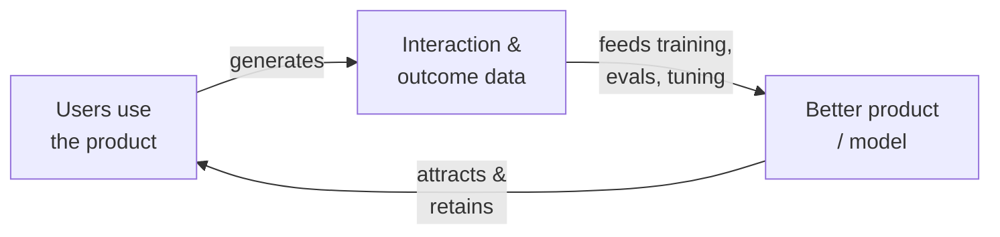
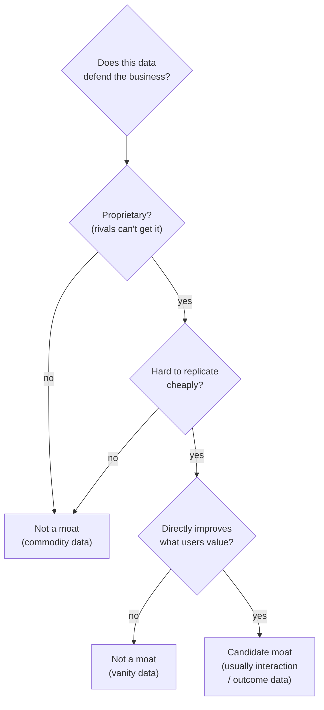

# Data moats and feedback loops

## The problem it solves

An AI product manager (PM) is asked the same question in every strategy review and every investor meeting: **once your product works, what stops a competitor from copying it?** For most of software history the answer was some mix of network effects, switching costs, and brand. But AI features have a specific vulnerability — the intelligence often lives in a [foundation model](../foundations/pretraining-vs-posttraining.md) that your rival can rent from the same provider you do. If your smart feature is "we call the same model everyone else calls," you have a product, not a moat. Anyone with an API (Application Programming Interface) key and a weekend can stand up the same thing.

So the industry reached for the one asset a competitor *can't* rent: **proprietary data, compounding through use.** The pitch is seductive and everywhere — "our data is our moat." The trouble is that the pitch is usually wrong. Most data is not a moat, and a PM who can't tell the difference between a real data advantage and a data-hoarding story will defend the wrong strategy in the room. This lesson is about which data actually defends a business, and the mechanism — the feedback loop — that makes it compound.

## The one analogy to remember

**The picture:** a **footpath worn across a field.** The first person to cross tramples a faint line in the grass. Because there's a faint line, the next person naturally follows it — and their steps deepen it. Because it's deeper, more people choose it over the untrodden grass, and each one wears it further. Eventually there's a clear path everyone uses, and the field beside it stays wild.

**The mapping:** the field with no path = a cold-start product no one uses yet; each person walking = a user generating usage data; the line getting deeper = the product improving from that data; more people choosing the deeper path = more usage flowing to the better product; the wild grass beside it = a competitor with no traffic and so no path forming.

**Why it holds:** the path gets better at being a path *only because* people walk it, and it attracts walkers *only because* it's already better — the improvement and the usage feed each other. That is exactly the mechanism of a data flywheel: usage produces data, data improves the product, the better product pulls more usage. The moat isn't the dirt; it's the **self-reinforcing loop** a latecomer can't shortcut, because they'd have to conjure the footfalls that carved yours.

**Say it like this:** "A real data moat is a footpath: it gets deeper the more people walk it, and its depth is what makes them walk it instead of the field — so a rival can't copy the path, only start trampling their own from scratch."

*Where it breaks:* a footpath forms from *any* footfall, but a product moat only compounds from data that actually teaches the product something a competitor lacks — plain foot traffic ("we have millions of users") deepens nothing if you never capture what worked. The analogy makes the loop vivid but flatters how automatic it is.

## The data flywheel: what it is and why it's the most-cited moat

The **data flywheel** (also called a data feedback loop) is a self-reinforcing cycle: usage generates data, that data is used to improve the product or the model, the better product attracts more usage, and around again. Each turn makes the next turn easier. A flywheel is a heavy wheel that's hard to start spinning but, once moving, stores momentum and takes less effort to keep going — hence the name.

The reason it dominates the "what's your AI moat?" conversation is that it's the one advantage that **compounds and is self-widening.** A feature can be copied. A price can be undercut. But a competitor entering a year late doesn't just need to build what you built — they need to *replay a year of accumulated usage* they never had, while you keep pulling further ahead each day. If your product is genuinely getting better from data your rival can't obtain, the gap grows on its own. That's a moat with the rare property of widening while you sleep.

But note the load-bearing word: *if.* The flywheel is real, and it's also the most oversold concept in AI strategy. The rest of this lesson is the "if."

## Why most data is not a moat

Here is the claim that separates a serious answer from a pitch-deck answer: **having a lot of data is not, by itself, a competitive advantage.** For data to defend a business it has to clear three bars at once, and most data clears none of them:

- **Proprietary** — you have it and competitors can't easily get it. Data you scraped from the public web, bought from a vendor who'll sell it to anyone, or that sits in a public dataset is available to every rival too. Volume doesn't help if it's commodity volume.
- **Hard to replicate** — a competitor can't cheaply reconstruct it. If a well-funded rival could regenerate equivalent data in a month, your "moat" is a speed bump.
- **Directly improves the product** — more of it measurably makes the thing users care about better. Data that never feeds back into quality is a storage cost, not an asset.

There's a fourth, subtler bar that trips up AI products specifically. **The frontier base model may already "know" your domain.** Foundation models are pretrained on enormous swaths of human text ([pretraining](../foundations/pretraining-vs-posttraining.md) is where that broad knowledge is baked in). If your proprietary corpus is generic domain content — general legal explainers, common medical facts, standard code patterns — the base model likely absorbed equivalents already, so feeding it yours adds little. Your data only moves the needle where it teaches the model something the base model *doesn't* have.

That last point reframes where the moat actually lives. It is almost never the raw content you hold. It's the **unique interaction and outcome data**: what your users actually did, which option they chose, whether the result worked, what they edited, what they abandoned. A competitor can scrape a million legal documents; they cannot scrape *which drafts your users accepted, which clauses they rewrote, and which contracts later got disputed.* That behavioral, outcome-linked data is proprietary by construction, expensive to replicate, and directly improves the product — it's the grass only your footfalls can flatten.

## Capturing the feedback: implicit vs. explicit signals

If the moat is outcome data, the PM's real job is designing the product so it *captures* that data as a natural byproduct of use — not by nagging users for it. Feedback signals come in two flavors, and understanding the tradeoff is core PM craft.

**Explicit feedback** is when the user deliberately tells you: a thumbs-up/down, a star rating, a "was this helpful?" survey. It's clean and unambiguous — you know exactly what they meant — but it's *sparse* (most people never click it) and *biased* (the angry and the delighted respond; the satisfied majority stays silent).

**Implicit feedback** is behavior you observe without asking: did they click the suggestion, accept the generated draft, edit it heavily before using it, copy the answer, dwell on it, or immediately rephrase and try again? It's *abundant* — every interaction emits it — but *noisy*, because you're inferring intent from action (a user might accept a mediocre answer just to move on). A coding assistant learns far more from "the developer kept this suggestion and shipped it unchanged" than from any thumbs-up, because acceptance-and-ship is an outcome, not an opinion.

The strong products lean on implicit outcome signals precisely because they scale with usage and can't be faked by a competitor without the same usage. That captured signal is not the end of the pipeline — it's the fuel for training and evaluation. Preference comparisons feed [RLHF (Reinforcement Learning from Human Feedback)](../model-behavior-training/rlhf.md), where "users preferred A over B" becomes a training signal; accepted-vs-rejected outputs become data for [fine-tuning](../model-behavior-training/fine-tuning.md) a model on your domain; captured domain content and corrected answers become retrieval knowledge for [RAG (Retrieval-Augmented Generation)](../retrieval-knowledge/rag.md) and raw material for iterating your prompts; and every captured outcome becomes a case in your [evaluation set / golden set](../evaluation/evaluation-methods.md) so you can tell whether the next model version is actually better. *How* those pipelines turn the data into a better model is their own topic — the moat lesson's point is that the flywheel is only as strong as the signal you capture to feed them, and that capturing it well is a **product design decision**, not an ML afterthought. (Systematically capturing production signals is also the domain of [observability](../production-ops/observability.md), and the specific dashboards and metrics belong to [AI product metrics](ai-product-metrics.md).)

## The cold-start problem: no users, no data, no advantage

The flywheel's cruelty is at the beginning. A flywheel at rest has no momentum: **no users means no data, which means no advantage, which means nothing to attract the first users.** The moat you're counting on doesn't exist yet, and worse, the product is at its *weakest* exactly when you most need it to be compelling. This is the **cold-start problem**, and it's why "our data flywheel will make us defensible" is a claim about the future that can't pay this quarter's rent.

Teams bootstrap past it several ways, and a PM should be able to name them:

- **Lean on the base model.** Modern foundation models are good enough that a product can be genuinely useful on day one with *zero* proprietary data — the flywheel then improves it from there. This is often the honest answer: you don't need the moat to launch, you need it to *stay ahead*.
- **Seed with existing or bought data.** Bootstrap the first version with public datasets, licensed data, or hand-labeled examples to clear the "useful enough to attract users" bar, then transition to compounding on real usage.
- **Design for capture from day one.** Instrument the product so that the moment users arrive, their outcomes are captured. A flywheel that only *starts* collecting data after you notice you need it has wasted its early, hardest-won usage.
- **Give the wheel a hard first push.** Manual effort, expert-in-the-loop, or a narrow initial use case where even a little data compounds fast, until the loop can spin on its own.

## Failure modes: when the loop turns against you

A feedback loop is a control system, and control systems can oscillate, drift, or blow up. The same self-reinforcement that builds the moat can amplify problems just as compoundingly.

**Self-reinforcing error / bias amplification.** If the product's output shapes user behavior, and that behavior becomes your training data, errors feed themselves. A recommender that over-shows one category teaches users to click that category, which "proves" they prefer it, which trains it to show even more — a bias the loop entrenches rather than corrects. The loop doesn't discover truth; it amplifies whatever it started leaning toward. (This is a core [responsible-AI](../safety-trust/responsible-ai.md) concern, where fairness and bias are treated directly.)

**Model collapse from training on your own outputs.** As AI systems increasingly generate the content that later becomes training data, there's a documented degradation — often called **model collapse** — where a model trained on the outputs of AI models (including earlier versions of itself) drifts toward blandness, loses the rare cases in the tails of the distribution, and gets progressively worse. If your "feedback loop" is quietly recycling the model's own generations as if they were fresh human signal, you're not compounding an advantage — you're photocopying a photocopy. The defense is keeping genuine human outcomes in the loop and knowing which of your data is human-origin.

**Vanity data.** The most common failure isn't dramatic — it's data that accumulates impressively and never feeds back into anything. Petabytes of logs nobody trains or evaluates on. It looks like a moat on a slide and defends nothing. The test is brutal and simple: *does this data measurably make the product better, and can you point to where?* If not, it's a storage bill wearing a moat costume.

**Privacy and consent limits.** You often legally cannot use user data the way the flywheel assumes. Consent, purpose limitation, regulated data, and personally identifiable information constrain what you may train on and retain — and treating protected user data as free training fuel is both a legal and a trust hazard. A moat strategy that ignores these is a liability strategy in disguise. (The rules and mechanics live in [privacy and PII (Personally Identifiable Information)](../safety-trust/privacy-pii.md).)

## The PM lens: designing for the flywheel, and calling the bluff

Two jobs sit squarely with the PM here. The first is **designing the product so it captures the compounding data as a byproduct of normal use** — the acceptances, edits, and outcomes that fuel the loop should be logged automatically, framed as a first-class product requirement, not bolted on later. If capturing the outcome requires the user to do extra work, you'll capture almost none of it.

The second is **telling a real moat from a data-hoarding story** — including when the story is coming from your own leadership. When someone says "our data is our moat," the PM's job is to interrogate it against the three bars: Is it proprietary, or could a rival get equivalent data? Is it hard to replicate, or could a funded competitor regenerate it? Does it *demonstrably* improve the product, or is it vanity data? And does the base model already know this domain, making the data marginal? A data advantage that survives all four questions is worth defending. One that doesn't is a comforting narrative — and mistaking the narrative for the moat is how companies over-invest in collection and under-invest in the thing that would actually differentiate them. (Whether to build this capability in-house or buy it is [build vs. buy](build-vs-buy.md); how data defensibility trades off against speed and cost is the [iron triangle](iron-triangle.md).)

## Summary / Points to Remember

- A **data flywheel** is the self-reinforcing loop *usage → data → better product → more usage.* It's the most-cited AI moat because, unlike a feature or a price, it **compounds and widens on its own** — a latecomer has to replay usage they never had.
- **Most data is not a moat.** To defend a business, data must be **proprietary, hard to replicate, and directly improve the product** — commodity or scraped data fails, and if the **frontier base model already knows your domain**, generic data adds little.
- The moat usually lives in **unique interaction and outcome data** — what users did and whether it worked (accepted, edited, disputed) — not in raw content a rival could also scrape.
- Capture the loop with **implicit signals** (clicks, acceptances, edits, dwell, task completion — abundant but noisy) over **explicit** ones (thumbs, ratings — clean but sparse and biased). That captured signal is what feeds [RLHF](../model-behavior-training/rlhf.md), [fine-tuning](../model-behavior-training/fine-tuning.md), and your eval set — capturing it well is a **product design decision**.
- **Cold start** is the flywheel's weakness: no users → no data → no edge, right when the product is weakest. Bootstrap by leaning on the base model, seeding with existing data, and instrumenting for capture from day one.
- Failure modes: **self-reinforcing bias**, **model collapse** from training on your own AI outputs, **vanity data** that never feeds back, and **privacy/consent** limits on using user data. The self-reinforcement that builds the moat also amplifies errors.
- PM job: **design the product to capture flywheel data as a byproduct of use**, and **call the bluff** on a data-hoarding story by testing it against the three bars plus "does the base model already know this?"

## Interview Questions That Stump People

**Q: "We're sitting on tons of data — isn't that our moat?"**

**Interviewer:** We've got years of accumulated data, way more than any startup. That's our defensibility, right?

**You:** Usually not, and it's worth being precise about why, because "we have a lot of data" is the most oversold moat in AI. Volume isn't the test. For data to actually defend us it has to clear three bars: it has to be *proprietary* — something competitors genuinely can't get, not scraped or bought data they could buy too; it has to be *hard to replicate* — a funded rival couldn't cheaply regenerate an equivalent; and it has to *directly improve the product* in a way we can point to. Most large data piles fail at least one — they're commodity content, or they're logs nobody trains or evaluates on. There's a fourth trap specific to AI: if we're building on a frontier foundation model, that model was pretrained on huge swaths of public text, so if our data is generic domain content, the base model largely already knows it and ours adds little at the margin. Where we'd actually have a moat is if buried in that pile is unique *interaction and outcome* data — what our users did and whether it worked — that a competitor can't scrape and that measurably lifts quality. So my answer is: let's not assume the volume is the moat; let's audit which slice of it is proprietary, unreplicable, and demonstrably improving the product. That slice is the moat. The rest is a storage bill.

> [!TIP]
> **Why this answer works:** The question is bait — the expected answer is an enthusiastic "yes," and agreeing marks you as someone who's absorbed the pitch without the nuance. The strong move is to refuse "volume = moat" and replace it with the three bars plus the base-model trap, then relocate the real moat to interaction/outcome data. Ending on a concrete action (audit which slice qualifies) turns a contrarian take into something the business can act on, which is what separates a skeptic from a strategist.

---

**Q (clarify-back): "Should we invest heavily in building a data flywheel for this product?"**

**Interviewer:** There's a proposal to spend big on data infrastructure so we build a defensible flywheel. Do we greenlight it?

**You (clarify back):** Before I answer — is the data the flywheel would collect something a foundation model can't already do well, or are we mostly wrapping a capable base model where generic usage data wouldn't teach it much?

**Interviewer:** Honestly, the base model already handles the core task well. The usage data would be fairly generic.

**You:** Then I'd push back on a heavy flywheel investment right now. A flywheel only compounds into a moat if the captured data teaches the product something the base model lacks — if the base model already nails the task and our data is generic, we'd be spending big to collect signal that barely moves quality. That's the vanity-data trap dressed up as strategy. What I *would* fund is cheap instrumentation to capture unique outcome data — did users accept, edit, or abandon results — so if a genuinely proprietary signal emerges we're already capturing it. But I'd tie the big infrastructure spend to evidence that a specific slice of data measurably improves the product, not to the general hope that "more data = moat." If the answer had been the opposite — the base model is weak here and our interaction data clearly lifts quality — then yes, invest early, because that's exactly the case where the flywheel compounds and starting late means replaying usage we can't get back.

> [!TIP]
> **Why this works:** "Should we build a flywheel?" has opposite answers depending on one hidden variable — whether the captured data teaches the model something the base model doesn't already know — and answering immediately would expose you as someone applying "flywheels are good" as a blanket rule. Clarifying that variable signals you understand the base-model trap is what decides flywheel value. The final recommendation splits cleanly (cheap capture always, heavy spend only on evidence), which shows you can size an investment to the actual defensibility rather than the narrative.

---

**Q: "Our recommendation model keeps getting more confident and our engagement metrics keep rising — the flywheel's working, right?"**

**Interviewer:** Every retrain on fresh usage data, the model doubles down harder on certain content and engagement ticks up. That's the loop compounding in our favor, isn't it?

**You:** That pattern is also the exact signature of a self-reinforcing bias loop, so I wouldn't celebrate yet. Here's the risk: the model's outputs shape what users see, users can only click what they're shown, and those clicks become the next round of training data. So if the model started leaning toward one type of content, it shows more of it, users click it because it's what's in front of them, and that "proves" the preference and trains it to lean even harder. Engagement can rise while the model is actually narrowing — entrenching its own bias rather than discovering what users truly prefer. The loop doesn't find truth; it amplifies whatever it started tilted toward. To tell a healthy flywheel from a degenerating one, I'd look past aggregate engagement at things a bias spiral would hide: are we still surfacing diverse content, how does the model perform on a held-out set that isn't contaminated by its own past choices, and are we measuring outcomes rather than just clicks. If it turns out we're also retraining partly on the model's own generated outputs, I'd flag model-collapse risk on top of the bias. Rising engagement is necessary but nowhere near sufficient evidence the loop is healthy.

> [!TIP]
> **Why this answer works:** The trap is treating a rising metric as proof the flywheel is compounding value — when the identical symptom (more confidence, more engagement) is what bias amplification looks like from the inside. Naming the causal loop (outputs shape behavior → behavior becomes training data → bias entrenches) shows you understand feedback loops as control systems that can degrade, not just virtuous cycles. Proposing diagnostics that a bias spiral would hide (diversity, uncontaminated held-out eval, outcomes over clicks) turns the caution into something testable, which is the senior move.

---

**Q: "Why not just train our model on its own outputs to make the flywheel spin faster without waiting for users?"**

**Interviewer:** We could generate synthetic data from our own model at scale and train on it — why wait for slow real usage?

**You:** Because that specific move is how you get model collapse. There's a documented degradation when a model is trained on the outputs of AI models — including earlier versions of itself: it drifts toward the average, loses the rare cases in the tails of the distribution, and gets progressively worse with each generation, like photocopying a photocopy. The reason is that the model's outputs are a *lossy* reflection of the real world — they under-represent the edges — so training on them concentrates that loss and compounds it. The whole point of a data flywheel is that real usage injects *fresh, human-origin signal* the model didn't already contain — genuine outcomes, real edge cases, actual preferences. Synthetic self-generated data has none of that novelty; it can only recycle what the model already believes. Now, synthetic data isn't uniformly bad — it can be useful for bootstrapping or augmentation when it's carefully filtered and mixed with real data. But as a substitute for real usage to "spin the flywheel faster," it's counterfeit fuel: it makes the wheel look like it's turning while the product quietly degrades. I'd keep genuine human outcomes as the core of the loop and track what fraction of our training data is actually human-origin.

> [!TIP]
> **Why this answer works:** The question is a tempting shortcut, and a shallow answer either accepts it or rejects it without a mechanism. Naming model collapse and explaining *why* — outputs are a lossy, tail-collapsing reflection, so recycling them compounds the loss — shows you understand what the flywheel's real fuel actually is (fresh human signal, not recycled model belief). The measured nuance (synthetic data has legitimate filtered uses) keeps you from sounding dogmatic, and the closing metric (track the human-origin fraction) makes it actionable.

---

**Q: "A competitor launched the same feature we did, and they're catching up fast. What happened to our data moat?"**

**Interviewer:** We were first, we had the data lead, and yet a rival matched us within months. Where did the moat go?

**You:** The most likely answer is that we never had a data moat — we had a data *story*. A real moat compounds because the data we collect is proprietary, unreplicable, and directly improves the product in a way a competitor can't shortcut. If a rival caught up in months, one of those was false: probably the intelligence was mostly coming from a shared foundation model both of us can rent, and our data was either commodity content they could also obtain or generic enough that the base model already knew it — so our "lead" added little on top of what anyone gets out of the box. The tell is the speed: a genuine flywheel forces a latecomer to replay usage they can't get, so they fall further behind, not catch up. Catching up fast means the data wasn't the thing carrying the product. What I'd do now is find whether there's any slice of unique *interaction and outcome* data — what our users did and whether it worked — that we're uniquely positioned to capture and that actually lifts quality, and make capturing that a first-class product requirement. If no such slice exists, then honestly our defensibility has to come from somewhere other than data — distribution, integrations, switching costs — and I'd rather name that clearly than keep funding a moat that isn't forming.

> [!TIP]
> **Why this answer works:** The instinct is to explain how the moat "eroded," which concedes a moat existed. The stronger diagnosis is that the fast catch-up is *evidence* there was no real data moat — a genuine flywheel makes latecomers fall behind, not catch up, so the symptom itself is the tell. Distinguishing a shared-base-model product from a true data advantage shows you know where AI defensibility actually comes from, and being willing to say "then our moat has to come from somewhere other than data" signals intellectual honesty over defending a comfortable narrative.
