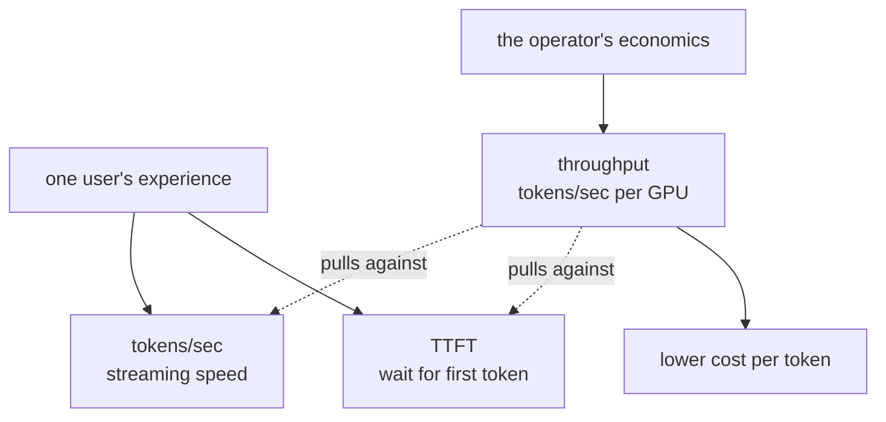
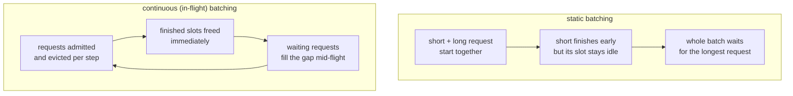
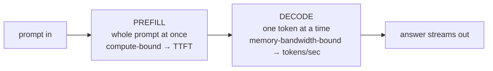
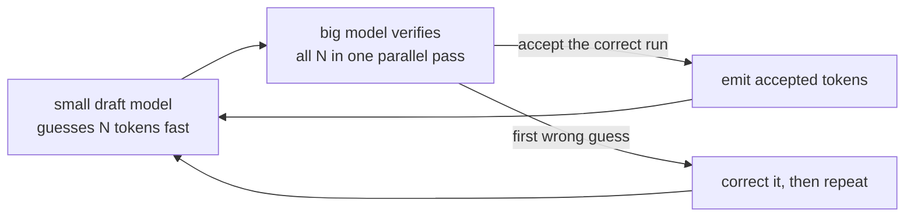
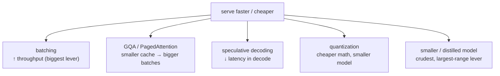

# Inference optimization

## The problem it solves

Your team ships a feature backed by a large language model (LLM). It works in the demo. Then two numbers land on your desk and refuse to leave. The first is a stopwatch: a user hits enter and waits — sometimes a second, sometimes five — before a single word appears, and the product feels broken even though the answer is correct. The second is a bill: each GPU (graphics processing unit — the specialized chip that runs the model) you rent costs a few dollars an hour whether it serves one user or a hundred, and at your current usage the monthly total makes the feature hard to justify.

Here is the trap. The obvious fix for the stopwatch — give every user their own dedicated slice of the machine so nothing slows them down — is the *most expensive* thing you can do, because the GPU sits mostly idle between requests and you pay for the idle. And the obvious fix for the bill — pack as many users as possible onto each GPU — can make every individual user wait longer. Latency and cost are not two independent dials; turning one usually moves the other.

**Inference optimization** is the set of techniques for serving the *same model* faster and cheaper by attacking that tension directly — squeezing more useful work out of each GPU without wrecking the experience of any one user. The focus here is making the model itself serve efficiently; the system *around* it (queues, routing, autoscaling, fallbacks) is [production architecture](production-architecture.md), and the money math is [cost and unit economics](cost-unit-economics.md). What a product manager (PM) needs is not the low-level GPU programming — it's a clear map of which knob trades latency for cost, and when to reach for each.

## The one analogy to remember

**The picture:** a highway during rush hour. You care about two completely different things depending on who you are. If you're one driver, you care about *your* trip time — how long from on-ramp to exit. If you run the highway, you care about *throughput* — how many cars get through per hour across all lanes. Carpool lanes, metering lights, and packing more cars onto the road all raise cars-per-hour, but they don't necessarily make any single trip faster — and some of them make an individual trip slower.

**The mapping:** one car's door-to-door trip time = **latency** for one user's request; cars-through-per-hour = **throughput** (total tokens served across all users); adding lanes and filling every lane = **batching** (packing many users' requests through the GPU together); the highway itself = one expensive GPU you're renting whether it's full or empty; an empty highway = a GPU sitting idle, which is money burned.

**Why it holds:** a GPU, like a highway, has a largely *fixed* capacity you pay for regardless of how full it is, so the route to low unit cost is keeping it full — high throughput — and the route to a snappy individual experience is low latency, and those two goals pull against each other exactly the way "get *my* car through fast" pulls against "get the *most* cars through." The analogy is faithful because both systems share the core economic fact: the resource is paid-for-in-advance and its efficiency is measured by utilization.

**Say it like this:** "There are two speeds that matter — how fast *your* car gets through, and how many cars the road moves per hour. Serving an AI model cheaply means keeping the road packed, and a packed road can slow down any one car. That's the whole tradeoff."

*Where it breaks:* cars are interchangeable and travel the road once; LLM requests differ wildly in length, and a long request occupies the "road" for thousands of steps, which is why the clever batching tricks below exist and simple carpooling doesn't fully capture them.

## The two numbers that fight each other

Everything in inference optimization is a negotiation between two metrics. Naming them precisely is the first thing that separates a fluent answer from a vague one.

**Latency** is how long one user waits, and it splits into two parts that feel completely different to a user:

- **Time to first token (TTFT)** — the pause from pressing enter to the *first* word appearing. This is dead air; it's the part that makes a product feel slow or broken.
- **Inter-token latency**, usually reported as its inverse, **tokens per second (TPS)** — how fast words stream out *after* the first one. Comfortable reading speed is only tens of tokens per second, so once you clear that bar, going faster buys diminishing returns.

**Throughput** is how much total work the system does across *all* users at once — total tokens generated per second, per GPU. This is the number that drives your bill, because cost is roughly (GPUs rented × time) ÷ (tokens served), so more tokens per GPU means a lower cost per token.

The tension in one sentence: **cheaper almost always means higher throughput, and the standard way to raise throughput — packing more work onto each GPU — tends to raise individual latency.** A PM who can't state that tension will pick a "make it faster" goal that silently triples the bill, or a "make it cheaper" goal that quietly makes every user wait.

> [!NOTE]
> **Token** — the unit an LLM reads and writes, roughly a word-piece; a short reply is tens of tokens, a long one thousands. Both latency and throughput are measured in tokens because that's the model's actual unit of work. Tokens get their own treatment in [tokenization](../foundations/tokenization.md); here they're just the currency both metrics are denominated in.

## Batching: the biggest throughput lever, and why it costs latency

A GPU is a massively parallel machine — thousands of arithmetic units that are happiest doing the *same* operation on lots of data at once. Serving a single user's request leaves most of those units idle, like a twelve-lane highway with one car on it. **Batching** is running many users' requests through the GPU *together*, in one pass, so those parallel units are actually used. This is the single largest lever on throughput — it's the difference between a GPU that's 5% utilized and one that's 80% utilized, and utilization is what your unit cost tracks.

The naive form, **static batching**, waits to collect a fixed group of requests, runs them all together start-to-finish, and only then accepts the next group. It has two ugly failure modes. First, if requests trickle in, early arrivals sit waiting for the batch to fill — pure added latency. Second, and worse, LLM responses finish at wildly different lengths: put a 20-token answer and a 2,000-token answer in the same static batch and the short one is *done* almost immediately but its slot stays occupied, idle, until the long one finishes. The highway leaves a lane empty for the whole trip because one car exited early.

**Continuous batching** (also called **in-flight batching**) fixes this. Instead of locking a batch start-to-finish, the server works at the granularity of a single generation step: after each step it evicts requests that just finished, frees their slots, and admits waiting requests *mid-flight*. The batch is constantly reshuffled so the GPU stays packed. This is the optimization that made high-throughput LLM serving practical, and it's why serving engines are built around it.

The tradeoff never fully disappears, though: a bigger batch means each generation step does more work, so it takes slightly longer, which nudges up every user's inter-token latency. And a request may wait a beat to be admitted, nudging up TTFT. Batching trades a little of each user's latency for a lot of the operator's throughput — usually a great trade, which is exactly why it's the default, but a trade nonetheless. Push batch size too high chasing cost and users start to feel the drag.

## Why one fix doesn't cover the whole request: prefill vs. decode

Different optimizations target different moments in a request because a request has two phases with fundamentally different bottlenecks. The full mechanism is owned by [KV caching](../prompting/kv-caching.md) — read it for *why* — but the one-line version you need here is:

- **Prefill** processes your entire prompt at once. All the tokens are known, so it happens in parallel and is **compute-bound** — limited by the GPU's raw arithmetic. Prefill is what sets **TTFT**.
- **Decode** generates the answer one token at a time. It's sequential and **memory-bandwidth-bound** — limited not by arithmetic but by how fast the GPU can shuttle the growing internal state (the key-value cache, or KV cache) in and out of memory. Decode is what sets your **tokens per second**.

Why a PM should hold this: it tells you which complaint maps to which fix. "Long pause before anything appears" is a prefill/compute problem — shorten the prompt, or reuse a repeated prefix via [prompt caching](../prompting/prompt-caching.md). "It streams too slowly" is a decode/memory problem, addressed by the cache-shrinking and draft-model techniques below. Some serving stacks even physically **split prefill and decode onto different GPUs** (disaggregation) so a burst of long prompts doesn't stall everyone's streaming. The point isn't the internals; it's that "make it faster" is two different projects wearing one sentence.

## The intuition-level toolbox

Beyond batching, a handful of techniques each attack a specific bottleneck. A PM doesn't turn these knobs — the infra team does — but should know what each one buys and what it costs.

**KV-cache optimizations — the memory-pressure fix.** During decode, the bottleneck is the memory bandwidth spent hauling the KV cache around, and the cache itself grows with every token and every concurrent user — so it's often the thing that limits how big a batch you can run, which caps throughput. Two families ease this. **PagedAttention** manages the cache in small reusable blocks the way an operating system pages memory, so you waste almost nothing to fragmentation and can pack in more concurrent requests — more effective batching, more throughput. **Grouped-query attention (GQA)** and its extreme cousin **multi-query attention (MQA)** let multiple attention heads *share* one set of keys and values instead of each keeping its own, shrinking the cache by a large factor for a small quality cost — which is why most modern models are trained with GQA. (The mechanics of keys, values, and the cache live in [KV caching](../prompting/kv-caching.md); here the point is simply that a smaller cache means bigger batches and higher throughput.)

**Speculative decoding — spend spare compute to cut latency.** Recall that decode is *memory*-bound, which means the GPU's arithmetic units are actually sitting idle between memory fetches. Speculative decoding exploits that: a small, cheap **draft model** rapidly guesses the next several tokens, and the big, expensive model then *verifies* them all in a single parallel pass — the kind of pass it's fast at. Whatever the draft got right (often most of it, on easy stretches like boilerplate) is accepted at once; the first wrong guess is corrected and the process repeats. The output is *identical* to what the big model would have produced alone — verification guarantees it — but you generate several tokens per expensive step instead of one, so tokens-per-second climbs. The cost is added complexity and some wasted work when the draft guesses badly.

**Quantization — cheaper arithmetic and a smaller footprint.** Running the model's numbers at lower precision (say 8-bit or 4-bit instead of 16-bit) makes each operation cheaper and the model smaller in memory, which raises throughput and can lower latency. As an inference lever it's one of the highest-leverage single changes, but it trades against quality and must be measured. The mechanism — what precision is and how it's reduced — is [quantization](../model-behavior-training/quantization.md); here it's simply one of the knobs.

**Model choice — the crudest and often the best lever.** Before any of the above, the biggest cost and latency swing is *which model you run*. A smaller model, or one **distilled** from a big one (a small model trained to mimic a large one — see [distillation](../model-behavior-training/distillation.md)), can be many times cheaper and faster per token. The catch is capability: it may not be good enough for the hardest queries, which is why production systems often *route* — a small model for the easy majority, a big one for the rest. This is the lever with the largest dynamic range, and the one most often overlooked because it feels like giving up rather than optimizing.

## Hardware and utilization: why "cheaper" is really "keep the GPU full"

Under all of this sits one economic fact. A GPU is a fixed, expensive, rented resource — you pay by the hour regardless of load — so the *cost per token* is almost entirely a function of **utilization**: how much useful work you extracted from each GPU-hour you paid for. Every technique above is ultimately in service of utilization. Batching raises it directly. Cache optimizations raise it by allowing bigger batches. Quantization and smaller models raise it by fitting more work (or more concurrent requests) onto the same chip. This is why throughput and cost are almost the same conversation, and why an under-loaded GPU is the most expensive way to serve.

That framing also decides a strategic question PMs face: **self-host vs. managed API.** A managed API (you call a provider's endpoint) hands *all* of these optimizations — batching, cache management, hardware, quantization — to the provider, who amortizes a full GPU across many customers' traffic. You get low operational burden and, usually, good utilization you didn't have to earn, but you give up fine control and pay a per-token price. Self-hosting hands you *all* the knobs in this lesson, which is worth it only when your volume is high and steady enough to keep your own GPUs full — because a self-hosted GPU that's half-idle costs more per token than the API you were trying to beat. The deciding variable is your traffic: high and steady favors self-hosting's control; spiky or modest favors the API's shared utilization. The dollar mechanics are [cost and unit economics](cost-unit-economics.md); the broader cost/latency/quality balance is the [iron triangle](../product-strategy/iron-triangle.md).

## Summary / Points to Remember

- Two metrics fight: **latency** (one user's wait — split into **TTFT**, the pause before the first token, and **tokens/sec**, the streaming speed after) versus **throughput** (total tokens/sec per GPU, which sets your cost). PM framing: "make it faster" and "make it cheaper" pull in opposite directions — decide which you're buying.
- **Batching** — running many requests through the GPU together — is the biggest throughput lever, and **continuous (in-flight) batching** is the version that made high-throughput serving practical by freeing finished slots mid-flight instead of waiting for the longest request. PM framing: it trades a little of each user's latency for a lot of the operator's throughput.
- A request has two phases with different bottlenecks — **prefill** (compute-bound, sets TTFT) and **decode** (memory-bandwidth-bound, sets tokens/sec) — so a latency complaint maps to different fixes depending on which phase it's in. The mechanism lives in [KV caching](../prompting/kv-caching.md). PM framing: "make it faster" is two projects, not one.
- The toolbox: **GQA/MQA and PagedAttention** shrink the KV cache so batches can grow; **speculative decoding** (a draft model proposes, the big model verifies) cuts decode latency with identical output; **quantization** makes the math cheaper; **smaller/distilled models** are the crudest, largest-range lever. PM framing: these are the infra team's knobs — know which trades latency for cost.
- Cost per token is really **GPU utilization** — a rented GPU is paid-for whether full or idle, so "cheaper" means "keep it full." PM framing: an under-loaded GPU is the most expensive way to serve.
- **Self-host vs. managed API** turns on your traffic: high and steady enough to keep your own GPUs full favors self-hosting's control; spiky or modest traffic favors the API's shared utilization. PM framing: don't take over the knobs unless you can keep the road packed.

## Interview Questions That Stump People

**Q: "Our infra team turned on bigger batches and our GPU bill dropped — but users are complaining it feels sluggish. What happened?"**

**Interviewer:** Batching cut our cost per token nicely, yet the app feels slower now. Explain that.

**You:** That's the latency-throughput tradeoff showing up exactly as expected. Bigger batches raise throughput — more tokens per GPU-hour — which is why the cost per token fell. But each generation step now processes more requests at once, so each step takes a bit longer, which slows every user's token stream; and a request may wait slightly longer to be admitted to a batch, which adds to time-to-first-token. So you bought lower cost with a little of everyone's latency. The fix isn't to abandon batching — it's to cap batch size at the point where latency stays within your user-experience budget, and lean on cache optimizations so you can keep a healthy batch without the cache forcing it smaller. The real question is what your TTFT and tokens-per-second targets are, and to tune batch size to hit those rather than maximizing throughput blindly.

> [!TIP]
> **Why this answer works:** It names the exact mechanism (more requests per step → longer steps → slower streaming) instead of hand-waving "batching has downsides," and it refuses the false choice of turning batching off. Framing the resolution as "tune batch size to a latency budget" signals you understand these are dials to balance, not switches to flip — which is the PM-level insight the question is fishing for.

---

**Q: "Speculative decoding uses a second model to generate — doesn't that risk changing or degrading the output?"**

**Interviewer:** If a small draft model is producing tokens, aren't you trading quality for speed?

**You:** No — and this is the elegant part. The draft model only *proposes*; the big model *verifies* every proposed token in a single parallel pass and rejects anything it wouldn't have produced itself. So the final output is mathematically identical to what the big model would have generated alone — the draft model can't inject its own quality, only its guesses, and wrong guesses are simply discarded. What you're actually exploiting is that decode is memory-bandwidth-bound, so the big model's arithmetic units are idle between memory fetches; verifying several tokens at once uses that idle compute. The tradeoff isn't quality — it's added system complexity and some wasted work when the draft guesses poorly, so the speedup is largest on predictable text and smallest on hard, surprising content.

> [!TIP]
> **Why this answer works:** The trap is assuming a second model in the loop must dilute quality — the same intuition that's correct for, say, model routing but wrong here. Stating that verification makes the output *identical*, and explaining *why* the trick pays off (idle compute during memory-bound decode), shows you understand the mechanism rather than the buzzword. Naming the real cost — complexity and variable payoff — keeps you honest.

---

**Q (clarify-back): "Should we self-host our model to cut costs, or stay on the managed API?"**

**Interviewer:** We're spending a lot on API calls. Should we bring the model in-house to save money?

**You (clarify back):** What does our traffic look like — is it high and steady enough to keep a GPU busy around the clock, or is it spiky and still fairly modest?

**Interviewer:** It's pretty spiky — heavy during business hours, almost nothing overnight.

**You:** Then self-hosting probably *raises* your cost, not lowers it. The reason the API is expensive per token is also the reason it's efficient: the provider packs many customers onto each GPU and keeps it full, so you're renting a slice of a well-utilized machine. If you self-host with spiky traffic, you either provision for the peak — and pay for idle GPUs all night — or provision low and fall over at peak. A rented GPU that's half-idle costs more per token than the API you're trying to beat. Self-hosting wins when your volume is high and steady enough that *you* can keep the GPU full and reclaim the margin the provider was taking. So I'd keep the API for now and revisit if usage grows into a steady, high floor.

> [!TIP]
> **Why this works:** "Self-host to save money" sounds obviously right and is often wrong, because the deciding variable — utilization, driven by traffic shape — isn't in the question. Clarifying it signals you know the API's cost is really the cost of *shared, high utilization*, and that you don't inherit that for free by moving in-house. Once "spiky and modest" is on the table, the recommendation follows directly, and it shows you optimize for cost per token, not the sticker price of the API.

---

**Q: "Time-to-first-token is bad but streaming is fine. Where do you look first — and why isn't it the same fix as slow streaming?"**

**Interviewer:** There's a long pause before anything appears, but once it starts, it streams smoothly. Where do you start?

**You:** A slow first token is a *prefill* problem, and prefill is compute-bound — the model is chewing through your entire prompt before it can emit anything. So the levers are prompt-side: shorten the prompt, and if a large chunk of it is stable across calls — a system prompt, a long instruction block — turn on prompt caching so that prefix's work is reused instead of recomputed every request. What I would *not* do is reach for the decode-side tools, because streaming is already fine. If the complaint were the opposite — smooth start, slow stream — that's decode, which is memory-bandwidth-bound on the KV cache, and there the fixes are cache-shrinking like grouped-query attention or speculative decoding. The reason it's not one fix is that the two phases are throttled by different resources — compute versus memory bandwidth — so optimizing the wrong one spends effort where there's no bottleneck.

> [!TIP]
> **Why this answer works:** It maps the symptom to the phase (pause = prefill) and the phase to its bottleneck (compute), then prescribes the matching lever — and, crucially, explains why the decode-side tools would be wasted effort here. Knowing that prefill and decode are bound by *different* resources, so they need different fixes, is precisely the distinction interviewers use to tell someone who has served a model from someone who has only read about one.

---

**Q: "If continuous batching is strictly better than static batching, why do we still talk about the latency cost of batching at all?"**

**Interviewer:** Continuous batching fixes the idle-slot problem — so is there still a latency downside, or did we solve it?

**You:** Continuous batching solves a *specific* waste — finished requests holding slots idle while the batch waits for the longest one — by freeing and refilling slots every step. That's a big win, but it doesn't repeal the underlying physics: however the batch is assembled, running more requests together means each generation step does more work and therefore takes marginally longer, which raises every user's inter-token latency. It also can't eliminate the small wait to be admitted to a batch. So continuous batching removes the *egregious* latency waste, not the *fundamental* tradeoff. The honest framing is that batching still trades a little per-user latency for a lot of throughput — continuous batching just makes that trade far more efficient, so you get more throughput for less latency cost than static batching, not zero cost.

> [!TIP]
> **Why this answer works:** "Strictly better" is bait — the strong move is to distinguish which problem continuous batching actually solves (idle-slot waste) from the one no batching scheme can escape (bigger batches, slower steps). Candidates who think continuous batching made the tradeoff disappear reveal they've memorized the term without the physics. Separating the fixable waste from the irreducible tradeoff is the mark of understanding.
