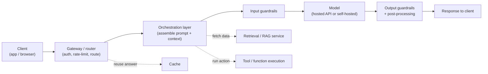
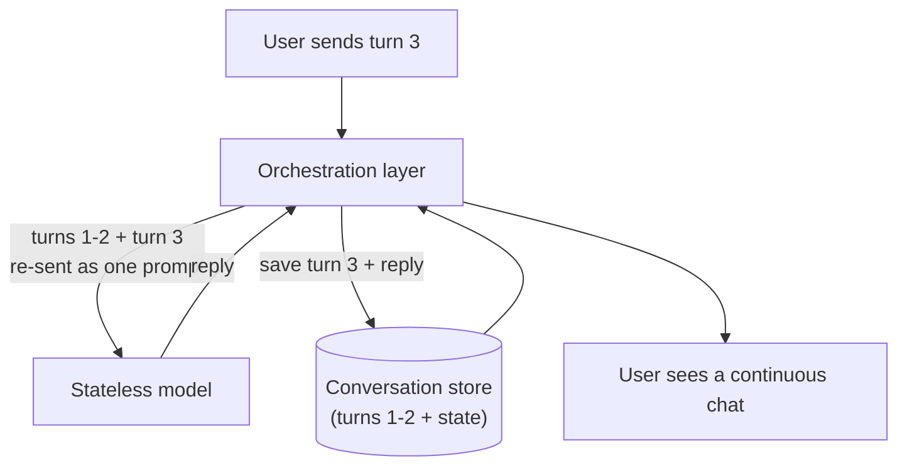
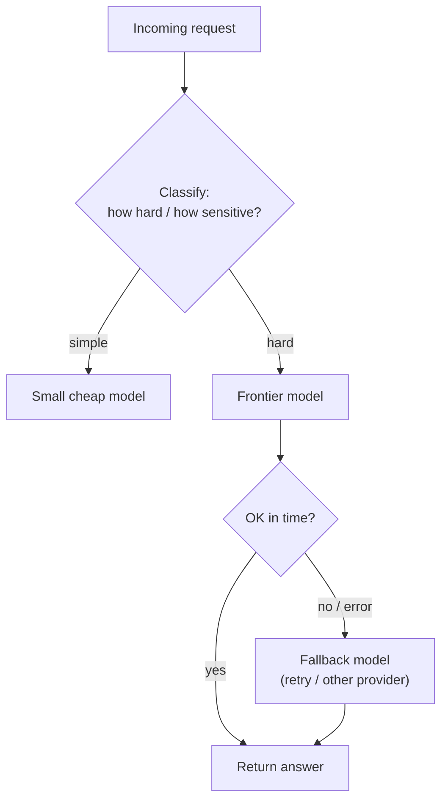

# Production LLM architecture

## The problem it solves

A prototype is one line of code: send a prompt to an API, print the reply. It demos beautifully, so a stakeholder asks the obvious question — "great, ship it." Then reality arrives. Who is allowed to call it, and how do you stop one user hammering it a thousand times a minute? Where does the last turn of the conversation live, since the model forgot it the instant it replied? What happens when the provider has an outage at 2pm on launch day? How does the model see your company's data, which it was never trained on? Who catches the answer that leaks a customer's phone number before it reaches the screen? None of those questions are about the model. They are about everything *around* the model — and that is where nearly all the engineering, cost, latency, and failure of a real LLM (Large Language Model — the AI that generates text) feature actually lives.

The thesis of this lesson: **a production LLM feature is a system, not an API call.** The model is one component wired into a larger operation — a gateway, an orchestration layer, retrieval, tools, caches, guardrails, queues. A product manager who thinks the model *is* the product will misjudge every timeline, budget, and outage. The model is the engine; the rest is the aircraft.

## The one analogy to remember

**The picture:** a commercial airport. The jet parked at the gate is a marvel, but it flies nobody anywhere on its own. It needs a control tower sequencing takeoffs, gate agents checking who is allowed to board, a baggage system routing luggage, fuel trucks, ground crew, and a backup plan when the assigned plane goes out of service. The aircraft is one moving part inside a large, coordinated operation.

**The mapping:** the aircraft = the model (the thing everyone points at); the control tower routing and sequencing traffic = the **gateway/router** (auth, rate-limiting, deciding which model handles a request); the gate agents assembling each passenger's boarding pass, seat, and connections = the **orchestration layer** (assembling the prompt, pulling in context and tools); the baggage and catering feeding the flight = **retrieval and tool execution** (getting the right data and actions to the model); security screening at entry and exit = **guardrails** (checking input and output); and a spare aircraft when the first is grounded = **model fallback** (failover to another provider when one is down).

**Why it holds:** the airport exists because the expensive, capable machine at the center is useless without a system that gets the right people, data, and safety checks to it and handles the moment it fails — which is *exactly* why a production LLM is mostly the code around the model, not the model. In both cases the headline component is a small fraction of the operation, and the operation is what determines whether anyone actually gets where they are going.

**Say it like this:** "The model is the plane. A production AI feature is the whole airport — control tower, gate agents, baggage, fuel, and a spare plane for when one breaks. Most of the work is the airport, not the plane."

*Where it breaks:* an airport's components are largely independent, whereas an LLM system's components all funnel into and out of one shared, stateless model on nearly every request — so the model is more of a constant bottleneck than any single airport subsystem is.

## A production request is a lifecycle, not a call

The mental upgrade a PM needs is to stop seeing "call the model" and start seeing a **request lifecycle**: a request enters the system, passes through several stages that each do a job, reaches the model, and then more stages shape what comes back before the user sees anything. The model call is one stop in the middle.

Each stage earns its place by solving a problem the model can't solve for itself. Walk them in order and the architecture stops looking like decoration and starts looking necessary.

**The gateway / router — the front door.** Every request hits this first. It authenticates the caller (are you allowed in?), enforces **rate limits** (a cap on how many requests one caller can make in a window, so one user or a runaway script can't exhaust your capacity or your budget), and decides *which* model should handle this request — a small cheap model for easy calls, a frontier model for hard ones. It is also where you attach a request ID for tracing and where a shared answer can be served from a cache instead of paying for the model at all. Without a gateway you have no control over who consumes what, and cost and abuse run unbounded.

**The orchestration layer — the part that does the real work.** This is the application logic, and it is where most of your engineering actually lives. The model receives only what you put in its context window, so *someone* has to build that context on every single request: take the user's message, stitch in the system prompt, pull in the last few conversation turns, call the retrieval service if the answer needs private data, expose the available tools, and assemble it all into the final prompt. Then it calls the model, and if the model asks to use a tool, the orchestration layer executes that tool and feeds the result back. This layer is the gate agent building each passenger's complete boarding package — and it is why "just call the API" undersells the work by an order of magnitude.

> [!NOTE]
> **Context window** — the model's working memory: the fixed amount of text (prompt plus everything you inject) it can consider at once for a single request. It has its own lesson ([context windows](../foundations/context-windows.md)); here it matters only as the reason the orchestration layer must *assemble* the input every time — the model sees nothing you don't place in that window.

**Retrieval and tools — reaching outside the model.** The model knows only what it was trained on, which excludes your company's data and anything that happened after training. So the orchestration layer calls a **retrieval service** to fetch relevant passages from your own documents and injects them into the prompt — the discipline of doing this well is [RAG (Retrieval-Augmented Generation)](../retrieval-knowledge/rag.md), its own lesson. Separately, when the model needs to *act* — look up a live order, send a query, book something — the orchestration layer runs a **tool** on its behalf, the subject of [tool calling](../agents/tool-calling.md) and, for multi-step autonomy, [agentic systems](../agents/agentic-systems.md). Architecturally the point is the same: these are separate services the surrounding system owns and calls, not things the model does by itself.

**Guardrails — screening on the way in and out.** A safety layer checks the *input* (is this a [prompt injection](../safety-trust/ai-security.md) or an abusive request?) and the *output* (does the answer leak private data, contain something harmful, or violate policy?) before it reaches the user. This is [guardrails](../safety-trust/guardrails.md) as its own lesson; in the architecture it is the screening at both doors, and it exists because you cannot trust a probabilistic model to always behave — you need a deterministic checkpoint around it.

**Post-processing.** The raw model output is often not the final answer. You may need to parse it into a strict format, validate it, strip or transform parts, or render it. The system shapes the model's text into whatever the client actually consumes.

## The model is stateless — the system has to remember

Here is the single fact that reorganizes how a PM thinks about this: **the model is stateless.** It remembers nothing between calls. Each request is judged entirely on the text you hand it right then; the moment it replies, it forgets everything. The "conversation" a user experiences is an illusion maintained *entirely by the surrounding system*, which stores the history and re-sends the relevant parts on every turn.

This is why memory, session state, and personalization are *system* responsibilities, never model features. If your product needs to remember a user across sessions, that lives in a database you own and re-inject; the model contributes nothing durable. ([Agent memory](../agents/agent-memory.md) covers the strategies for what to store and re-send.) The interview-grade way to say it: *the model is a pure function of its input — same-ish input, same-ish output, no side memory — so every stateful thing your product does is built in the system around it.*

## Routing and fallback — why there is rarely just one model

A mature system does not wire itself to a single model. Two forces push toward **multi-model routing**. First, cost and fit: an easy classification or a short rewrite is wasteful on a frontier model, so the router sends easy work to a small cheap model and reserves the expensive one for genuinely hard requests. Second, reliability: providers have outages, get slow, or rate-limit *you*. If your product can only speak to one model and that model is down, your product is down.

So production systems build **fallback**: if the primary model errors or times out, retry, then fail over to a secondary — often a different provider entirely — so a single vendor's bad afternoon does not become your outage.

For a PM this is a strategic point, not a plumbing detail: routing is where the cost curve is bent (see [cost & unit economics](cost-unit-economics.md)) and fallback is what turns "we depend on one vendor" into "we degrade gracefully when a vendor fails." *How* the model itself is made fast and cheap — batching, smaller weights, serving tricks — is a different lesson ([inference optimization](inference-optimization.md)); this lesson is only about the routing decision at the architecture level.

## Reliability: everything that isn't the happy path

The demo shows the happy path. Production is mostly the unhappy ones, and the system is what stands between them and the user.

- **Provider outages and slowness.** External model APIs are dependencies you don't control. The defenses are **timeouts** (don't wait forever), **retries** (with backoff, since a retry storm can make an overload worse), and **fallback** to another model as above.
- **Long-running work needs queues.** Some jobs — summarizing a hundred documents, a long agentic run — take too long to answer in a single web request. The system hands those to a **queue** and processes them **asynchronously** (the user gets "we'll notify you," not a spinning page that times out). Chat, by contrast, is usually streamed token-by-token so the user sees progress immediately.
- **Graceful degradation.** When something fails, a good system does the least-bad thing rather than erroring out: serve a [cached](../prompting/prompt-caching.md) or slightly stale answer, drop to a cheaper model, or return a partial result with an honest note — instead of a blank error page.
- **Caching for cost and speed.** Repeated or near-repeated requests can be served from a cache rather than re-billed to the model. (This is distinct from the model-internal [KV caching](../prompting/kv-caching.md) and provider-side [prompt caching](../prompting/prompt-caching.md), which those lessons cover — here it's the application-level cache in front of the whole call.)

Watching all of this in production — traces, latency, error rates, cost per request — is its own discipline, [observability](observability.md); this lesson is about the components, that one is about seeing them work.

## Summary / Points to Remember

- **A production LLM feature is a system, not an API call.** The model is one component; the gateway, orchestration, retrieval, tools, caches, guardrails, and queues around it are where most of the engineering, cost, latency, and failure surface live.
- The request is a **lifecycle**: client → gateway (auth, rate-limit, route) → orchestration (assemble prompt, call retrieval/tools) → input guardrails → model → output guardrails + post-processing → response.
- Each component exists to solve something the model can't: the **gateway** controls who gets in and which model runs; the **orchestration layer** builds the context on every request (the real bulk of the work); **retrieval/tools** reach outside the model; **guardrails** screen input and output; **queues** handle long jobs.
- **The model is stateless** — it remembers nothing between calls. Every conversation, session, and personalization feature is maintained by the surrounding system re-sending stored history; memory is never a model feature.
- Mature systems use **multi-model routing** (easy/cheap vs. hard/expensive) and **fallback** (fail over when a provider errors or is slow), so cost is controlled and one vendor's outage isn't yours.
- PM framing: *don't budget or plan around the model — budget and plan around the airport you have to build so the plane can fly.*

## Interview Questions That Stump People

**Q: "The demo was one API call and it worked. Why is the team now quoting me three months to ship it?"**

**Interviewer:** Engineering showed me a working prototype in an afternoon. Now they say production is a quarter of work. What changed?

**You:** Nothing about the model changed — everything around it appeared. The prototype was the happy path: one call, one user, no data, no failures. Production has to answer the questions the demo skipped. Who's allowed to call it and how do we stop abuse — that's a gateway with auth and rate limits. Where does the conversation live, since the model forgets every turn — that's a state store the app re-sends each request. How does it see our data — that's a retrieval service. What happens when the provider has an outage on launch day — that's fallback to a second model. Who catches a bad or leaky answer before the user sees it — that's guardrails on input and output. And then long jobs need queues, and everything needs monitoring. The model was one afternoon; the *system* around it is the quarter. The demo was the plane; we're being asked to build the airport.

> [!TIP]
> **Why this answer works:** The trap is to sound defensive or vague ("production is just harder"). Naming the specific components and tying each to a concrete question the demo didn't answer shows you understand *where* the work is, not just that there is work. The plane/airport image gives a non-technical exec a durable mental model for why "it demoed in an afternoon" and "it's a quarter to ship" are both true.

---

**Q: "If we add a good memory feature, does that mean we should fine-tune the model on each user's history?"**

**Interviewer:** We want the assistant to remember users across sessions. Is that a model training problem?

**You:** No — and the reason is that the model is stateless, so memory was never going to be a model property in the first place. The model is a pure function of the text you hand it on a given call; it retains nothing afterward. "Memory" in a product is the *system* storing a user's history in a database and re-injecting the relevant parts into the prompt on the next turn. Fine-tuning bakes in general behavior and style, not per-user facts, and you'd never retrain a model per user per new fact — it's the wrong tool, absurdly expensive, and slow to update. So a memory feature is a storage-and-retrieval design in the surrounding system: decide what to remember, store it, fetch and re-send it. The model just reads what we place in front of it.

> [!TIP]
> **Why this answer works:** It catches the most common architectural misconception — that capabilities like memory live "in the model." Anchoring on statelessness (the model retains nothing) explains *why* memory must be a system feature, and distinguishing fine-tuning (general behavior) from per-user facts (state) shows you know what each mechanism is actually for. That distinction is exactly what separates a PM who understands the stack from one repeating buzzwords.

---

**Q (clarify-back): "A vendor outage took us down for two hours last week. How do we make sure that never happens again?"**

**Interviewer:** Our model provider had an outage and our feature was dead for two hours. How do we prevent that?

**You (clarify back):** Before I answer — is the feature interactive chat where a user is waiting on each response, or is it background processing where a short delay is acceptable? The right defense is different for each.

**Interviewer:** It's the live chat feature — users are actively waiting.

**You:** Then the answer is architectural, not a promise to the vendor. First, don't depend on a single provider: put a router in front that can fail over to a second model — ideally a different vendor — when the primary errors or times out, so one company's outage becomes a degraded experience instead of a dead one. Second, set aggressive timeouts with retries and backoff so we're not hanging on a slow provider. Third, design graceful degradation: if all models are struggling, serve a cached answer where we can, or an honest "try again in a moment" rather than a blank error. Since it's live chat, I'd prioritize the fast failover and streaming so the user sees *something* quickly. What I wouldn't do is promise it'll never happen — external APIs are dependencies we don't control, so the goal is to make their failure survivable, not impossible.

> [!TIP]
> **Why this works:** "Make sure it never happens again" is a trap — you can't guarantee a third party's uptime, and promising to would signal naivety. Clarifying interactive-vs-background is the senior move because it changes the design (a batch job can just retry later; live chat needs instant failover). The strong answer reframes from "prevent" to "make survivable" and names the concrete mechanisms — fallback, timeouts, graceful degradation — showing you treat the provider as an uncontrollable dependency, which is the correct mental model.

---

**Q: "Where does most of our latency and cost actually come from — isn't it just the model being slow and expensive?"**

**Interviewer:** When users complain the feature is slow or when the bill spikes, is that the model?

**You:** Often it's not *only* the model — and assuming it is sends you optimizing the wrong thing. Trace a single request and the time and money are spread across the system. Latency: retrieval has to run before the model can even start, tool calls each add a round trip, guardrail checks add steps at both ends, and if you're chaining multiple model calls the delays stack. Cost: every token you *assemble into the prompt* is billed, so a bloated context — huge retrieved passages, a long system prompt, full conversation history re-sent every turn — can cost more than the answer itself, and multi-step or agentic flows multiply calls. So the honest answer is "let's look at the trace." Sometimes the fix is a faster or cheaper model, but just as often it's trimming what we inject, caching repeated calls, or routing easy requests to a small model. The system is where the cost and latency are shaped, so that's where I'd look first.

> [!TIP]
> **Why this answer works:** The naive view treats the model as the sole cost/latency center; the strong answer shows cost and latency are properties of the *whole request path*. Calling out that assembled context is billed per token — and that history is re-sent every turn — demonstrates you understand the economics of the surrounding system, and "let's look at the trace" signals you diagnose before optimizing rather than blaming the model reflexively.

---

**Q: "Why not just let the client call the model API directly and skip building all this middle layer?"**

**Interviewer:** Every hop we add is complexity. Why can't the app just talk to the model API?

**You:** Because the moment the client calls the model directly, you lose every control point that makes the thing safe, affordable, and functional — and you expose things you can't expose. Your API key would have to ship to the client, where anyone can extract it and run up your bill on their own. You'd have no place to enforce auth or rate limits, no place to inject your private data via retrieval, no place to screen input or output for safety, no place to route or fall back when the provider fails, and no place to keep conversation state. The middle layer isn't ceremony — each hop is a control point that exists precisely because the model is an untrusted, stateless, single-vendor black box. Skipping it doesn't remove the complexity; it just moves it to a place where you can't manage it and can't secure it.

> [!TIP]
> **Why this answer works:** It resists the seductive "less is simpler" framing by showing that the middle layer isn't overhead — each hop is a *capability or control* you can't get any other way, starting with the concrete security disaster of a leaked client-side key. Framing the model as "untrusted, stateless, single-vendor" ties every component back to a first principle, which is what turns a list of boxes into an argument for why the architecture has to exist.
