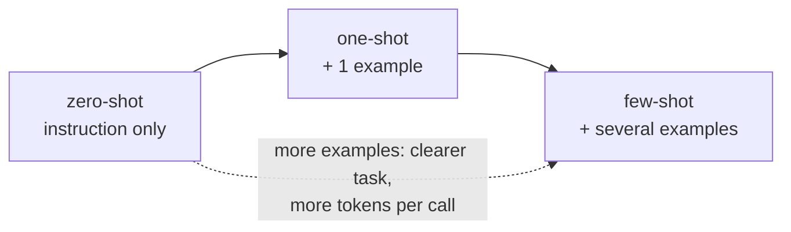
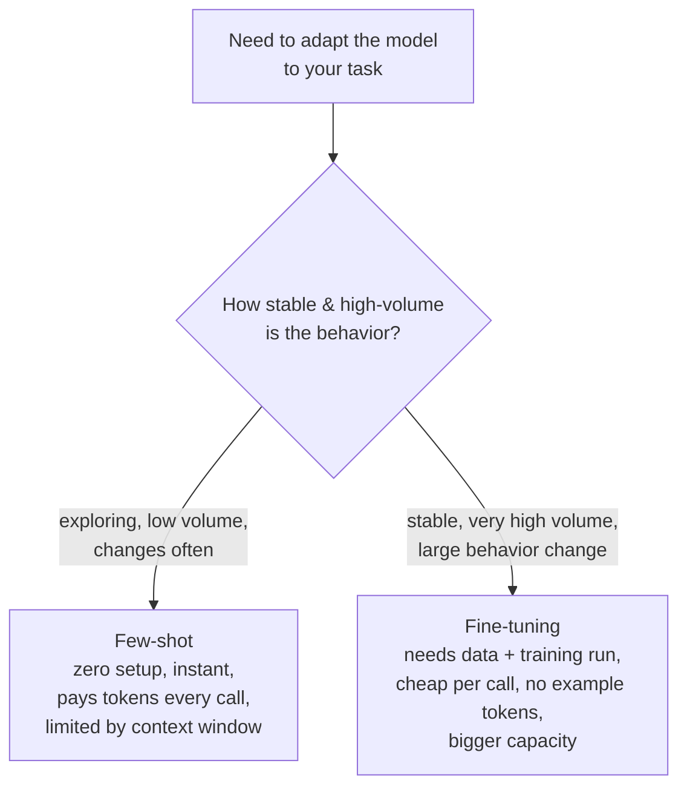

# Few-Shot and In-Context Learning

## The problem it solves

You have a task in mind — classify support tickets into your six internal categories, extract dates in a specific format, rewrite text in your brand's voice. The model is perfectly capable of the underlying skill, but it doesn't know *your* exact flavor of it: which six categories, which date format, what "your brand's voice" means. You could try to *describe* all of that in words (an instruction), but some things are painful to specify and trivial to demonstrate. Explaining your tone in a paragraph is hard; showing three examples of it is easy.

For most of machine learning's history, getting a model to do *your* specific task meant collecting a labeled dataset and running a training job — hours or days of work before you could see a single result. The startling discovery that arrived with large language models is that you often don't need any of that. You can just *put a few examples of the task, done correctly, directly in the prompt*, and the model will pick up the pattern and continue it — with no training, no data pipeline, no weight changes, and results in seconds. That ability is **in-context learning**, and doing it by supplying examples is **few-shot prompting**. It collapsed "adapt a model to a task" from a training project into a prompt edit, and it's the reason you can prototype a new AI feature in an afternoon.

## The one analogy to remember

**The picture:** You hand a sharp new temp worker a stack of already-completed forms and say, "Do the rest of the pile like these." You don't send them on a training course. They glance at the three finished examples, infer the pattern — what goes in each field, the format, the tone — and start filling in blank forms the same way. Take the examples off the desk and next week they won't remember a thing about it; and if your sample forms are sloppy or inconsistent, they'll faithfully copy the sloppiness.

**The mapping:** the completed example forms = the few-shot examples (each one a "shot") you put in the prompt; the temp inferring the pattern from them = **in-context learning**; "no training course" = no weight updates, nothing permanently changed in the model; the blank form they then fill = your actual query; forgetting it once the examples are gone = in-context learning is *ephemeral*, confined to that one prompt; copying sloppy samples = the model imitates the format **and** the flaws of your examples.

**Why it holds:** few-shot genuinely changes the model's output using nothing but what's sitting in the [context window](../foundations/context-windows.md), with the model's weights completely frozen — exactly like the temp adapting from desk samples without any permanent learning. The "learning" happens only in the model's transient processing of that one prompt, not in the model itself.

**Say it like this:** "Few-shot prompting is like handing a temp a few completed examples and saying 'do the rest like these' — they copy the pattern without ever being trained, and forget it the moment the examples are taken away."

*Where it breaks:* you can *tell* a temp a brand-new fact and they'll use it; few-shot examples mostly convey the *shape* of the task — format, style, the kind of answer — not durable new knowledge. It's demonstrating, not really educating.

## The vocabulary: zero-shot, one-shot, few-shot

The "shot" is a single worked example of the task included in the prompt. The count gives you the spectrum:

- **Zero-shot** — no examples, just an instruction: "Classify this ticket as billing, bug, or feature request." You're relying entirely on the model's general ability plus your description.
- **One-shot** — exactly one example before the real input.
- **Few-shot** — a handful of examples (typically 2–8) before the real input.

The whole point of moving rightward is to remove ambiguity: each example silently communicates the format, the label set, the level of detail, and the tone, all at once, in a way instructions often can't. The cost of moving rightward is tokens — every example is sent (and paid for) on every call.

## In-context learning: what's actually happening

The term for the underlying phenomenon is **in-context learning (ICL)**: the model adjusts its behavior based on information in the prompt, *at inference time, without any change to its weights.* This is worth dwelling on because the word "learning" misleads people. Nothing is learned in the permanent sense — no gradient descent, no updated parameters, no new training. The instant the request is over, the model is exactly as it was; the next request starts from scratch. The adaptation lived entirely in that one forward pass over that one prompt.

Why can a model do this at all? The honest answer has a solid part and an open part. The solid part: during [pretraining](../foundations/pretraining-vs-posttraining.md), the model saw enormous quantities of *patterned* text, so "continue the established pattern" is precisely what next-token prediction is built to do. When you lay down three input→output examples and start a fourth input, the single most probable continuation is an output that matches the pattern — so the model produces it. Few-shot prompting essentially hijacks the model's pattern-completion instinct and points it at your task.

The open part: *exactly how* in-context learning works mechanistically is still an active area of research, and you should not state any single explanation as settled fact. There are credible hypotheses (that the model is doing something loosely analogous to on-the-fly adjustment inside its [attention](../foundations/attention.md) layers), but they're hypotheses. The safe, accurate framing for an interview is: "It emerges from large-scale pretraining as a pattern-completion ability; the precise internal mechanism is still debated." Claiming certainty here is a tell that you've over-read a blog post.

## What few-shot is good at — and what it isn't

The sharp mental model: **few-shot examples teach the model the *task and format*, far more than they teach it *facts*.**

Good uses — showing beats telling:

- **Pinning down output format** — if you need JSON with specific keys, or a particular date style, two examples nail it more reliably than a paragraph of description.
- **Fixing the label set** — showing examples labeled only with your six categories steers the model to use exactly those, not invent its own.
- **Conveying hard-to-describe style or tone** — brand voice, level of formality, how terse to be.
- **Disambiguating a fuzzy task** — where the instruction alone leaves too much open, examples resolve it.

Poor uses — where few-shot is the wrong tool:

- **Injecting large bodies of new knowledge.** A few examples can't teach the model your entire product catalog or the latest news; that's what [retrieval-augmented generation (RAG)](../retrieval-knowledge/rag.md) is for. Examples shape *how* it answers, not *what it knows*.
- **Permanently changing behavior at scale.** If you need the same behavior on millions of calls, paying to resend the examples every single time is wasteful — that's the case for [fine-tuning](../model-behavior-training/fine-tuning.md), below.

## Few-shot vs. fine-tuning: the decision that matters

Both few-shot prompting and [fine-tuning](../model-behavior-training/fine-tuning.md) adapt a model to your task, and interviewers love making you choose. The difference is *where the adaptation lives*: few-shot puts it in the **prompt** (temporary, resent every call); fine-tuning bakes it into the **weights** (permanent, no prompt cost).

The tradeoffs to say out loud:

- **Few-shot:** zero setup, instant to change, flexible — but every example is sent on every request, so it **inflates token cost and latency on each call** and competes for [context window](../foundations/context-windows.md) space. Great for prototyping and low-to-moderate volume.
- **Fine-tuning:** a real project (you need labeled data and a training run) — but once done, the behavior is in the weights, so calls are shorter and cheaper and you can encode more than fits in a prompt. Worth it when the task is **stable and high-volume**.

The break-even logic: few-shot's per-call token overhead is trivial at low volume and crippling at high volume. So the classic path is *prototype with few-shot, and if it works and traffic grows, consider fine-tuning to stop paying the example tax on every request.* (One thing that softens that tax: because the examples are a stable prefix, [prompt caching](prompt-caching.md) can make resending them much cheaper — which sometimes lets few-shot stay competitive longer than the naive cost math suggests.)

## The subtlety: your examples *are* the spec, and the model is fussy about them

Few-shot is not "throw in some examples and relax." The examples function as your specification, and the model is sensitive to them in ways that surprise people:

- **Bad examples poison the output.** A single mislabeled example, or examples with inconsistent formatting, teaches the model the wrong pattern. Garbage demonstrations, garbage completions.
- **Selection matters.** Examples that are relevant to the actual input, and that cover the range of cases (including tricky ones), work better than random or one-sided ones.
- **Order can matter.** Models can be sensitive to the *sequence* of examples — there are known biases toward the format or label seen most recently or most frequently in the example set. If nearly all your examples share one label, the model may over-predict that label.
- **More is not linearly better.** Beyond a handful, extra examples give diminishing returns while steadily adding token cost and context pressure — and can even dilute focus. The right number is usually "the fewest that make the task unambiguous," not "as many as fit."

The takeaway a PM should carry: treating example curation as a throwaway step is the most common way few-shot underperforms. The examples deserve the same care as the instructions.

## Summary / Points to Remember

- A **"shot" is one worked example** in the prompt. **Zero-shot** = instruction only; **few-shot** = a handful of examples before the real input. Moving toward more shots removes task ambiguity at the cost of tokens.
- **In-context learning** is adapting behavior from the prompt *at inference time with weights frozen* — nothing is permanently learned; it's ephemeral to that one request. The word "learning" is misleading.
- It works because pretraining makes the model a **pattern-completer**, so it continues the input→output pattern you set up. The *precise mechanism is still debated* — don't state one as fact.
- Few-shot teaches the **task and format, not facts.** For new knowledge use [RAG](../retrieval-knowledge/rag.md); to bake in stable high-volume behavior use [fine-tuning](../model-behavior-training/fine-tuning.md).
- **Few-shot vs. fine-tuning** hinges on volume and stability: few-shot is zero-setup but **pays example tokens on every call**; fine-tuning is a project but **cheap per call**. Prototype with few-shot; fine-tune when it's stable and high-volume ([prompt caching](prompt-caching.md) can defer that switch).
- **Your examples are your spec.** The model is sensitive to example quality, selection, and even order (recency/majority-label biases); a mislabeled or inconsistent example degrades output. Use the fewest examples that make the task unambiguous.

## Interview Questions That Stump People

**Q: "When we give the model few-shot examples, are we training it on them?"**

**Interviewer:** So each time we send examples, the model gets a little better at the task — it's learning from them, right?

**You:** No, and the distinction is important. Few-shot examples don't change the model at all — no weights are updated, nothing is stored. That's in-context learning: the model adapts its output purely from what's in the prompt during that one forward pass, and the moment the request ends it's back exactly as it was. The next request knows nothing about the last one's examples. So it's not "learning" in the training sense; it's pattern-completion at inference time. If we wanted the examples to actually persist in the model so we didn't have to resend them, that's a different thing entirely — fine-tuning, which does update the weights.

> [!TIP]
> **Why this answer works:** The word "learning" invites the false picture that few-shot accumulates or trains the model. Stating plainly that the weights are frozen and the effect is ephemeral shows you understand the mechanism, not just the term. Naming fine-tuning as the actual "make it persist" option demonstrates you know where the boundary is — a boundary a lot of people blur.

---

**Q (clarify-back): "We need the model to handle our ticket classification. Few-shot or fine-tune it?"**

**Interviewer:** Classify incoming support tickets into our categories. Do we prompt with examples or fine-tune a model?

**You (clarify back):** Two things decide it for me: what's the request volume — hundreds a day or millions? — and how settled is the category scheme, or is it still changing?

**Interviewer:** Very high volume, and the categories have been stable for over a year.

**You:** Then this leans toward fine-tuning. With stable categories and huge volume, few-shot would mean prepending the same example set to every single request forever — you'd pay for those example tokens millions of times over, and eat context and latency on each call. Fine-tuning bakes the task into the weights: shorter prompts, lower per-call cost, and it handles high volume cleanly. I'd still *start* with few-shot to validate that the task works and to generate labeled data cheaply, then fine-tune once we've confirmed it and the scheme is locked. If instead you'd told me the categories change every few weeks, I'd stay on few-shot — re-fine-tuning constantly is a treadmill, and prompt edits are instant.

> [!TIP]
> **Why this works:** "Few-shot or fine-tune" has no answer without volume and stability, so answering immediately would be reciting a rule. The two clarifying variables are exactly the ones that flip the decision — high-volume-and-stable is the textbook fine-tune case, volatile-or-low-volume is the few-shot case. Adding "prototype with few-shot first, then fine-tune" shows you sequence it in practice rather than treating it as a one-shot pick.

---

**Q: "Can we use few-shot to give the model up-to-date information it doesn't know — like our current pricing?"**

**Interviewer:** The model's knowledge is stale. Can we just put a few examples in the prompt to teach it our latest pricing?

**You:** Few-shot is the wrong tool for that, and it's a common mix-up. Examples teach the model the *shape* of a task — the format, the style, how to structure an answer — not a body of facts. A handful of pricing examples won't reliably install your whole current price list; the model will pattern-match the format and still get specific numbers wrong. What you actually want is to put the real, current information into the prompt as *content* the model reads and uses — which at any scale means retrieval, RAG, so the model answers *from* the fetched pricing data rather than from memory. Few-shot could still help *format* the pricing answer nicely, but the facts have to come from retrieved context, not from examples.

> [!TIP]
> **Why this answer works:** It nails the core misconception — conflating "shape the task" with "supply knowledge." Separating the two, and correctly routing new/current facts to retrieval while keeping few-shot for formatting, shows you understand what each technique is actually for. That "format vs. facts" line is the crisp distinction that signals real command rather than buzzword-matching.

---

**Q: "We added more examples to improve accuracy and it got *worse*. How is that possible?"**

**Interviewer:** More examples should mean more signal. Why would accuracy drop when we added some?

**You:** A few things could cause that, and they're all classic few-shot pitfalls. First, example *quality and consistency* — if the ones you added were mislabeled or formatted differently from the rest, you taught the model a conflicting pattern, and even a single bad example can drag output off. Second, *label balance and order* — models are sensitive to the distribution and sequence of examples; if the added ones skewed heavily toward one label, the model can start over-predicting that label, and there are known recency and majority biases in how examples are weighted. Third, you may have hit *diminishing returns while adding noise* — past a handful, extra examples rarely help and can dilute focus while consuming context. So I'd audit the new examples for correctness and consistency first, check the label balance, and honestly test whether fewer, cleaner, more representative examples do better — they often do.

> [!TIP]
> **Why this answer works:** The naive assumption is "more examples = more accuracy," monotonically. Explaining the three real mechanisms — bad-example poisoning, label/order sensitivity, diminishing returns — shows you know few-shot is a fussy specification, not a volume knob. Recommending "fewer but cleaner" as the fix is the counterintuitive, experienced move that separates you from someone who'd just keep piling on examples.
