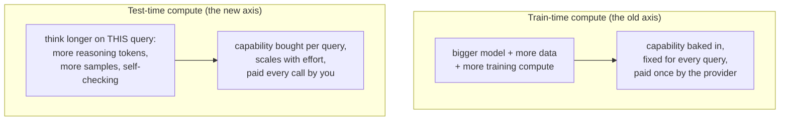
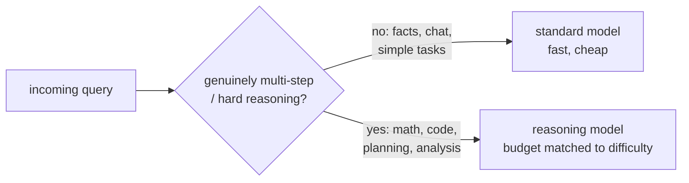

# Reasoning Models and Test-Time Compute

## The problem it solves

For years there was essentially one recipe for a smarter model: **scale up training.** More parameters, more data, more compute spent during [pretraining](../foundations/pretraining-vs-posttraining.md). That axis works, but it has two painful properties — it's astronomically expensive, and it's a *one-time* bet the model provider makes before anyone ever sends a query. Once training is done, the model's capability is fixed. Every question, easy or fiendish, gets the same fixed amount of computation: one forward pass per token, answer streamed out. A trivial "what's the capital of France" and a brutal competition-math problem are treated identically. That's obviously wasteful on the easy end and *insufficient* on the hard end — some problems simply need more thinking than a single pass can provide, no matter how well the model was trained.

**Test-time compute** is the recognition that there is a *second* axis for getting better answers: spend more computation **at inference time** — while answering the specific question — rather than only at training time. Let the model think longer, explore more paths, check its own work, on *this* problem. The previous lesson showed the seed of this: [chain-of-thought](chain-of-thought.md) works precisely because generating reasoning tokens is more compute spent on the problem. Test-time compute is that idea promoted to a **scaling principle** — a knob you can turn per query, trading money and latency for capability, entirely separate from how the model was trained.

**Reasoning models** are the class of models built to exploit that axis well. They are models specifically *post-trained to produce long, effective reasoning* before answering — and, just as important, to know *how much* to think and *how* to think (break down, backtrack, verify) rather than merely emitting more words. The paradigm shift interviewers are probing: capability is no longer only something you *bake in at training*; it's also something you can *buy at inference*, and reasoning models are the models designed to make that purchase pay off.

## The one analogy to remember

**The picture:** There are two ways to get better at chess. One is to *study for years* — openings, endgames, thousands of games. The other is, in the game itself, to *take more time on the current move.* The same player is far stronger in a classical game (minutes per move, deep calculation) than in a blitz game (seconds per move, snap decisions). And a player who has specifically *trained* to calculate deeply gets far more out of a long clock than a casual player would.

**The mapping:** the years of study = training compute (pretraining and post-training); the clock time you spend on *this* move = test-time compute / the thinking budget for *this* query; blitz (a few seconds) = answering immediately in one pass; classical (long clock) = extended reasoning; a player *trained* to use a long clock well = a **reasoning model**; the specific tough position on the board = a hard query.

**Why it holds:** it's literally two distinct levers on the same skill — preparation versus in-the-moment calculation — which is exactly the train-time-vs-test-time-compute distinction. And it captures the non-obvious catch: a player who never practiced deep calculation barely improves with a longer clock. That's *why you have to train* reasoning models rather than just telling any model to "think longer" — the ability to use inference-time thinking effectively is itself a trained skill, not a free switch.

**Say it like this:** "There are two dials for a better answer — how much the model studied (training) and how long you let it think on this question (test-time compute). Reasoning models are the ones trained to be great at that second dial."

*Where it breaks:* chess has a crisp win/lose signal that makes "think longer" reliably help; for fuzzy, open-ended tasks more thinking plateaus or can even hurt. And unlike a human's free clock, every extra second of a model's thinking is real money per query — the long clock has a meter running.

## Two axes of capability: train-time vs. test-time

Hold the two axes side by side, because the whole lesson hangs on the distinction.

The economic consequence is the part a PM must internalize: **test-time compute moves cost from a one-time training bill (the provider's) to a recurring per-query bill (yours).** A reasoning-heavy answer can cost many times a normal answer, because it generates far more tokens and you pay for every reasoning token even though the user never sees most of them. Train-time scaling makes *all* future queries a bit better for a fixed sunk cost; test-time scaling makes *this* query better for a marginal cost you pay again next time. They're complementary, not rivals — but they hit different budgets.

## What actually makes a "reasoning model"

A reasoning model is not a different architecture — under the hood it's the same [transformer](../foundations/transformers.md). What's different is the **post-training**. Two things characterize it:

- **Trained to reason, typically with reinforcement learning on checkable tasks.** The dominant recipe rewards the model for reaching *correct final answers* on problems where correctness can be automatically verified — math with known answers, code that passes tests. Given that reward signal, the model *discovers* effective reasoning strategies on its own: decomposing problems, trying an approach, catching its own errors, backtracking, and verifying. This differs from [RLHF](../model-behavior-training/rlhf.md), where the reward comes from *human preference* about which response is nicer; here the reward is often *objective correctness*, which is why math and code drove the early progress — they give a clean, cheap "right or wrong" signal to train against. (This lesson only contrasts with RLHF; that lesson owns it.)
- **A controllable thinking budget.** Reasoning models typically expose an *effort* or *budget* setting — how much test-time compute to spend. More budget for a hard proof, less for a routine question. The model is trained to make use of that budget productively rather than padding.

The raw reasoning chain is usually **kept hidden** from the user (shown as a summary, if at all), for the UX and safety reasons covered under [chain-of-thought](chain-of-thought.md) — the point here is that a reasoning model *generates a lot of it* by design.

## The forms test-time compute takes

"Spend more compute at inference" isn't a single technique — it's a family, and knowing the forms signals real understanding:

- **Longer single chains.** The straightforward form — one long reasoning trace, as in extended thinking. More thinking tokens = more sequential compute on the problem.
- **Parallel sampling + selection.** Generate *many* independent attempts and pick or vote among them — [self-consistency](chain-of-thought.md) (majority vote over sampled chains) is the classic example. This spends compute *in parallel* rather than in one long line.
- **Search and verification.** More elaborate schemes generate candidate steps, score them (sometimes with a separate verifier model), and expand the promising ones — a guided search over reasoning paths rather than a single guess.

All three share the same shape: **do more computation before committing to an answer, and use it to explore or check.** And all three share the same limit next.

## The catch: diminishing returns and when *not* to reason

Test-time compute is not magic, and "use the reasoning model" is not always right.

- **Diminishing returns.** Accuracy rises with thinking budget but *flattens* — the tenth-thousand reasoning tokens buy far less than the first thousand. Past some point you're paying linearly more for negligible gain. There's a sweet spot, not a "more is always better" line.
- **It only helps problems with reasoning structure.** Test-time compute pays off on multi-step, verifiable-ish tasks — math, coding, logic, planning, complex analysis. On tasks with *no* multi-step structure — recalling a fact, simple classification, casual chat, and much of creative writing — extra thinking adds cost and latency for little or no gain, and can even *hurt* by second-guessing a correct first instinct ("overthinking"). Reasoning is a specialist tool, not a general upgrade.
- **Cost and latency are real and recurring.** A reasoning answer can be several times slower and pricier than a standard one. For a high-volume, latency-sensitive, or low-margin surface, defaulting to a reasoning model can wreck both the user experience and the [unit economics](../production-ops/cost-unit-economics.md).

The practical stance: **route by difficulty.** Use a fast standard model for the bulk of easy traffic and reserve reasoning models (with a budget matched to the task) for the genuinely hard slice. Blanket-enabling reasoning is the most common expensive mistake.

## Summary / Points to Remember

- There are **two axes** to a better answer: **train-time compute** (bigger model/more data, baked in once, paid by the provider) and **test-time compute** (think harder on *this* query, paid per call by you). Test-time compute is the newer axis.
- **Test-time compute** = spend more computation at inference to get a better answer. It's the [chain-of-thought](chain-of-thought.md) insight promoted to a *scaling principle* with an **effort/budget dial**.
- **Reasoning models** are same-architecture transformers **post-trained (typically with RL on checkable tasks like math and code) to reason effectively** and to use a thinking budget well — capability you *buy at inference*, not only bake in at training. Contrast with [RLHF](../model-behavior-training/rlhf.md): reward is often objective **correctness**, not human preference.
- Forms of test-time compute: **longer single chains**, **parallel sampling + voting** (self-consistency), and **search + verification** — all "compute more before committing."
- The catches: **diminishing returns** (accuracy flattens as budget grows), **only helps tasks with reasoning structure** (wasteful or harmful on facts/chat/creative), and **cost/latency are recurring** per query.
- Product instinct: **route by difficulty** — standard model for the easy majority, reasoning model with a matched budget for the hard slice. Blanket reasoning is the classic expensive error. The big shift: cost moved from **one-time training** to **per-query inference**.

## Interview Questions That Stump People

**Q: "For years 'make it smarter' meant 'train a bigger model.' What changed with reasoning models?"**

**Interviewer:** What's actually new here — isn't this just a bigger model with a fancy name?

**You:** No — the new thing is a *second axis* for capability. The old axis is train-time compute: bigger model, more data, more training, which bakes capability in once and applies the same fixed compute to every query afterward. Reasoning models exploit test-time compute: spending more computation at inference on the *specific* question — thinking longer, exploring multiple paths, checking their own work. Architecturally they're the same transformer; what's different is post-training that teaches them to reason effectively and to use a thinking budget well. The consequence that matters is economic: capability is no longer only something the provider pays for once at training — it's something you buy per query at inference. That's a genuine paradigm shift, not a bigger-model rebrand: you can now turn a dial at answer time to trade money and latency for accuracy on hard problems.

> [!TIP]
> **Why this works:** The trap is treating reasoning models as "GPT but bigger." Naming the two distinct axes — train-time vs. test-time compute — and landing the economic consequence (cost shifts from one-time training to per-query inference) shows you grasp *why* it's a paradigm shift. Adding that the architecture is unchanged and the difference is post-training prevents you from overclaiming a new invention, which is a credibility signal.

---

**Q (clarify-back): "Reasoning models score higher on the benchmarks. Should we switch our whole product to one?"**

**Interviewer:** They win the leaderboards. Why wouldn't we just standardize on a reasoning model everywhere?

**You (clarify back):** What does our request mix look like, and how latency- and cost-sensitive is the surface? Are these mostly quick, simple interactions, or genuinely hard multi-step problems?

**Interviewer:** High volume, users expect near-instant responses, and most requests are pretty simple — occasional complex ones.

**You:** Then standardizing on a reasoning model would be a costly mistake. Reasoning models help on tasks with real multi-step structure — math, coding, planning, complex analysis — but on simple, high-volume, latency-sensitive requests they mostly add cost and delay for no accuracy gain, and can even overthink a straightforward answer. The benchmark wins are real but they're measured on hard reasoning tasks, which is a small slice of our traffic. The right design is to route by difficulty: a fast standard model as the default for the simple majority, and a reasoning model — with a thinking budget matched to the task — only for the genuinely complex requests. That captures the capability where it pays off without taxing every request. I'd also watch the recurring inference cost, since reasoning tokens are billed per call, every call.

> [!TIP]
> **Why this works:** "It wins benchmarks, so use it everywhere" ignores that benchmarks measure the hard slice, not your traffic. Clarifying the request mix and latency/cost sensitivity is what justifies the difficulty-routing answer — you can't recommend routing without it. It signals you weigh unit economics and UX against a leaderboard number, which is the PM judgment being tested.

---

**Q: "If test-time compute makes answers better, why not just crank the thinking budget to the max on hard problems?"**

**Interviewer:** More thinking, more accuracy — so max it out on anything hard, right?

**You:** Only up to a point, because the returns diminish. Accuracy does climb with thinking budget, but the curve flattens — the first chunk of reasoning buys a lot, and beyond some point you're paying linearly more tokens and latency for a negligible accuracy bump. So "max it out" burns money and makes users wait for gains that aren't there. The skill is finding the sweet spot for the task's actual difficulty, which is exactly why these models expose a budget dial rather than one fixed high setting. There's also a quality ceiling: if a problem is genuinely beyond the model, more thinking can produce longer, more confident-sounding wrong answers rather than correct ones — extra compute isn't a substitute for capability it doesn't have.

> [!TIP]
> **Why this answer works:** The premise assumes a linear "more compute = more accuracy" law. Naming diminishing returns and the flattening curve shows you understand test-time compute as an economic trade with a sweet spot, not a free accuracy lever. The kicker — more thinking can just yield confident wrong answers when the problem exceeds the model — shows you don't confuse "thinking longer" with "being more capable."

---

**Q: "How is training a reasoning model different from RLHF? Isn't it all just reinforcement learning?"**

**Interviewer:** Both use reinforcement learning. What's the real difference?

**You:** The difference is what the reward is measuring. In RLHF, the reward comes from *human preference* — people judge which response is more helpful, honest, or nicely worded, and the model is tuned toward what humans prefer. For reasoning models, the dominant recipe rewards *objective correctness* — did it get the right answer to a problem we can automatically check, like a math question with a known result or code that passes its tests. That's why math and coding drove the early progress: they give a clean, cheap, automatic right-or-wrong signal, so you can run enormous amounts of RL without a human in the loop rating each attempt. And because the reward is on the final answer rather than the steps, the model is free to *discover* its own reasoning strategies — decomposing, backtracking, self-checking — as whatever gets it to correct answers. So both are RL, but RLHF optimizes "what humans like" and reasoning training optimizes "what's verifiably correct."

> [!TIP]
> **Why this answer works:** "It's all RL" is the surface view. The high-signal distinction is the *reward source* — subjective human preference vs. objective verifiable correctness — and the consequence that verifiability is what lets reasoning training scale without human raters, which explains why math/code led. Noting that rewarding the final answer lets the model discover its own strategies shows you understand the mechanism, not just the label.

---

**Q: "Our finance team is alarmed that inference costs jumped after we adopted a reasoning model. Is that expected, and what's the lever?"**

**Interviewer:** Costs spiked once we turned on reasoning. Bug, or expected?

**You:** Expected, and it's structural, not a bug. Reasoning models work by generating a lot of thinking tokens before the answer, and you're billed for every one of those tokens even though the user usually never sees them — so a single reasoning answer can cost several times a standard answer. More deeply, test-time compute shifts cost from a one-time training bill to a *recurring per-query* bill: you pay for that thinking again on every single call. The levers are: lower the thinking budget to the minimum that still solves the task; route only genuinely hard queries to the reasoning model and keep a cheap standard model as the default for everything else; and watch what fraction of traffic actually needs reasoning — often it's small. The mistake to avoid is treating reasoning as a free quality upgrade; it's a per-call purchase, so it has to be spent where it changes the outcome.

> [!TIP]
> **Why this answer works:** It confirms the cost jump is inherent to how reasoning models operate — billed thinking tokens, recurring per query — rather than a misconfiguration, which stops a fruitless bug hunt. Offering concrete levers (budget, routing, measuring the share that needs it) and framing reasoning as a per-call purchase shows you connect the technique to unit economics, which is precisely the PM-relevant angle finance is asking about.
