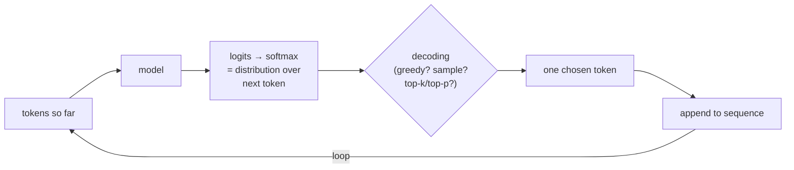
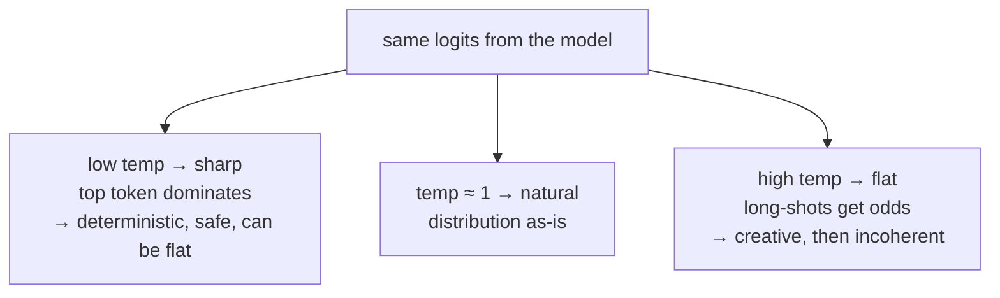
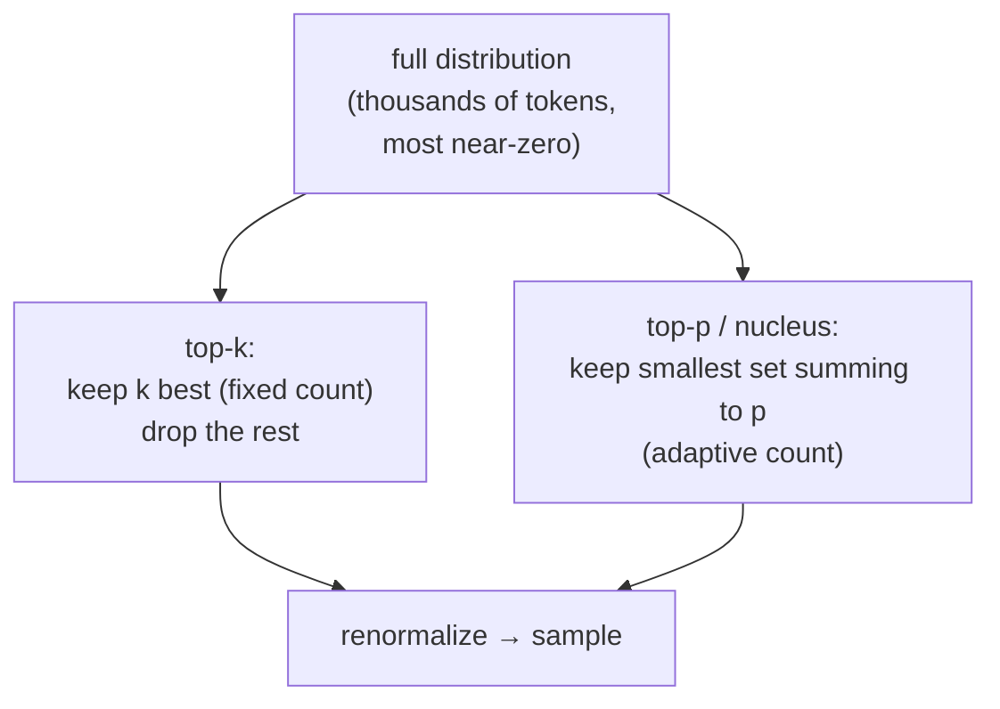

# Sampling and Decoding

## The problem it solves

A language model does not, in any single step, produce a word. What it produces is a **probability distribution over the entire vocabulary** — a score for every possible next [token](../foundations/tokenization.md) it could emit. Ask it to continue "The capital of France is" and internally it hands you something like: `Paris` 0.91, `the` 0.02, `a` 0.015, `located` 0.01, and a long tail of tens of thousands of other tokens each with some tiny sliver of probability. That distribution *is* the model's raw output. It is not text yet.

So there is a gap that has to be crossed on every single token: the model gives you a distribution over all possible next tokens, and something has to **choose one actual token** from it. That choosing step — turning a probability distribution into a committed token, over and over, one token at a time — is **decoding**. The specific family of methods that make that choice by *drawing randomly* from the distribution rather than always taking the most likely token is **sampling**. This lesson is about that step: the part of the pipeline that sits *after* the model has done its thinking and *before* you see a word.

This matters far more than it first sounds. The exact same model, with the exact same weights, given the exact same prompt, will produce wildly different behavior — dull or creative, reliable or erratic, repetitive or fluent — depending purely on *how you decode*. Decoding is the one lever that changes a model's visible personality without touching the model at all. It is also the cheapest lever you have: no retraining, no new data, just a few numbers in the API call. A product manager who understands decoding understands why "the model got worse" is often "someone changed the temperature," and why "make it more creative" is frequently a decoding change, not a model change.

> [!NOTE]
> **A logit is the raw, unnormalized score the model assigns to each vocabulary token before it's turned into a probability.** Logits can be any real number (negative, zero, large). To become probabilities that sum to 1, they're passed through a function called **softmax**, which exponentiates each logit and divides by the total — so bigger logits become bigger probabilities, and the gaps between them get stretched. You don't need the math; you need the chain: **logits (raw scores) → softmax → a probability distribution over all tokens → decoding picks one.** Every knob in this lesson works by bending that chain somewhere.

## The one analogy to remember

**The picture:** You're writing a sentence with a magic set of alphabet dice. Each die isn't fair — it's weighted. On every roll, the faces are the possible next words, and the weighting reflects how likely each one is. You have a dial that controls how *lopsided* the dice are. Turn it one way and the dice become so loaded they almost always land on the single heaviest word. Turn it the other way and the dice flatten out toward fair, so even oddball words start coming up. You roll, write down the word, then the dice are re-weighted for the *next* word based on everything written so far, and you roll again.

**The mapping:** the weighted die = the probability distribution the model outputs for the next token; the faces = the candidate tokens; how heavily the die is loaded = the sharpness of the distribution; the dial = **temperature**; "always take the heaviest face" = **greedy decoding**; "roll the weighted die" = **sampling**; re-weighting the die after each word = the autoregressive loop, where each chosen token feeds back in to shape the next distribution; refusing to even print certain ultra-light faces = **top-k / top-p** truncation.

**Why it holds:** it captures the two things people most often miss. First, generation is **one token at a time**, with the odds recomputed after every pick — not a sentence chosen whole. Second, the "creativity" dial doesn't add ideas to the dice; it only changes *how lopsided* the existing weighting is. Temperature can't make the model think of a word it wasn't already considering — it can only raise or lower the odds of the words already on the faces. That's exactly what temperature does and doesn't do.

**Say it like this:** "The model rolls a weighted die for every word. Temperature is the dial for how loaded the die is — crank it down and it almost always lands on the top choice, crank it up and long-shot words start showing up."

*Where it breaks:* real dice are memoryless, but here the whole point is that each roll *reshapes* the next die — the sequence is deeply dependent, which is why one weird early token can send the whole passage sideways. And the dial isn't infinite: past a point, flattening the dice enough produces gibberish, not creativity.

## The autoregressive loop: why this happens on every token

Before the knobs, fix the loop in your head, because every decoding choice compounds across it. Language models are **autoregressive** — they generate by feeding their own output back into themselves. The cycle is:

1. Feed the prompt (all tokens so far) into the model.
2. The model outputs logits → softmax → a probability distribution over the next token.
3. The decoding method picks one token from that distribution.
4. Append that token to the sequence.
5. Go back to step 1, now with the chosen token included.

The consequence that matters: **decoding decisions are not independent — they cascade.** A single unlucky sample at token 5 becomes part of the context for tokens 6 through 500, and the model will now try to stay consistent with that mistake. This is why a slightly-too-high temperature doesn't just add occasional odd words; it can send an entire answer down a wrong path, because early randomness gets amplified by the loop. It's also why decoding interacts with the [context window](../foundations/context-windows.md) — everything you generate becomes input for what comes next.

## The two families: greedy vs. sampling

At the top level there are only two ways to make the choice in step 3.

**Greedy decoding** takes the single highest-probability token, every time. It's deterministic: same prompt, same weights, same output, always. That sounds ideal — "just take the best word" — but it has two problems. First, *locally* best is not *globally* best: always grabbing the most likely next token can walk you into a bland, repetitive, or dead-end sentence, the same way always taking the widest road can miss the destination. Second, it makes the model dull and repetitive, because it never explores; it collapses onto the safest continuation and tends to loop ("the best the best the best…") on certain inputs.

**Sampling** *draws randomly* from the distribution, so a token with 30% probability gets picked about 30% of the time. This introduces variety and, crucially, lets lower-probability-but-still-good tokens surface — which is where fluency and creativity come from. The cost is that it's **non-deterministic** (you get different outputs on repeat calls) and, uncontrolled, it can occasionally pick genuinely bad tokens from the long tail. Every knob below exists to make sampling *controlled* — to keep its upside (variety, fluency) while cutting its downside (that long tail of garbage tokens).

The one-liner: **greedy is safe but flat; sampling is lively but needs guardrails.** The knobs are the guardrails.

## Temperature: the sharpness dial

**Temperature** is a single number, applied to the logits *before* softmax, that controls how sharp or flat the resulting distribution is. It's the most important decoding knob and the one interviewers probe most.

- **Low temperature (→ 0):** sharpens the distribution — the gaps between logits get exaggerated, so the top token's probability climbs toward 1 and everything else gets crushed toward 0. At the limit, temperature 0 *is* greedy decoding: the model becomes deterministic and always picks its top choice. Use it when you want **consistency and correctness** — extraction, classification, code, math, anything with a right answer.
- **Temperature around 1:** leaves the distribution essentially as the model produced it — the "natural" sampling setting.
- **High temperature (> 1):** flattens the distribution — the gaps shrink, so unlikely tokens get a real shot. This produces **variety and surprise**, and past a point, **incoherence**. Use it (moderately) for brainstorming, creative writing, generating diverse options.

The critical misconception to kill: **temperature does not make the model smarter, more knowledgeable, or more creative in the sense of having new ideas.** It only redistributes probability mass over the tokens the model was *already* considering. High temperature can't conjure a fact or an idea the model didn't already have some probability on — it can only raise the odds that a lower-ranked existing option gets chosen. "Turn up the temperature for more creativity" is true only in the narrow sense of "sample more from the tail," and past a threshold it degrades into noise, not brilliance.

## Truncation: top-k and top-p (nucleus)

Temperature reshapes the *whole* distribution, including that long tail of tens of thousands of near-zero tokens — and even flattened, the tail collectively holds enough probability that *something* absurd occasionally gets drawn. **Truncation methods fix this by throwing away the tail entirely before sampling**, so you can turn temperature up for variety without opening the door to genuine garbage. Two methods dominate.

**Top-k** keeps only the *k* highest-probability tokens and zeroes out the rest, then renormalizes and samples from those k. With k=40, only the 40 most likely tokens are ever eligible; the other ~50,000 can't be picked no matter what. Simple and effective. Its weakness is that k is *fixed* regardless of context: sometimes the model is very confident and only 2 tokens are reasonable (but top-k still admits 40, including 38 bad ones); sometimes it's genuinely torn among 200 good options (but top-k cuts it to 40, needlessly limiting variety). A fixed count doesn't adapt to how peaked or flat the distribution actually is.

**Top-p (nucleus sampling)** fixes exactly that. Instead of a fixed *count*, it keeps the smallest set of top tokens whose probabilities *add up to p* (say 0.9 = 90%), then samples from that set. The set size **adapts** to the model's confidence: when the model is sure, a couple of tokens already sum to 0.9 and the rest are dropped (tight, safe); when the model is uncertain and probability is spread out, it takes many tokens to reach 0.9, so more options stay in play (varied). This context-sensitivity is why **top-p is the more popular default** — it keeps roughly the "plausible nucleus" of the distribution and discards the tail, sizing that nucleus to the situation.

The mental model that ties it together: **temperature reshapes the odds; top-k and top-p decide which tokens are even allowed in the room; then you sample.** They stack — a typical creative setting is temperature ≈ 0.8 with top-p ≈ 0.9. And a subtle interview point: temperature and top-p do overlapping jobs (both influence how much of the tail you draw from), which is why tuning both at once can produce confusing results and why many teams fix one and tune the other.

## Why not just search for the best whole sentence? (beam search)

A natural objection: if greedy is short-sighted, why not look ahead and find the highest-probability *sequence*, not just the highest-probability *next token*? That's **beam search** — it keeps several candidate sequences ("beams") alive at once, extends each, and keeps the best-scoring few, trying to optimize the whole sentence's probability rather than each token greedily.

Beam search is standard in **machine translation and other tasks with a single correct-ish answer**, where you genuinely want the most probable output. But it's largely **not** used for open-ended chat and creative generation, and knowing why is a good signal: optimizing for the single most probable sequence produces text that is *safe, generic, and repetitive* — the highest-probability paragraph is a boring one. For open-ended generation, a bit of well-controlled randomness reads as more human and more useful than the "optimal" bland answer. So the field mostly moved to **sampling with temperature + top-p** for chat, and reserves beam search for constrained tasks. The takeaway: "most probable" is the right target for translation and the wrong target for conversation.

## Repetition controls and stopping

Two smaller knobs round out the practical picture. **Repetition penalties** (including "frequency" and "presence" penalties) reduce the probability of tokens that have already appeared, to fight the model's tendency to loop or over-use a phrase — useful, but heavy-handed settings can push the model into unnatural word choices as it strains to avoid anything it's said. **Stop sequences and max tokens** control *when generation ends*: a stop sequence is a string that, when generated, halts decoding (e.g., stopping at `\n\n` or a closing tag), and max-tokens caps the length outright. These aren't about *which* token but *whether to keep going*, and they matter for cost and for clean [structured outputs](structured-outputs.md).

## The product lens: determinism, reproducibility, and cost

Three consequences a PM should carry into any conversation.

**Determinism is a decoding choice, not a model property.** If a stakeholder says "the model gives different answers every time and that's unacceptable," the fix is usually temperature 0 (greedy), not a different model. Conversely, if outputs feel robotic and repetitive, low temperature is often the cause. This is the single most common decoding-related product bug.

**Even "temperature 0" is not a hard guarantee of identical output.** Greedy removes the *sampling* randomness, but in practice production systems can still vary run-to-run due to floating-point non-determinism on GPUs (graphics processing units — the chips models run on), batching effects, [MoE](../model-behavior-training/mixture-of-experts.md) routing, and model updates behind an API. So promise "much more consistent," not "byte-for-byte reproducible," unless you control the whole stack. Overpromising reproducibility is a classic trap.

**Decoding is nearly free and instant to change.** Unlike [fine-tuning](../model-behavior-training/fine-tuning.md) or swapping models, decoding parameters are just numbers in the request. This makes them the *first* thing to tune when behavior is off, and a cheap lever for offering users modes ("precise" vs. "creative" is often just two temperature/top-p presets). It also means a single careless config change can silently alter product behavior across every request — which is why decoding settings deserve to be version-controlled and monitored like any other critical parameter.

## Summary / Points to Remember

- A model doesn't output a word; it outputs a **probability distribution over all next tokens** (via **logits → softmax**). **Decoding** is the step that picks one actual token from that distribution, repeated **one token at a time** in the autoregressive loop.
- Because each pick feeds back into the next, **decoding decisions cascade** — early randomness gets amplified across the whole output.
- Two families: **greedy** (always take the top token — deterministic, safe, but flat and prone to loops) and **sampling** (draw randomly — varied and fluent, but needs guardrails).
- **Temperature** is the sharpness dial: low (→0) sharpens toward greedy/deterministic (use for correctness — code, extraction, classification); high (>1) flattens toward variety and then incoherence (use moderately for creative work). It **redistributes existing probability; it does not add knowledge or ideas.**
- **Top-k** keeps a fixed number of top tokens; **top-p (nucleus)** keeps the smallest set summing to probability *p* and **adapts to the model's confidence** — which is why top-p is the more common default. Both **cut the long tail before sampling**; they stack with temperature.
- **Beam search** optimizes the most probable *whole sequence* — right for translation, wrong for chat, because "most probable" reads as bland and generic in open-ended generation.
- Product truths: **determinism is a decoding choice** (temp 0), not a model trait; even temp 0 is **not a byte-for-byte reproducibility guarantee** in production; decoding is the **cheapest, fastest behavior lever** you have — and therefore an easy way to silently break things.

## Interview Questions That Stump People

**Q (clarify-back): "Our summarization feature gives a different answer every time someone re-runs it, and legal is upset. How do you fix it?"**

**Interviewer:** Same document, same button, different summary each time. Legal wants it stopped. What do you do?

**You (clarify back):** Quick question first — do they need the output to be *stable* (the same summary if you re-run the same input), or do they specifically need it to be *byte-for-byte identical and auditable* across our whole infrastructure? Those have different answers.

**Interviewer:** Stable is what they care about — re-running the same document shouldn't produce a visibly different summary.

**You:** Then this is a decoding fix, not a model change. The variation is coming from sampling — we're drawing randomly from the distribution, so each run lands on different tokens. Setting temperature to 0 (greedy decoding) makes the model take its top token every time, so the same input yields the same summary. I'd change that config and the problem largely disappears. The one caveat I'd put in writing to legal: "much more consistent," not "provably identical forever" — floating-point effects on GPUs, batching, and any model update behind our API can still cause rare differences. If they genuinely need auditable, reproducible-to-the-byte output, that's a bigger conversation about pinning model versions and controlling the serving stack, not just a temperature setting.

> [!TIP]
> **Why this works:** The naive answer is "switch models" or "temperature 0, done." The clarify-back separates the *real* need (stable) from the expensive one (byte-for-byte auditable), because promising true reproducibility on a hosted API is a trap you can't deliver on. Naming that even temp 0 isn't a hard guarantee signals you understand production non-determinism — the detail that separates someone who's shipped from someone who read a blog post. And correctly identifying it as a free config change, not a model swap, shows you reach for the cheapest lever first.

---

**Q: "A user says our creative-writing tool is boring. Someone suggests cranking temperature way up. Good idea?"**

**Interviewer:** The output feels safe and dull. Just max out the temperature?

**You:** Turning it up is the right *direction*, but "way up" is a trap, and temperature alone isn't the whole answer. Temperature only reshapes the odds over tokens the model is already considering — it doesn't give the model new ideas, it just raises the chance a lower-ranked token gets picked. Push it too high and you don't get *more creative*, you get *incoherent*, because the model starts drawing from the garbage tail of the distribution. The better move is moderate temperature — say 0.8 to 1.0 — combined with top-p around 0.9, so we get variety from the plausible part of the distribution while the nucleus cut throws away the truly bad long-shot tokens. That's how you get "surprising but still good" instead of "random." I'd also check whether "boring" is even a decoding problem — if the *prompt* is generic, no temperature setting fixes that.

> [!TIP]
> **Why this answer works:** It resists the linear "more temperature = more creativity" myth and names the failure mode (incoherence from the tail). Pairing temperature with top-p shows you know the two knobs work together — variety from temperature, safety from truncation. And flagging that the cause might be the prompt, not decoding, shows you diagnose before you tune, which is the PM-relevant instinct.

---

**Q: "What's the actual difference between top-k and top-p, and why do people usually reach for top-p?"**

**Interviewer:** Both trim the distribution. Why prefer one?

**You:** They differ in whether the cutoff is a fixed *count* or an adaptive *mass*. Top-k always keeps exactly k tokens — say the top 40 — no matter what the distribution looks like. The problem is that the right number of "reasonable" tokens changes with context: when the model is very confident, maybe only two tokens are sensible, but top-k still lets in 40, including 38 bad ones; when the model is genuinely torn among many good options, top-k arbitrarily cuts it to 40. Top-p, or nucleus sampling, keeps the smallest set of tokens whose probabilities add up to p — say 0.9 — so the number of eligible tokens *grows and shrinks with the model's confidence*. Confident? The nucleus is tiny and safe. Uncertain? It widens to keep more options. That adaptivity is why top-p is the more common default: it matches how much freedom to allow to how sure the model actually is.

> [!TIP]
> **Why this answer works:** The distinction the interviewer wants is "fixed count vs. adaptive mass," and everything follows from that. Giving the concrete failure of top-k in both the confident and uncertain cases proves you understand *why* adaptivity matters, not just that top-p is "usually better." This is a definitional question that still stumps people because they memorize the mechanics without grasping the consequence.

---

**Q: "Greedy decoding always picks the most likely token. Isn't that strictly the best you can do?"**

**Interviewer:** If each step takes the highest-probability word, how could that be anything but optimal?

**You:** Because locally optimal isn't globally optimal, and "most probable" isn't the same as "best." Greedy picks the best *next* token at each step in isolation, but the highest-probability token now can lead into a dead end or a bland, repetitive continuation — the same way always taking the widest road at each turn doesn't get you to the best destination. That's actually the motivation for beam search, which keeps several candidate sequences alive to optimize the *whole* sequence's probability rather than each token greedily. But here's the deeper twist: even the most probable whole sequence isn't what you want for open-ended generation, because the highest-probability paragraph is a *generic, safe, boring* one. For chat and creative work, a little controlled randomness reads as more human and useful than the "optimal" bland answer. So greedy is neither locally sufficient nor globally the goal — for conversation you deliberately *don't* want the single most probable output.

> [!TIP]
> **Why this answer works:** It dismantles the premise in two layers — first that greedy is short-sighted (motivating beam search), then the counterintuitive kicker that "most probable" is itself the wrong target for open-ended text. Landing that second point separates people who've only heard "greedy is bad" from those who understand *why the whole field samples for chat*. Mentioning beam search and where it *does* belong (translation) shows range without rambling.

---

**Q: "We're getting occasional totally bizarre words in otherwise fine outputs. What's going on and what's the smallest fix?"**

**Interviewer:** Ninety-nine percent of the output is clean, then one word is nonsense. Diagnose it.

**You:** That pattern — mostly fine, rare bizarre token — points at the long tail of the distribution. We're sampling, and even when each weird token has a tiny probability, there are tens of thousands of them, so collectively the tail gets drawn from occasionally. The smallest fix is truncation: add or tighten top-p (or top-k) so the tail is cut off before we sample, without lowering temperature so much that we kill the variety we presumably want. If we're already using top-p, I'd lower it a bit — from 0.95 toward 0.9 — to trim more of the tail. I'd reach for that before touching temperature, because temperature would flatten the *whole* distribution and dull the good variety too, whereas top-p surgically removes just the implausible tail. If it persists, I'd check whether temperature is set unusually high, since that fattens the tail in the first place.

> [!TIP]
> **Why this answer works:** It correctly localizes the symptom (rare-but-present garbage = the tail, a collective-probability effect people forget) and prescribes the *targeted* tool (top-p truncation) over the blunt one (temperature), with reasoning for the order. Knowing that top-k/top-p and temperature attack different parts of the problem — the tail vs. the overall sharpness — is exactly the distinction that shows real command of decoding rather than knob-twiddling.
