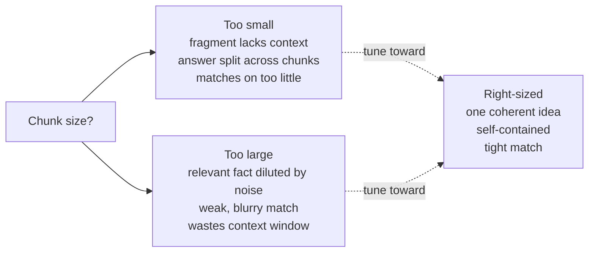
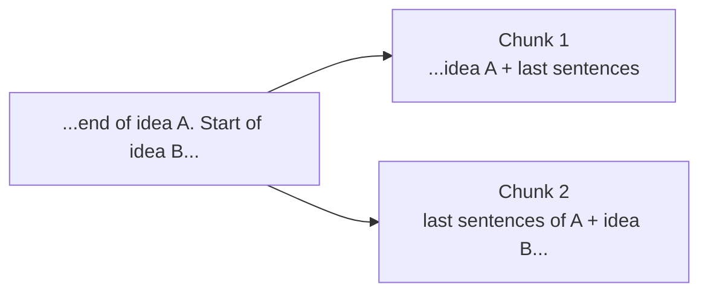

# Chunking

## The problem it solves

[RAG](rag.md) works by fetching the passages most relevant to a question and putting them in the model's [context window](../foundations/context-windows.md). But "fetch the relevant passages" hides a question nobody asked yet: relevant passages *of what size*? Your knowledge base isn't a neat pile of question-sized answers — it's 80-page PDFs, sprawling wiki articles, transcripts, contracts. You cannot retrieve "the 80-page PDF" and drop it in the window; it won't fit, and even if it did, burying the one relevant paragraph in 79 irrelevant pages is exactly the "lost in the middle" quality-killer RAG is supposed to avoid. And you can't retrieve at the level of a single sentence either — one sentence usually doesn't carry enough surrounding context to stand on its own.

So before anything can be retrieved, every document has to be **split into pieces** — and the size and boundaries of those pieces quietly decide whether retrieval can ever find the right answer. That splitting step is **chunking**: cutting your source documents into smaller units ("chunks") that become the atomic thing your system stores, searches, and returns. It sounds like janitorial pre-processing. It is one of the highest-leverage decisions in the whole RAG stack, because **a chunk is the smallest unit retrieval can hand the model — if the answer is split across two chunks, or drowned inside one bloated chunk, no amount of clever searching later can undo it.** Chunking happens once, up front, when you load documents; get it wrong and every query pays for it forever.

> [!NOTE]
> **Where this sits in the pipeline:** chunking is the *ingestion*-time step — done once when you add a document to the knowledge base, before any question is asked. Each chunk is then turned into an [embedding](../foundations/embeddings.md) (a numeric fingerprint of its meaning) and stored in a [vector database](vector-databases.md) so it can be found later. This lesson is only about *how you cut the document*; how the pieces are stored and searched are the next two lessons. Embedding is covered in [Embeddings](../foundations/embeddings.md); hold it here as "each chunk gets a meaning-fingerprint used to match it to questions."

## Cutting a book into flashcards

You're turning a thick handbook into flashcards for a study group, and the only thing anyone can later pull from the box is a *single* card — so where you cut decides everything.

Cut too coarse — a whole chapter per card — and the "Returns & Refunds" card is now *about* ten things at once: shipping, exchanges, store credit, warranty, the refund window. Someone who asks only "what's the refund window?" gets handed a card that's mostly noise, and it barely reads as a match for their narrow question in the first place. Cut too fine — one clause per card — and you get a card that says "…which then resets the 14-day clock" with no card saying *what* clock or *whose*: a fragment nobody can use alone. Worse, the full rule — "annual plans carry a 14-day refund window, which resets if the plan is upgraded" — can get split across two cards, so pulling either one gives you half an answer forever.

The useful cards are cut at the seams — one coherent idea each: "Annual plan refunds: 14-day window, resets on upgrade." Big enough to stand on its own, small enough to be *about* one thing. That's chunking: the handbook is your document, each flashcard a chunk, a chapter-card an oversized chunk (diluted, matches weakly), a dangling-clause card an undersized one (no standalone meaning), and cutting at the seams instead of blindly every N characters is splitting on the document's real structure.

One line to carry out of here: **chunking is cutting the book into flashcards — one coherent idea per card, cut at the seams, or you get cards that are about everything or about nothing.** Where the picture leaks: a person making flashcards understands the content and naturally cuts at meaning; a naive chunker slicing every N characters does not — it'll happily cut mid-sentence. The analogy is the *goal*; most of this lesson is how to approximate "cut at the seams" mechanically.

## The core tradeoff: chunk size

Everything about chunking orbits one dial — how big each chunk is — and it's a genuine tradeoff with a cost at each extreme.

- **Too small.** A tiny chunk often can't stand on its own — it references "this process" or "the above" with no antecedent, so even when it's retrieved the model can't use it. Worse, a complete answer that spanned a few sentences may now be *split across two chunks*, and if retrieval returns only one, the answer is permanently half-there. Tiny chunks also match on very little signal, so they're noisy.
- **Too large.** A big chunk contains the answer *plus* a lot of unrelated text. That hurts twice. First, its embedding — the meaning-fingerprint used for matching — is an average over everything in it, so one relevant paragraph gets blurred together with unrelated ones and the chunk matches the question only weakly (the signal is diluted). Second, when it *is* retrieved, you've spent a big slice of the context window (and token budget) carrying mostly noise, reintroducing the "lost in the middle" problem RAG exists to prevent.

The right size is the smallest piece that still stands on its own as a coherent, self-contained idea — big enough to carry its own context, small enough to be *about* one thing. There is no universal number; it depends on your content (dense contracts chunk differently from chatty support threads) and is something you tune against real retrieval quality, not a constant you look up. The sayable version: **chunk size trades context against precision — too small loses the meaning, too large blurs the match.**

## Overlap: the seam insurance

Because a fixed cut will sometimes land in the middle of an idea, the standard mitigation is **overlap**: let consecutive chunks share a bit of text at their boundary — the last sentence or two of one chunk is repeated as the first sentence or two of the next. If an answer straddles a boundary, overlap raises the odds that *at least one* chunk contains it whole.

Overlap isn't free — you're duplicating text, which means slightly more storage and some chance the same passage gets retrieved twice — so it's a small, deliberate redundancy, not a big one (a modest fraction of the chunk, commonly ~10–20%). The point to carry: **overlap is cheap insurance against cutting an answer in half at a chunk boundary**, and it's why "just split every N tokens" is rarely done without at least some overlap.

## How you decide where to cut

Splitting strategies form a ladder from crude-but-simple to content-aware. A PM should know the rungs and what each buys.

- **Fixed-size.** Cut every N characters or tokens. Dead simple and predictable, but content-blind — it will slice mid-sentence and mid-idea. Rarely used alone except as a baseline; usually paired with overlap to soften the damage.
- **Recursive / structural.** Split along the document's *natural* boundaries in priority order — try paragraphs first, then sentences, then words — only falling back to a finer cut when a piece is still too big. This respects the writing's structure, so chunks tend to end at real seams. It's the common default because it approximates "cut at the seams" without understanding the content.
- **Document-structure-aware.** Use the document's actual markup — Markdown headings, HTML sections, PDF layout, code function boundaries — so a chunk aligns with a real section or heading. Great when your documents *have* reliable structure; useless when they don't.
- **Semantic.** Cut where the *topic* actually shifts, detected by comparing the meaning of adjacent sentences and breaking where they diverge. This gets closest to "one idea per chunk" but costs more to compute at ingestion and can be overkill. Worth it for high-value corpora where retrieval quality is paramount.

The progression is the point: each rung tries harder to make a chunk boundary coincide with a *meaning* boundary, at rising cost and complexity. Most production systems start at recursive/structural and only reach for semantic when retrieval quality demands it.

## Metadata: the part beginners skip

A chunk shouldn't travel naked. Attach **metadata** to each one — the source document title, section heading, author, date, URL, page number, access permissions — stored alongside the chunk. This earns its keep three ways that a PM should be able to name:

- **Citations.** [Grounding and citations](grounding-citations.md) needs to tell the user *where* an answer came from; the source lives in the chunk's metadata.
- **Filtering.** You can restrict retrieval to, say, documents this user is allowed to see, or only the current version of a policy, before the meaning-based search even runs — which is both a relevance and a *security/permissions* control.
- **Context restoration.** A small chunk plus "from the *Refunds* section of the *2026 Policy* doc" gives the model back some of the context the cut removed, without bloating the chunk itself.

The framing: **metadata is how a small, self-contained chunk stays traceable and governable** — skip it and you can't cite, can't filter by permission, and can't tell two identical-looking chunks from different documents apart.

## Why this is a PM concern, not just an engineer's

It's tempting to file chunking under "implementation detail." Resist that, because its failures show up as *product* symptoms and its decisions carry *product* constraints:

- When a RAG feature "can't find" an answer that's demonstrably in the docs, the cause is frequently that the answer was split across chunk boundaries or diluted in an oversized chunk — a chunking failure wearing a retrieval costume. Knowing chunking exists changes how you diagnose it.
- Chunking is a **re-ingestion cost**: changing your chunk strategy means re-processing and re-embedding the *entire* corpus, which is real time and money. So "let's just tune the chunk size" is not a free knob late in the project — it's a decision with a migration attached.
- Different content types in one product (chat logs, legal docs, code) may each need a different chunking approach, which is a scope and roadmap consideration, not a line of config.

The honest summary a PM carries: **chunking is a one-time, upstream decision that silently sets the ceiling on retrieval quality — cheap to get right at the start, expensive to fix once you're at scale.**

## Summary / Points to Remember

- **Chunking is splitting source documents into small, self-contained pieces at ingestion time** — the atomic unit your system stores, searches, and returns. A chunk is the smallest thing retrieval can hand the model.
- **It sets the ceiling on retrieval quality.** If the answer is split across two chunks or drowned inside a bloated one, no later cleverness in searching recovers it. Many "retrieval can't find it" failures are really chunking failures.
- **The core dial is chunk size, and it's a real tradeoff:** too small loses standalone meaning and splits answers; too large dilutes the meaning-fingerprint (weak match) and wastes the context window on noise. Aim for the smallest piece that's still a coherent, self-contained idea — a number you *tune against real retrieval*, not a constant.
- **Overlap** — sharing a sentence or two across consecutive chunks (~10–20%) — is cheap insurance against cutting an answer in half at a boundary.
- **Splitting strategies climb from crude to content-aware:** fixed-size → recursive/structural (the common default) → document-structure-aware → semantic (cut where the topic shifts). Each tries harder to make a chunk boundary land on a *meaning* boundary, at rising cost.
- **Attach metadata to every chunk** (source, section, date, permissions) — it powers citations, permission/version filtering *before* search, and restoring context a small chunk lost.
- **It's a PM concern:** chunking failures surface as product symptoms, and re-chunking means re-ingesting the whole corpus — cheap to set right up front, expensive to change at scale.

## Interview Questions That Stump People

**Q: "Our RAG system swears a policy detail 'isn't in the docs,' but I can see the exact sentence in the source PDF. How is that possible?"**

**Interviewer:** A user asked about our cancellation window. The answer is right there in the policy PDF — one clear sentence. But the assistant said it couldn't find it. The document is definitely in the knowledge base. What's going on?

**You:** The most likely culprit isn't search — it's chunking, upstream of search. When that PDF was ingested it got cut into chunks, and if the cut landed badly, the sentence you're looking at may have been *split across two chunks* — half the context in one, the operative clause in another — so neither chunk, on its own, reads as a clean match for the question, and retrieval never surfaces a whole answer. The other version: the sentence sits inside a huge chunk full of unrelated policy text, so the chunk's meaning-fingerprint is an average over everything in it and matches the specific question too weakly to rank. Either way it's the same root cause — the answer exists in the source but not as a coherent, retrievable *unit*. I'd verify by looking at the actual chunks that document produced, not by tweaking the search first. The fixes are chunking fixes: add overlap so boundary-straddling answers survive, or move to a structure-aware split so chunks end at real section seams. And I'd flag the cost — fixing it means re-chunking and re-embedding, not a one-line change.

> [!TIP]
> **Why this answer works:** The naive instinct is "the search is broken" or "we need a better model." The strong move is to localize the failure to *ingestion* — the answer isn't a retrievable unit because of how it was cut — and to explain the two distinct chunking pathologies (split-across-boundary and diluted-in-a-big-chunk) with their mechanisms. Insisting on inspecting the real chunks before touching search, and naming the re-ingestion cost, shows you understand chunking as the silent ceiling on retrieval, which is exactly the misconception this question probes.

---

**Q (clarify-back): "What chunk size should we use — I've seen 512 tokens recommended?"**

**Interviewer:** We're setting up our chunking. Someone said use 512 tokens. Should we just go with that?

**You (clarify back):** It can be a fine starting point, but before I'd commit — what kind of content is it, and what do the questions look like? Are these dense structured documents like contracts, or conversational stuff like support chats, and are users asking narrow factual questions or broad summarizing ones?

**Interviewer:** Mostly technical documentation with clear headings, and users ask fairly specific how-do-I questions.

**You:** Then I wouldn't anchor on a token number at all — I'd anchor on the *structure*. Technical docs with clear headings are the ideal case for structure-aware chunking: cut on the headings so each chunk is one coherent section, and let the size fall out of that rather than forcing a fixed 512. Specific factual questions reward smaller, precise chunks, so I'd lean toward finer sections with some overlap to protect answers that straddle a boundary. But critically, I'd treat any starting number as a hypothesis and *measure* it — build a set of real questions with known correct sections, and check how often the right chunk is actually retrieved. That number, not a rule of thumb from a blog post, tells us whether the size is right. 512 isn't wrong; committing to it before looking at the content or measuring retrieval would be.

> [!TIP]
> **Why this works:** The question dangles a specific number to see if you'll recite it. Clarifying *content type and query shape* surfaces the two things that actually determine chunking — and lets you pivot from "pick a size" to "respect the structure and measure retrieval," which is the senior framing. Naming that a chunk size is a hypothesis you validate against real retrieval quality, not a constant, signals you've tuned one of these rather than read a default off a page.

---

**Q: "Why not use huge chunks now that context windows are enormous? Just give the model whole documents and skip the fiddly splitting."**

**Interviewer:** Context windows are massive now. Why bother cutting documents into little pieces at all — why not chunk very coarse, or not chunk, and let the big window sort it out?

**You:** Because chunk size isn't only a *fit* constraint — it's a *matching* constraint, and that part doesn't go away with a bigger window. Each chunk is matched to the question by its meaning-fingerprint, and that fingerprint is an average over the chunk's contents. Make the chunk huge and the one relevant paragraph gets averaged in with everything else, so the chunk matches the question weakly and may not get retrieved at all — you've *hurt retrieval* before the window size ever enters the picture. And even when a giant chunk is retrieved, you've handed the model mostly-irrelevant text, which dilutes the signal and drags in the "lost in the middle" effect that lowers accuracy. So coarse chunking degrades both the *finding* and the *using*. Bigger windows make chunking more forgiving — you can afford somewhat larger chunks and return more of them — but they don't remove the reason chunks should be about *one thing*: precise matching. The window solved capacity, not relevance.

> [!TIP]
> **Why this answer works:** This is the long-context skeptic's trap again, aimed at chunking. The weak answer treats chunking as purely a workaround for small windows. The strong answer separates the two jobs a chunk does — *being retrievable* (matching) and *fitting* — and shows the window only helps the second, while coarse chunks actively damage the first by blurring the embedding. Landing "the window solved capacity, not relevance" proves you understand *why* chunking survives long context, not just that it does.
