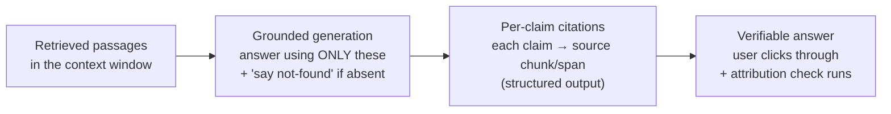
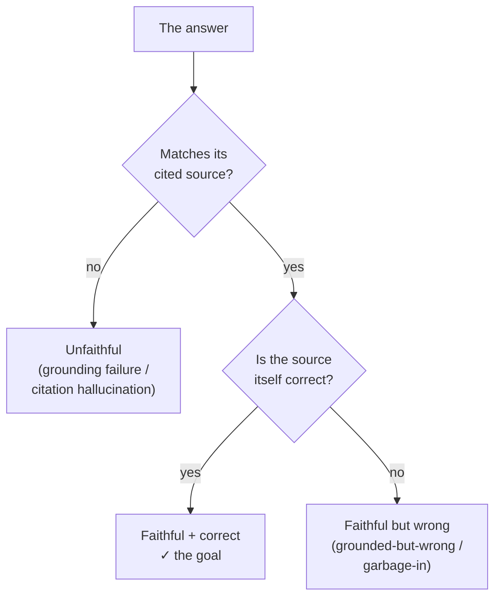
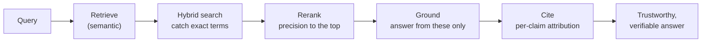

# Grounding and Citations

## The problem it solves

You've done everything right up the pipeline. You [chunked](chunking.md) the documents, searched the [vector store](vector-databases.md), ran a good [retrieval](retrieval.md) pass, and the three passages sitting in the [context window](../foundations/context-windows.md) genuinely contain the answer. Then the model answers — and it answers *wrong*, or it answers right but from some fact it clearly pulled out of its own memory rather than the passage you handed it, or it gives a beautiful answer with a citation to "Document 2" that, when you actually open Document 2, says nothing of the kind.

Here is the uncomfortable truth this lesson exists to fix: **putting the right context in the prompt does not mean the answer is derived from it.** Retrieval's job ends when the passages are in the window. Whether the model *actually reads and uses* those passages — instead of ignoring them and answering from its trained-in [parametric memory](../model-behavior-training/fine-tuning.md), or wandering off into a fluent guess — is a separate problem, and it is the *last mile* of the whole [RAG (Retrieval-Augmented Generation)](rag.md) pipeline. That last mile is **grounding** (making the answer provably derived from the retrieved text) and **citations** (attaching, to each claim, a pointer back to the exact source it came from so a human can check it). Get this stage wrong and every upstream investment is wasted: you fetched the right folder and the model answered from a rumor anyway.

> [!NOTE]
> **Parametric memory** — the knowledge baked into a model's weights during [pretraining](../foundations/pretraining-vs-posttraining.md), as opposed to knowledge supplied at answer-time in the prompt. "Parametric" just means "stored in the parameters (the weights)." The whole point of RAG was to answer from *supplied* text instead of this frozen, unverifiable memory — but the model still *has* that memory and will happily fall back on it unless you actively steer it not to. That tension is the heart of this lesson.

## The newsroom standards desk

A newspaper runs a standards desk with two ironclad rules. First, a reporter may print only what a named, on-the-record source actually told them — nothing from personal hunch, memory, or a rumor overheard in the hallway. Second, every sentence in the filed story must carry a footnote naming the source it came from. Then a fact-checker goes down the story line by line and, for each footnote, confirms the named source really said that thing.

Map that onto a RAG answer and it lands cleanly. The reporter is the model generating the answer; the rule "print only what your sources told you, never from memory" is *grounding* — answer only from the retrieved passages, not from the model's trained-in memory; the footnote on every sentence is a *citation*, per-claim attribution back to a source chunk; the fact-checker verifying each footnote is the *attribution check*. And the scene already contains the failure that trips everyone up: a source who was on-record but simply *wrong* is a retrieved passage that's stale or mistaken — the reporter quotes it faithfully and the printed story is false anyway. That's *faithful but not true*, and it's why "we put the right documents in the prompt" doesn't guarantee a correct answer. Meanwhile a reporter who footnotes a source that never said the thing is *citation hallucination* — a footnote that makes a claim look checked when it isn't.

One line to carry out of here: **grounding is the newsroom rule that you print only what your sources told you; citations are the footnotes that let the reader check each line — together they make the answer *verifiable*, which is not the same as making it *true*.** Where the picture leaks: a seasoned reporter cross-checks several sources and *notices* when one smells wrong; the model won't unless you build that in. Hand it one authoritative-looking passage that happens to be wrong and it will faithfully, confidently report the error with a tidy footnote attached.

## Grounding: nearby is not the same as derived-from

The single idea to internalize: **there are two very different states that look identical from the outside.** In both, the correct passage is sitting in the context window. In the first, the model *read it and answered from it*. In the second, the model *ignored it and answered from its own weights* — and happened to produce something plausible. You cannot tell these apart by glancing at the output; a fluent answer looks the same either way. Grounding is the set of techniques that force the first state and starve the second.

Why doesn't context-in-the-prompt guarantee derived-from-context automatically? Because a language model is not a database lookup — it is blending everything it can draw on to produce the most plausible continuation, and its trained-in memory is *right there*, always available, often louder than a passage it was handed a second ago. When the retrieved text and its parametric memory agree, no harm done. But when they diverge — your policy changed last week, your product's spec contradicts the general internet the model trained on — the model will frequently side with its weights, confidently, and the passage you carefully retrieved gets overruled. This is a [faithfulness failure](../reasoning-generation/hallucination.md), and it is the specific reason "we gave it the documents" is not the same as "it will stick to them."

The levers that actually enforce grounding, roughly in order of how much work they do:

- **Instruct answer-from-context-only.** The prompt tells the model, in no uncertain terms, to answer *using only the provided passages* and to treat its own prior knowledge as inadmissible. This is the foundational move and it is not optional decoration — the model's default is to blend sources, and this instruction is what tips the balance toward the supplied text.
- **Grant explicit permission to fail.** Tell the model that if the passages don't contain the answer, the correct response is "I don't know" or "that isn't covered in the provided documents." This matters enormously because the model's baked-in default — reinforced by [alignment](../model-behavior-training/rlhf.md) — is to *always produce a confident, complete-sounding answer*. Without an explicit escape hatch, a model handed irrelevant passages will not say "these don't help"; it will manufacture an answer anyway, usually by falling back on parametric memory. Making "not found" a *sanctioned, even preferred* output is how you convert a silent fabrication into an honest abstention.
- **Constrain against outside knowledge.** Related but distinct from the first lever: explicitly forbidding the model from supplementing the passages with general knowledge, so it doesn't "helpfully" add a fact from its weights that the source never mentioned. The tighter the task, the less room to wander.

None of these is a hard lock — they are strong pressures on a probabilistic system, not a compiler flag. The model *can* still leak parametric memory. That's why grounding is paired with citations (so a leak is *visible*) and with [evaluation](../evaluation/evaluation-methods.md) (so the leak rate is *measured*), which is the rest of this lesson.

## Citations: per-claim attribution is what makes RAG trustworthy

Grounding makes the answer *come from* the sources. Citations make that *checkable* — and checkability is what changes the product. Without citations, a RAG answer is still a black box: the user has to *trust* that the confident paragraph is faithful to real documents. With per-claim citations, the user can click through and *verify* — and a system a skeptical user can verify is a categorically different product from one they have to take on faith. In high-stakes domains (legal, medical, financial, compliance) this isn't a nice-to-have; an answer nobody can trace is an answer nobody is allowed to act on.

The important word is **per-claim**. A single "Sources: [1][2][3]" dumped at the bottom of a five-sentence answer is nearly useless for verification — the reader still can't tell *which* sentence came from *which* source, so checking any one claim means re-reading all three documents. Real attribution ties each specific claim to the specific chunk (ideally the specific span) that supports it, so verification is a single click, not a research project. This is where citation output leans on [structured outputs](../reasoning-generation/structured-outputs.md): rather than hoping the model formats footnotes consistently in prose, you have it emit a structured object — claim text plus the source ID (and offsets) backing it — that the application can render as inline, clickable references and, crucially, can *check programmatically*.

## Faithfulness vs. correctness: the distinction that separates real understanding

This is the idea an interviewer uses to find out whether you actually get grounding or just like the word. **A grounded answer is *faithful* to its sources — it says what the sources say. That is not the same as being *correct* — factually true about the world.** The two come apart because *the sources themselves can be wrong.*

- **Faithful and correct** — the answer matches the source and the source is right. The goal.
- **Faithful but incorrect** — the answer accurately reports a retrieved passage that was itself outdated, mistaken, or irrelevant. The model did its job perfectly; the input was bad. This is the **grounded-but-wrong** failure, and it is *garbage-in-garbage-out*: retrieval capped the quality (RAG's iron law again), and grounding faithfully propagated the garbage — now wearing a citation that makes it look *more* authoritative.
- **Unfaithful** — the answer doesn't match its cited source at all, whether or not it happens to be true. This is the failure grounding and citation-checking are built to catch.

The sharp framing to carry: **grounding buys you faithfulness and verifiability — not truth.** It guarantees the answer is *traceable to a source*, so a human *can* catch an error; it does not guarantee the source was right. That is a huge, product-changing improvement — an auditable wrong answer is far safer than an unauditable one — but overselling it as "grounding makes the model correct" is the claim that comes back to bite you. Truth still depends on the quality of what you retrieved.

## The failure modes to name out loud

Grounding and citations *reduce* [hallucination](../reasoning-generation/hallucination.md) sharply, but — exactly as that lesson warned — they don't eliminate it, and they introduce failure modes of their own. Being able to name these precisely is what signals you've operated a RAG system rather than diagrammed one.

- **Parametric leak (grounding failure).** The model ignores the provided passages and answers from its trained-in memory anyway — especially when its memory contradicts the source. Symptom: the answer states something the passages don't support (or contradict). Mitigation: stronger answer-only-from-context instructions, permission to abstain, and citation-checking that flags claims with no supporting source.
- **Citation hallucination.** The model cites a source that doesn't actually support the claim — or fabricates a citation to a chunk/section that doesn't exist. This is *especially* insidious because a citation is a **trust signal**: it makes the answer *look* verified, so a user who sees a footnote is *less* likely to check it. A wrong answer with a confident-looking citation can be more dangerous than a wrong answer with none. Mitigation: programmatically verify that every cited chunk exists and that its text genuinely entails the claim.
- **Grounded-but-wrong.** The answer is perfectly faithful to a retrieved chunk that was itself wrong, stale, or irrelevant. This is not a generation failure at all — it's [retrieval](retrieval.md) failure propagated downstream. You fix it *upstream* (better chunking, [hybrid search](hybrid-search.md), [reranking](reranking.md)), not by tuning the grounding prompt. Naming which stage owns the failure is the whole skill.

## Measuring it: groundedness and attribution

You cannot tune what you don't score, and grounding is measurable — you just have to know the two distinct questions to ask. (Keep this light; the machinery of how you build and run these lives in [evaluation methods](../evaluation/evaluation-methods.md).)

- **Groundedness / faithfulness evals** ask: *is every claim in the answer supported by the retrieved context?* This catches parametric leaks and unfaithful statements. It is deliberately a *different* question from "is the answer correct" — a faithfulness eval can pass on a grounded-but-wrong answer, which is exactly why you don't measure only end-to-end correctness.
- **Attribution / citation-accuracy checks** ask: *does each cited source actually contain and support the claim it's attached to?* This catches citation hallucination. Often the cheapest, highest-leverage check in the whole pipeline, because it can be at least partly automated — verify the cited chunk exists, then test whether it entails the claim (a smaller model, or an [LLM-as-judge](../evaluation/evaluation-methods.md) — using a large language model to score another model's output — can do the entailment check).

The point isn't the exact metric names — it's that **faithfulness and correctness are measured separately, on purpose**, because grounding's promise is faithfulness, and conflating the two hides the grounded-but-wrong failure that only better retrieval can fix.

## Closing the pipeline: this is the last mile

Step back and look at the whole of category 04 as one chain, because that's how this lesson closes it. Every stage before this one was in service of getting the *right text* in front of the model; this stage is what turns that text into a *trustworthy answer*.

**Retrieve → (hybrid) get the candidates → (rerank) reorder them → ground the generation in them → cite each claim.** Retrieval and its refinements ([hybrid search](hybrid-search.md), [reranking](reranking.md)) decide *what the model sees*; grounding and citations decide *what the model does with it and whether you can trust the result*. The iron law from [RAG](rag.md) still rules the whole chain — a great grounding stage cannot rescue bad retrieval, it can only faithfully repeat retrieval's mistakes — but a great retrieval stage is *wasted* without grounding, because the model will cheerfully ignore perfect context and answer from memory. This last mile is what converts "we put the documents in the prompt" into "we ship answers a user can check."

## Summary / Points to Remember

- **Context in the prompt ≠ answer grounded in it.** Retrieval ends when the passages are in the window; whether the model *derives its answer from them* instead of from its trained-in ([parametric](../model-behavior-training/fine-tuning.md)) memory is a separate problem — the *last mile* of RAG. **Grounding** forces answer-from-context; **citations** make each claim traceable so a human can verify it.
- **Grounding levers:** instruct the model to use *only* the provided passages, give it explicit permission to say "not in the provided documents," and constrain it against supplementing with outside knowledge. These are strong pressures on a probabilistic system, not hard locks — the model can still leak parametric memory, which is why they're paired with citations (leak becomes visible) and evals (leak gets measured).
- **Citations must be per-claim, not a footer dump.** Tying each specific claim to the specific chunk/span that supports it is what makes verification one click instead of a research project — lean on [structured outputs](../reasoning-generation/structured-outputs.md) so the app can render *and programmatically check* the references. Checkability is what changes the product: a system users can verify beats a black box they must trust.
- **Faithfulness ≠ correctness — the money distinction.** A grounded answer is *faithful* (says what its sources say); it is not necessarily *true* (the sources can be wrong). **Grounding buys faithfulness and verifiability, not truth.** An auditable wrong answer is far safer than an unauditable one — but "grounding makes it correct" is an overclaim.
- **Three failure modes:** *parametric leak* (model answers from memory, ignoring context), *citation hallucination* (cites a source that doesn't support the claim, or fabricates one — dangerous because a citation is a trust signal that discourages checking), and *grounded-but-wrong* (faithful to a chunk that was itself wrong — a [retrieval](retrieval.md) failure propagated downstream, fixed upstream, not in the grounding prompt).
- **Measure faithfulness and correctness separately, on purpose:** groundedness evals ask "is every claim supported by the context?"; attribution checks ask "does each cited source actually support its claim?" Conflating them hides the grounded-but-wrong failure. (Machinery: [evaluation methods](../evaluation/evaluation-methods.md).)
- **Grounding reduces [hallucination](../reasoning-generation/hallucination.md) but does not eliminate it** — it changes the failure surface. It's the closing stage of the pipeline: **retrieve → hybrid → rerank → ground → cite.** Retrieval decides what the model sees; grounding and citations decide whether you can trust what it says.

## Interview Questions That Stump People

**Q: "We put the retrieved documents right in the prompt and told the model to use them. Why is it still answering with stuff that isn't in there?"**

**Interviewer:** The passages are definitely in the context window — we can see them. We even wrote "use the context below." But the model keeps stating things those passages don't say. If the context is right there, why isn't it using it?

**You:** Because context sitting *near* the answer in the prompt isn't the same as the answer being *derived from* it. A model isn't doing a database lookup — it's producing the most plausible continuation, and its trained-in parametric memory is always available and often louder than a passage you handed it a moment ago. When the passage and the model's memory agree, you never notice. The failures you're seeing are the cases where they *diverge* — your data says one thing, the general internet it trained on says another — and the model sides with its weights. That's a grounding failure, specifically a parametric leak. The fixes are about tipping the balance toward the supplied text and making leaks visible: instruct it to answer *only* from the passages and treat its own knowledge as inadmissible; give it explicit permission to say "that's not in the provided documents," because otherwise its default is to answer anyway rather than admit a gap; and add per-claim citations plus a check that flags any claim with no supporting source — so a leak stops being invisible. One caveat: none of this is a hard lock. It's strong pressure on a probabilistic system, so you drive the leak rate down and *measure* it with a faithfulness eval, you don't assume it's zero.

> [!TIP]
> **Why this answer works:** The naive read is "the context is in the prompt, so the model must be broken." The strong move is to explain the *mechanism* — the model blends parametric memory with supplied text and can favor memory when they conflict — which reframes the symptom as a predictable grounding failure rather than a mystery. Naming the specific fixes (answer-only instruction, permission to abstain, citation-backed leak detection) and then refusing to overclaim ("not a hard lock, measure it") shows you've operated this, not just read the diagram.

---

**Q (clarify-back): "Our RAG bot gave a confident, fully-cited answer — and it was wrong. How is that possible if it's grounded and citing sources?"**

**Interviewer:** This is the part I don't get. The answer had a citation. We clicked it, and the cited document *does* say what the answer said. But the answer was still factually wrong and a customer acted on it. Grounding and citations were supposed to prevent exactly this.

**You (clarify back):** Let me pin down which of two very different failures this is: when you opened the cited source, did it actually support the claim — so the model faithfully repeated what the document said — or did the source *not* really say that and the citation was bogus?

**Interviewer:** No, the source genuinely said it. The document itself was out of date — an old policy version that shouldn't have been in the index.

**You:** Then this isn't a grounding failure at all — grounding worked perfectly. This is *grounded-but-wrong*, and it's the distinction that trips everyone up: grounding buys *faithfulness*, not *correctness*. The model's job is to say what the sources say, and it did exactly that — it faithfully reported a source that happened to be wrong. Faithful and correct are different things, because the source itself can be wrong, and here it was: a stale policy version that retrieval never should have surfaced. So the fix is upstream, not in the generation prompt — tightening the grounding instructions won't help, because the model already did what you asked. You fix it where the bad chunk got in: purge or version-gate outdated documents in the index, and improve retrieval so the current source outranks the stale one. And it's worth saying plainly — the citation actually made this *more* dangerous, because a footnote is a trust signal that told your customer "this is verified," discouraging the double-check. Grounding and citations reduce hallucination and make answers auditable; they don't make the underlying sources true.

> [!TIP]
> **Why this works:** The question conflates two failures that demand opposite fixes, so answering immediately risks solving the wrong one. The clarify-back — "did the source actually support the claim?" — is the exact fork that separates *citation hallucination* (fix generation) from *grounded-but-wrong* (fix retrieval). Landing on faithfulness-vs-correctness, then pushing the fix upstream and flagging that the citation *increased* risk, proves you understand grounding's real guarantee (verifiability, not truth) rather than treating citations as a correctness stamp.

---

**Q: "If we're going to show citations anyway, why bother evaluating groundedness separately from whether the answer is correct? Isn't a correct answer automatically grounded?"**

**Interviewer:** We already run a correctness eval on the final answers. Adding a separate faithfulness eval feels redundant — if the answer's correct, it must be grounded, and if it's grounded, it's probably correct. Why pay for both?

**You:** Because they measure different things and each catches failures the other is blind to. Correctness asks "is this true about the world?" Faithfulness asks "is every claim supported by the retrieved context?" Those come apart in both directions. An answer can be *correct but ungrounded* — the model answered from parametric memory and got lucky; the passage didn't actually support it — and your correctness eval passes it while a real grounding bug goes undetected, one that will produce a wrong answer the next time the memory is wrong. And an answer can be *grounded but incorrect* — faithfully repeating a stale or mistaken source — which a faithfulness eval passes and correctness fails. If you only measure correctness, you can't tell whether a wrong answer is the *model's* fault (a leak or a bad citation — fix generation) or *retrieval's* fault (it fed a bad chunk — fix upstream), and that's the single most important thing to know, because it tells you which stage to go fix. Separating the two evals is what turns "the answer was wrong" into "retrieval surfaced a stale doc" versus "the model ignored a good doc." Same symptom, opposite fixes.

> [!TIP]
> **Why this answer works:** The trap is treating correctness as a superset that makes faithfulness redundant. The strong move shows the two metrics are *orthogonal* — correct-but-ungrounded and grounded-but-incorrect both exist — so measuring only one hides a whole class of bug. Tying it to *fault localization* (which pipeline stage to fix) reframes the second eval from "redundant cost" to "the thing that tells you where the problem lives," which is exactly the operational judgment the question is probing.

---

**Q: "Citations basically eliminate the hallucination problem, right? The user can just check the source."**

**Interviewer:** Once every claim has a citation, the model can't really get away with making things up — the user sees the source and verifies. So citations solve hallucination. Fair?

**You:** They help a lot, but "solve" is the overclaim I'd push back on, for two reasons. First, the citation itself can be the hallucination — the model can cite a source that doesn't actually support the claim, or invent a reference that looks real. And that's not a minor edge case, because a citation is a *trust signal*: a footnote makes the answer look verified, so users are *less* likely to check it, not more. An unsupported claim with a confident citation is arguably more dangerous than one without. So citations only deliver their value if you actually *verify* them — programmatically check that each cited chunk exists and genuinely supports its claim — rather than just displaying them and assuming they're honest. Second, even a perfectly honest citation only proves the answer is *faithful to a source*, not that the source is *right* — the grounded-but-wrong case. So the accurate claim is: citations plus verification make answers *auditable and much less prone to fabrication*, which is a big deal, but they don't make the model correct and they don't eliminate hallucination — they change its shape. I'd never let "citations solve hallucination" reach a sales deck.

> [!TIP]
> **Why this answer works:** The bait is a clean, appealing overclaim. The expert reply resists it on the specific mechanism — citation *hallucination* and the trust-signal effect that makes unverified footnotes worse, not better — and then adds the faithfulness-vs-correctness ceiling that even honest citations can't cross. Ending on "auditable and less prone to fabrication, not solved" mirrors the mature framing from the hallucination lesson (manage, don't cure) and shows you protect the company from an unkeepable promise.
