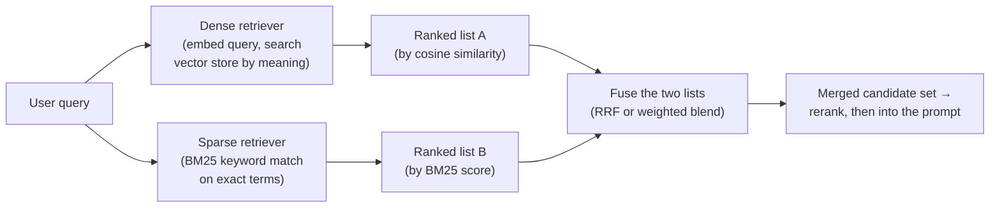

# Hybrid search

## The problem it solves

[Retrieval](retrieval.md) left us with a named, specific wound. Ranking chunks by geometric closeness in [embedding](../foundations/embeddings.md) space is a cheap, mostly-good proxy for relevance, and it fails in two directions. Reranking handles one of them. This lesson is the fix for the other: **relevant-but-not-similar** — the passage that genuinely answers the question but sits far from it in embedding space because it's phrased differently, or because the query is an *exact string* that a meaning-vector cannot represent.

Two flavors of this failure, and the second is the killer.

The mild one is **vocabulary mismatch**: a user asks "laptop won't turn on" and the answer lives in a doc titled "device fails to boot." Good embeddings often bridge this — that's their whole selling point — but not always, and near the edges they miss.

The severe one is **exact identifiers**, and here semantic search doesn't merely underperform, it is structurally the *wrong tool*. A user pastes an error code `E-1042`, a part number `SKU-88213-B` (SKU = stock-keeping unit, a product's exact code), a proper name, a configuration flag, a case number. What makes that token useful is its literal, character-for-character identity — and an embedding is designed to throw exactly that away. Embeddings encode a token by smearing it into a dense representation of the *meaning-neighborhood* it tends to appear in; `E-1042` has no meaning-neighborhood, so it lands near other codes that look vaguely similar and nowhere near the one document that actually mentions it. The more precise the query, the worse pure semantic search does — which is the exact inverse of what a user expects.

The uncomfortable truth this lesson resolves: the "old-fashioned" keyword search that embeddings were supposed to make obsolete is *better than embeddings* at precisely the queries embeddings are worst at. **Hybrid search is the admission that you shouldn't have to choose** — run both, and let each cover the other's blind spot.

> [!NOTE]
> **Keyword / lexical / "sparse" search (the BM25 workhorse).** Before embeddings, search worked by matching *words*, not meaning: index which terms appear in which documents, then rank a document by how many of the query's exact terms it contains and how rare-and-therefore-informative those terms are. **BM25 (Best Match 25)** is the standard scoring function for this — a decades-old, battle-tested keyword ranker still running under most search bars. You do **not** need its formula; hold it at intuition depth: *BM25 rewards a document for containing the query's exact terms, especially uncommon ones.* It's called "sparse" because it represents text as a huge mostly-zero vector over the whole vocabulary (one slot per word), the opposite of a "dense" embedding where every slot is a small number. Sparse = exact terms; dense = meaning.

## Two clerks in one bookstore

A vast secondhand bookstore has two clerks. Ada knows every book by what it's *about*: describe a half-remembered plot — "it's about a lighthouse and grief" — and she walks you to the shelf even if you've mangled the title. Cyrus hasn't read one of them, but he's memorized the catalog: read him an ISBN — the exact code printed in every book — and his finger is on it in seconds. Their weaknesses are mirror images. Ask Ada for "978-0-15-602760-7" and she's helpless; ask Cyrus for "the lighthouse one" and he shrugs. So you don't pick a clerk — you ask *both*, each hands you a ranked shortlist, and you merge the two lists.

That's hybrid search exactly. Ada is the dense/semantic retriever, matching by meaning; Cyrus is the sparse/keyword (BM25) retriever, matching exact terms. "The lighthouse one" is a paraphrase query where Ada wins; the ISBN is an exact identifier — an error code, a SKU, a part number — where Cyrus wins and Ada, whose embeddings blur literal character-identity, fails. Merging the two shortlists is *fusion*. Because they fail on *opposite* inputs, the merged list is blind only where *both* are blind, which is rare — and that complementarity is the entire reason to run two searches instead of one. It isn't redundancy; it's two searches because they're wrong about different things.

One line to carry out of here: **one clerk finds books by what they're about, the other by their exact catalog number — ask both and combine their lists, because no single clerk is good at both kinds of question.** Where the picture leaks: a human merging two shortlists uses judgment, but real fusion is a blunt formula — and you can't just staple the lists together, because Ada's "how sure am I" (a cosine similarity) and Cyrus's (a BM25 score) are measured on totally different scales. Reconciling those scales is the one genuine subtlety, and it's what the fusion methods below are built to handle.

## Two retrievers, then a fusion step

The architecture is exactly the analogy: run both retrievers on the same query, then combine their ranked outputs into one list.

Two things to notice before we get to *how* you fuse.

First, this costs you a **second index**. The dense side needs its [vector database](vector-databases.md); the sparse side needs a keyword index (an inverted index, the classic search-engine structure). You now build, store, and keep *both* in sync as your corpus changes — real operational weight, not a free win. Some vector databases bundle both so it's one system to run, but conceptually there are still two indexes doing two different jobs.

Second — and this is the pipeline hand-off — **hybrid search's job ends at "a better candidate set."** It widens the net so the right chunk is *present*, including the exact-identifier chunk a pure vector search would have dropped. Deciding the final *order* of that set, and trimming it to the best few, is [reranking](reranking.md)'s job, the next lesson. Hybrid improves *recall* (did we catch it at all); reranking improves *precision* (are the top ones the truly-best). Don't conflate them.

## Fusion: the actual hard part

You have two ranked lists. List A ranks by **cosine similarity** — a number like 0.82. List B ranks by **BM25 score** — a number like 14.7. How do you produce one combined ranking?

The naive move, "add the two scores," is a trap, and understanding *why* is the whole lesson. **The two scores live on incompatible scales.** Cosine similarity is bounded (roughly −1 to 1); BM25 is unbounded and depends on term rarity and document length — a BM25 of 14.7 has no fixed relationship to a cosine of 0.82. Add them and the larger-magnitude scale silently dominates; normalize them and you're now hostage to how you normalized, which shifts with every query. Raw scores from two different retrievers are simply not the same currency.

There are two answers to this, and knowing when each applies is what the topic is really testing.

### Reciprocal Rank Fusion (RRF) — fuse by rank, not by score

**RRF (Reciprocal Rank Fusion)** sidesteps the scale problem entirely with one move: *throw the scores away and use only the rank.* For each document, in each list, take its position (1st, 2nd, 3rd…), and give it points equal to `1 / (k + rank)` — a document ranked 1st is worth more than one ranked 5th, and the drop-off is steep. Sum a document's points across both lists; sort by the total. (The `k` is a small smoothing constant, conventionally around 60, that keeps the top rank from utterly dwarfing everything below it — don't confuse it with the top-k of retrieval.)

Why this is the popular default: **rank is a common currency that both retrievers already share.** "Ada's 2nd-favorite" and "Cyrus's 2nd-favorite" are directly comparable in a way "0.82 cosine" and "14.7 BM25" never are. RRF needs no normalization, no per-query tuning, no assumption that the two score distributions line up — it just asks each retriever "where did you *rank* this?" and rewards documents that rank high in *either* list. A chunk Ada buried at rank 50 but Cyrus put at rank 1 (your exact error code) surfaces near the top of the merged list, which is exactly the rescue you wanted. Robust, parameter-light, works out of the box — that's why it's the industry default.

Its cost is the flip side: **by discarding scores it discards magnitude information.** If one retriever was *wildly* more confident than the other about a result, RRF can't hear that — a rank-1 is a rank-1 whether the retriever was certain or barely.

### Weighted score blending — and the alpha dial

The alternative: normalize the two scores onto a comparable range and take a weighted sum, typically written

`final = alpha * dense_score + (1 - alpha) * sparse_score`

where **alpha** is a dial from 0 to 1. `alpha = 1` is pure semantic search; `alpha = 0` is pure keyword search; `0.5` weights them equally. This *keeps* the magnitude information RRF throws away, and it gives you a genuine tuning knob: a codebase-search or legal-citation product, where exact terms dominate, might push alpha toward the sparse side; a conversational FAQ (frequently-asked-questions) assistant, where paraphrase rules, pushes toward the dense side.

The price is everything RRF avoided: you must normalize two ill-matched scales (and your normalization can misbehave on outlier queries), and alpha is now a parameter you have to *tune against real data* rather than accept a default. Alpha is a real lever, but a lever someone has to pull correctly.

The sayable contrast: **RRF fuses by rank — no tuning, no scale problem, the robust default; weighted blending fuses by normalized score with an alpha dial — more control, more magnitude-awareness, but you own the normalization and the tuning.** Most teams start with RRF and reach for weighted blending only when they have the eval data to tune alpha and a reason to.

## When hybrid earns its keep — and when it doesn't

Hybrid is not a free upgrade you bolt onto every system. It's a targeted fix, and the mature move is knowing when the fix is warranted.

**Hybrid genuinely helps when your queries carry exact tokens that must match literally:** product catalogs (SKUs), technical support (error codes, log strings), code search (function names, flags), legal and medical (case numbers, drug names, statute cites), and anywhere users paste proper nouns or identifiers. If your failure logs show "the answer was in the docs but only findable by an exact term the vector search blurred," that's the signature — the [relevant-but-not-similar](retrieval.md) failure with an exact-match flavor.

**Pure semantic search is often fine when queries are natural-language and conceptual:** "how do I feel more motivated at work," "summarize the themes in this report." There are no load-bearing exact strings; meaning is the whole game, and a sparse retriever adds cost and a second index for little lift. Adding hybrid here is complexity you're maintaining for a benefit you can't measure.

So the honest tradeoff sheet: hybrid buys you coverage of the exact-match blind spot, at the cost of a **second index to build and keep in sync**, **added system complexity**, and — if you go the weighted route — **a fusion parameter to tune**. Worth it when your query mix has literal tokens; over-engineering when it doesn't. As always in this category, **measure it** ([Recall@k](retrieval.md) with and without the sparse side) rather than adding it on faith.

## Summary / Points to Remember

- **Hybrid search = run a dense/semantic retriever and a sparse/keyword (BM25) retriever, then fuse their two ranked lists into one candidate set.** It's the fix for [retrieval](retrieval.md)'s *relevant-but-not-similar* failure.
- **Dense and sparse fail on opposite inputs, which is the entire point.** Dense (embeddings) is great at meaning and paraphrase but blurs exact identifiers — error codes, SKUs, part numbers, proper names — because it encodes meaning-neighborhoods, not literal character identity. Sparse (BM25) nails exact terms but is blind to paraphrase. Combining them covers each other's blind spot.
- **Fusion is the hard part because the two scores are on incompatible scales** — a cosine similarity (~0.82) and a BM25 score (~14.7) aren't the same currency, so you can't just add them.
- **RRF (Reciprocal Rank Fusion) is the popular default because it fuses by *rank*, not score** — rank is a currency both retrievers share, so no normalization and no per-query tuning; a chunk ranked high by *either* retriever surfaces. Its cost: it discards magnitude/confidence information.
- **Weighted blending uses an alpha dial** (`alpha·dense + (1−alpha)·sparse`): alpha=1 is pure semantic, alpha=0 pure keyword. It keeps magnitude info and gives real control, but you must normalize the scales and tune alpha against data.
- **Hybrid helps when queries carry literal tokens that must match** (codes, SKUs, names, code, legal/medical cites); **pure semantic is fine for conceptual natural-language queries.** The cost is a second index, more complexity, and a possible tuning parameter — so measure the lift, don't add on faith.
- **Hybrid improves the *candidate set* (recall); it does not decide final order — that's [reranking](reranking.md).** Hybrid catches the right chunk; reranking floats the best ones to the top.

## Interview Questions That Stump People

**Q: "If our embedding model is state-of-the-art and 'understands meaning,' why would we ever bolt on 1970s keyword search? Isn't that a step backward?"**

**Interviewer:** We spent real money on a top-tier embedding model precisely so we'd be past keyword matching. Now the proposal is to add BM25 alongside it. Why would a better embedding not just solve this?

**You:** Because the failure isn't a weakness in the embedding — it's a *property* of what an embedding is, and a better embedding doesn't remove it. Embeddings work by mapping a token into a dense vector of the meaning-neighborhood it lives in. That's exactly why they're brilliant at "laptop won't boot" ≈ "device fails to start." But an exact identifier — an error code, a SKU, a part number — has no meaning-neighborhood; its entire value is its literal character identity, which the embedding is *designed* to abstract away. So `E-1042` gets mapped near other codes that look similar and far from the one doc that actually contains it. A stronger embedding model makes the meaning-matching even better and does nothing for the literal-match problem, because that problem is structural, not a quality gap. Keyword search isn't a step backward here — it's the tool that's *good at the exact thing embeddings are worst at*. Hybrid search runs both and fuses the results, so you get meaning-understanding where that wins and literal precision where *that* wins. The framing I'd push back with is that "old" doesn't mean "obsolete" — BM25 covers a blind spot that no amount of embedding quality closes.

> [!TIP]
> **Why this answer works:** The bait is "better model → problem solved," treating keyword search as legacy cruft. The strong move explains the *mechanism* — dense vectors encode meaning-neighborhoods and therefore blur literal identity — so the interviewer sees the exact-match failure is inherent, not a bug you can spend your way out of. Positioning BM25 as the complement to a specific structural blind spot (not a downgrade) shows you understand what an embedding actually is, which is what the question is really probing.

---

**Q: "Fine, we run both retrievers. Why not just add the cosine similarity and the BM25 score and sort by the total? Why do we need some special fusion algorithm?"**

**Interviewer:** We've got two ranked lists with scores on each. Adding two numbers is trivial. What's wrong with `cosine + bm25` as the combined score?

**You:** Because those two numbers aren't the same currency, so adding them is meaningless. Cosine similarity is bounded, roughly −1 to 1; BM25 is unbounded and swings with term rarity and document length, so a "good" BM25 might be 14 on one query and 40 on another. Add them raw and the bigger-magnitude scale silently dominates the ranking — you're mostly just sorting by BM25 with a cosine rounding error. You *could* normalize both onto a common range and take a weighted sum, and that's a legitimate method — weighted blending with an alpha dial — but now your result depends on how you normalized, and query-to-query the score distributions shift, so it's fragile without tuning. The clean way around all of it is Reciprocal Rank Fusion: throw the scores away and fuse on *rank* instead. Each document scores `1/(k+rank)` in each list, summed across lists. Rank is a currency both retrievers already share — a 2nd-place from the dense side and a 2nd-place from the sparse side are directly comparable in a way their raw scores never are — so RRF needs no normalization and no per-query tuning, which is why it's the default. You give up magnitude information — RRF can't tell "barely ranked #1" from "overwhelmingly #1" — but for most systems that robustness is the better trade.

> [!TIP]
> **Why this answer works:** The trap is treating fusion as trivial arithmetic. Naming *why* raw addition fails — incompatible, differently-bounded score scales where one silently dominates — is the insight that separates someone who's built this from someone sketching a diagram. Presenting both real options (weighted blending vs RRF) with their actual tradeoff (tuning/normalization vs discarding magnitude) shows range, and explaining that RRF works because *rank is a shared currency* demonstrates you understand the mechanism, not just the acronym.

---

**Q (clarify-back): "We want to add hybrid search to our product to improve retrieval. Should we use RRF or weighted blending with a tuned alpha?"**

**Interviewer:** We're sold on hybrid. The team's debating RRF versus a tuned alpha blend. Which should we ship?

**You (clarify back):** Two things decide it for me: do we have a labeled eval set to actually *tune* alpha against — real queries with known-correct chunks — and how skewed is our query mix between exact-identifier lookups and conceptual questions?

**Interviewer:** Honestly, no real eval set yet, and the query mix is all over the place — some people paste error codes, plenty ask normal how-to questions.

**You:** Then start with RRF, and don't reach for alpha yet. Weighted blending's whole advantage is the tunable alpha, but a tuning knob with no eval data to tune it against isn't an advantage — it's a guess you'll set to 0.5 and never validate, plus a normalization step that can misbehave on outlier queries. RRF gives you most of the benefit with none of that: no tuning, no scale reconciliation, robust across a mixed query set out of the box, and it correctly rescues the exact-code chunk that the dense side buried. So ship RRF, and *simultaneously* start building the eval set — real queries labeled with their answer chunks — because that's what unlocks everything downstream: it tells you whether hybrid even helped (compare Recall@k with and without the sparse side), and only once you have it does moving to a tuned alpha become a measurable decision instead of a vibe. The sequencing matters: RRF now, eval set in parallel, weighted alpha only if the data later says a specific tilt beats the default.

> [!TIP]
> **Why this works:** "RRF or weighted blend" sounds like a pure technical preference, but the real deciding variable is whether you can *tune* — and that hinges on eval data you might not have. Clarifying surfaces exactly that, plus the query mix, before committing. Recommending RRF-now-plus-build-the-eval-set shows you know weighted blending's alpha is only worth its complexity when there's data to tune it, and that measurement is the precondition for the fancier method — not an afterthought. Recommending the tunable option to a team with nothing to tune it on would signal you've read about the methods but never operated them.

---

**Q: "Our semantic search is great on conceptual questions but users complain it 'can't find things it obviously has.' What's the likely cause and fix?"**

**Interviewer:** Retrieval feels smart on open-ended questions, but users keep saying they searched for something specific that's definitely in the docs and got nothing useful. What's going on?

**You:** "It obviously has it but can't find it" plus "something specific" is the textbook signature of the exact-identifier blind spot. I'd bet those failing queries contain literal tokens — an error code, a product ID, an exact feature name, a filename — and pure semantic search is structurally bad at those, because an embedding blurs literal character identity into a meaning-neighborhood the token doesn't really have. So the vector search returns things that are *about* the general area and misses the one chunk that contains the exact string. First I'd confirm it empirically: pull the failing queries, check whether they're identifier-heavy, and look at what got retrieved — you'll usually see topically-near-but-wrong chunks. The fix is hybrid search: add a BM25 keyword retriever alongside the semantic one and fuse with RRF, so a chunk that the dense side buried but that literally contains the code ranks high in the sparse list and surfaces in the merged set. I'd validate with Recall@k on that failing-query slice specifically, with and without the sparse side. One caveat — I'd make sure this is a retrieval-method problem and not a chunking one; if the exact term exists in the corpus but got split awkwardly across chunk boundaries, hybrid helps less, so I'd check that too before declaring victory.

> [!TIP]
> **Why this answer works:** It maps a vague user complaint onto a specific, named failure mode (exact-match / relevant-but-not-similar) rather than reaching for a bigger model or more k. Insisting on confirming empirically — inspect the failing queries and what was retrieved — signals you diagnose before prescribing, and prescribing hybrid+RRF with a *targeted* Recall@k check on the failing slice shows you'd measure the lift, not add complexity on faith. Flagging chunking as an alternative cause proves you reason across pipeline stages instead of pattern-matching to one fix.
