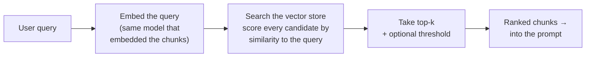

# Retrieval

## The problem it solves

The [vector database](vector-databases.md) lesson ended on a deliberate boundary: the database returns "the nearest vectors by the distance metric," and whether those are *actually the right ones* is somebody else's job. This is that somebody. **Retrieval is the query-time logic that turns a user's question into a set of chunks worth putting in the [context window](../foundations/context-windows.md)** — embedding the question, searching the store, scoring candidates by how close they are, and deciding how many to keep and whether any clear the bar at all. The vector database is the *warehouse and its index*; retrieval is the *act of shopping* — what you search for, how you rank, how much you take home.

And it is, per [RAG](rag.md)'s iron law, the stage that caps everything: the model can only answer as well as the passages retrieval hands it, and most RAG failures are retrieval failures. So this lesson is where that law gets operational — the concrete decisions and the one deep subtlety that separates a retrieval system that looks fine in a demo from one that holds up on real questions.

That subtlety, stated up front because everything else orbits it: **"closest in embedding space" is only a *proxy* for "actually answers the question," and the whole craft of retrieval is narrowing the gap between the proxy and the truth.** A passage can sit near the query's meaning-fingerprint and still not contain the answer; a passage that *does* contain the answer can sit far away because it's phrased differently. Retrieval quality is the war against both.

> [!NOTE]
> **What's assumed here.** This lesson stands on three earlier ones and re-teaches none: [embeddings](../foundations/embeddings.md) (text → a meaning-vector), [chunking](chunking.md) (documents pre-split into the units being searched), and [vector databases](vector-databases.md) (the store that finds nearest vectors fast). If any is shaky, read it first. Here they're the given, and the question is: *given* a store full of chunk-vectors, how do you query it well?

## A recruiter ranking résumés

A recruiter has one opening and four hundred résumés. They can't interview everyone, so they rank every résumé by how well it matches the job posting and interview only the top handful. Whether that works comes down to three things — and each is a retrieval decision in disguise.

Say the role is "Kubernetes platform engineer." First, the recruiter has to *describe the job in the words résumés actually use*: if the posting says "container orchestration" but the strongest candidate just wrote "K8s" on their CV, a matching that keys on the posting's wording sails right past them — that's the query and the documents needing to live in the same space, and the vocabulary-mismatch problem when they don't. Second, the recruiter must not be seduced by a résumé *stuffed with the right buzzwords* — "Kubernetes, Kubernetes, Kubernetes" — that ranks near the top but belongs to someone who's never run a cluster: sounding like a match isn't being one. Third, they choose *how many* to interview: too few and the real hire is in the stack they skipped; too many and they drown in mediocre ones.

Line those up and it's exactly retrieval: the job posting is the user's query, each résumé a stored chunk, ranking by match is scoring chunks by similarity to the query, interviewing the top handful is returning the *top-k*, the buzzword-stuffed résumé is a chunk that's *similar but not relevant*, and the strong candidate who only wrote "K8s" is the *relevant but not similar* one a raw ranking misses.

One line to carry out of here: **retrieval is a recruiter ranking résumés — score everything by how well it matches, interview the top few, and never confuse a résumé full of the right words with a candidate who can actually do the job.** Where the picture leaks: a recruiter can *read* a résumé and understand it; retrieval's score is a geometric distance between vectors with no comprehension, so it's even more prone to the buzzword trap than a human — which is exactly why the next lessons ([reranking](reranking.md), [hybrid search](hybrid-search.md)) exist to catch what a raw similarity score misses.

## The mechanics: query in, ranked chunks out

At query time, retrieval runs a short, fixed pipeline. None of it is exotic; the leverage is in the choices at each step.

- **Embed the query with the *same* model that embedded the chunks.** This is a non-negotiable and a classic silent bug: query and documents must live in the *same* embedding space, or "closeness" is meaningless. Embed your chunks with one model and your queries with another and retrieval quietly returns garbage — no error, just bad results.
- **Score by similarity.** The store ranks candidates by a distance metric (next section).
- **Keep the top-k, optionally above a threshold.** Return the k best, and optionally drop anything below a minimum similarity so a query with *no* good match returns nothing rather than forcing weak chunks in.

## How "closeness" is actually measured

"Nearest" needs a definition, and the metric is a real choice with a conceptual point behind it.

- **Cosine similarity** — the most common. It measures the *angle* between two vectors, i.e. whether they point in the same *direction*, ignoring their length. The intuition that matters: it compares *what a piece of text is about* (direction) and deliberately ignores *how much text there is* (magnitude), so a short query and a long passage on the same topic still score as close. That length-independence is why it's the default for semantic search.
- **Dot product** — like cosine but *not* length-normalized, so magnitude counts. Faster, and used when the embedding model is trained to produce vectors where magnitude is meaningful.
- **Euclidean distance** — straight-line distance between the two points. Intuitive, less common for text embeddings than cosine.

You rarely have to *pick* this by hand — you use whatever your embedding model was trained for — but you should know *why* cosine dominates: **for meaning-search you care about direction (topic), not magnitude (length), and cosine is the metric that throws length away.** Getting this wrong (using a metric the model wasn't trained for) is another quiet quality leak.

## Top-k: the dial you actually turn

`k` — how many chunks you retrieve — is the knob a PM will genuinely tune, and it's a direct tradeoff.

- **Too small a k** risks *recall failure*: the passage with the answer exists but sits at rank 6 when you only took 5, so the model never sees it and can't answer. This is the more dangerous side, because a missing answer is invisible — the system just fails.
- **Too large a k** drags in weakly-related chunks, which costs [tokens](../foundations/tokenization.md) and latency and — crucially — reintroduces the "lost in the middle" dilution that hurts answer accuracy. More context is not more better.

The instinct people bring — "retrieve a lot to be safe" — is half-right and half-wrong, which is exactly why the next stage exists: **you retrieve a *generous* k to get recall (don't miss the answer), then [rerank](reranking.md) to cut it back down to the few genuinely-best before they hit the model.** Retrieval optimizes for *not missing it*; reranking optimizes for *precision*. Holding k as "the recall dial, refined later by reranking" is the mature framing.

## Similarity is not relevance — the deep point

Here is the idea that separates someone who's *operated* retrieval from someone who's read the diagram. **The similarity score ranks by geometric closeness in embedding space, which is a strong but imperfect stand-in for "answers the user's question."** The gap shows up in both directions and both are common:

- **Similar but not relevant.** A chunk can share the query's topic and vocabulary — score high — while not containing the answer. Ask "how do I *cancel* my subscription?" and a passage lovingly explaining the *benefits* of your subscription is highly similar and useless. Raw semantic search has no way to tell "about the same thing" from "answers this."
- **Relevant but not similar.** The answer exists but is phrased in words the query doesn't use — the *vocabulary-mismatch* problem. A query for "laptop won't turn on" may not land near a document titled "device fails to boot," because embeddings can miss that these are the same thing, and pure semantic search will also underperform on exact identifiers — a part number, an error code, a proper name — where you need a *literal* match, not a vibe.

These two gaps are the entire motivation for the next two lessons, and you should name them as *fixes for retrieval's blind spots*, not as unrelated features:

- **[Reranking](reranking.md)** attacks *similar-but-not-relevant*: a second, slower, sharper model re-scores the top candidates for true relevance and reorders them, so the genuinely-best rise above the merely-similar.
- **[Hybrid search](hybrid-search.md)** attacks *relevant-but-not-similar*: combine semantic search with old-fashioned keyword search so exact terms and identifiers the embedding blurred still get caught.

The sayable core: **retrieval ranks by similarity because it's cheap and mostly works; it fails when similarity and relevance diverge, and the rest of the RAG stack is machinery for closing that gap.**

## Making the query itself better

One lever sits *before* the search and is easy to forget: the raw user query is often a bad search key, and you can transform it first.

- **Query rewriting / expansion** — reshape the user's input into something that retrieves better: expand abbreviations, add synonyms, or in a conversation rewrite a follow-up like "what about the annual one?" into the standalone "what is the price of the annual plan?" (a bare pronoun-laden follow-up retrieves terribly on its own). This is one of the highest-ROI, least-glamorous retrieval improvements.
- **Multi-query** — issue several phrasings of the question and merge the results, to hedge against any single phrasing missing the right chunk.

You don't need the implementations; you need the reflex that **the query you search with does not have to be the string the user typed** — improving retrieval can mean fixing the *question* before you ever touch the index.

## Measuring it — because you can't tune what you don't score

RAG's iron law told you to measure retrieval in isolation; this is how. Build a set of real questions each labeled with the chunk(s) that actually answer them, then score:

- **Recall@k** — of the questions whose answer-chunk exists, how often is it in the top-k retrieved? This is usually *the* number that predicts RAG quality, because a chunk not retrieved can never be used.
- **Precision@k** — of the k chunks returned, how many are actually relevant? Low precision means you're feeding the model noise.
- **MRR (Mean Reciprocal Rank)** — how high up the *first* correct chunk lands on average; rewards getting a right answer near the top, not just somewhere in the list.

The point isn't the exact statistic — it's that **retrieval is independently measurable, and you debug a weak RAG system by scoring retrieval first, before touching the model or the prompt.** A team that can't state its Recall@k is flying blind on the stage that caps their quality.

## Summary / Points to Remember

- **Retrieval is the query-time logic that turns a question into ranked chunks:** embed the query, score candidates by similarity, keep the top-k (optionally above a threshold). The [vector DB](vector-databases.md) is the store; retrieval is the act of querying it well.
- **The deep truth: similarity ≠ relevance.** Ranking by geometric closeness in embedding space is a cheap, leaky proxy for "answers the question." It fails as *similar-but-not-relevant* (topic match, no answer) and *relevant-but-not-similar* (right answer, different words / exact identifiers a semantic search blurs).
- **Those two failures motivate the next lessons:** [reranking](reranking.md) fixes similar-but-not-relevant (a sharper model re-scores the top candidates); [hybrid search](hybrid-search.md) fixes relevant-but-not-similar (add keyword search for literal matches).
- **Embed the query with the *same* model as the chunks** — different spaces = silently meaningless "closeness," a classic no-error bug.
- **Cosine similarity dominates because it compares *direction* (topic) and ignores *magnitude* (length)** — exactly what you want for meaning-search; dot product and Euclidean are the alternatives.
- **top-k is the recall dial:** too small and the answer-chunk gets left out (an invisible failure); too large and you pay tokens/latency and dilute accuracy ("lost in the middle"). Standard move: retrieve generous k for recall, then rerank down for precision.
- **The query you search with needn't be what the user typed** — rewriting/expansion and multi-query are high-ROI retrieval boosts (especially rewriting conversational follow-ups into standalone questions).
- **Retrieval is independently measurable — Recall@k, Precision@k, MRR — and you debug RAG by scoring retrieval first.** Recall@k usually predicts overall quality, since an un-retrieved chunk can never be used.

## Interview Questions That Stump People

**Q: "Our retrieval returns chunks that are clearly on-topic, but they often don't actually contain the answer, so the bot rambles. The similarity scores are high. What's wrong?"**

**Interviewer:** We looked at what's being retrieved. The chunks are definitely about the right subject — high similarity scores — but they don't have the specific answer, so the model waffles. If similarity is high, why are the results unhelpful?

**You:** Because high similarity is telling you the chunks are *about the same topic*, and you're assuming that means they *answer the question* — and those are different things. Retrieval ranks by geometric closeness in embedding space, which captures topical and vocabulary overlap really well, but "about subscriptions" and "explains how to cancel a subscription" are both close to a cancel query, so a chunk that just discusses the topic scores high without containing the answer. That's the classic similar-but-not-relevant failure, and raw semantic search structurally can't distinguish the two. The fix isn't a bigger k or a better embedding model — it's a *reranking* stage: after retrieval pulls a generous candidate set, a slower, sharper model re-scores each candidate against the query specifically for whether it *answers* it, not just whether it's related, and reorders so the genuinely-relevant ones rise to the top. I'd also sanity-check the chunks themselves — if the answer is getting split across chunk boundaries, that's a chunking problem masquerading as a retrieval one. But the symptom you describe — high similarity, low usefulness — is the textbook signature of similarity outrunning relevance, and reranking is the targeted cure.

> [!TIP]
> **Why this answer works:** The trap is treating a high similarity score as proof the retrieval worked. The strong move names the exact conceptual gap — similarity measures topical closeness, not answer-bearing relevance — and explains *why* semantic search can't close it on its own, then prescribes reranking as the specific fix rather than flailing at k or the embedding model. Flagging chunking as an alternative cause shows you diagnose across pipeline stages instead of guessing, which is the competence the question probes.

---

**Q: "Semantic search is supposed to understand meaning, so why does our system whiff on exact things — product codes, error numbers, specific names?"**

**Interviewer:** The whole pitch of embeddings is understanding meaning beyond keywords. So why does our search fail exactly when a user pastes an error code or a SKU (stock-keeping unit — a product's exact code) — the times an old keyword search would've nailed it?

**You:** Because that's the flip side of retrieval's proxy — relevant-but-not-similar — and it's the one thing semantic search is *worst* at. Embeddings encode meaning by smearing a token into a dense representation of its context, which is brilliant for "laptop won't boot" ≈ "device fails to start," but it actively *blurs* the thing that makes an error code or a SKU useful: its exact, literal, character-for-character identity. To an embedding, one part number looks a lot like a similar-looking part number, because it has no semantic neighborhood to anchor it — so the precise match you need drops in the ranking. Old keyword search was *great* at this: exact-term matching is its whole nature. So the answer isn't to abandon semantic search, it's hybrid search — run both, semantic for conceptual queries and keyword (lexical) matching for exact terms, and fuse the results. You get meaning-understanding where that helps and literal precision where *that* helps. It's a case where the "old" technique isn't obsolete; it covers precisely the blind spot the new one has.

> [!TIP]
> **Why this answer works:** The question bait is "embeddings understand meaning, so keyword search is obsolete." The expert reply shows the *mechanism* — dense semantic representations blur exact literal identity — so the failure on codes/SKUs is inherent, not a bug, and positions keyword search as the complementary fix (hybrid) rather than a legacy relic. Explaining *why* embeddings fail on identifiers, not just that they do, demonstrates you understand what an embedding actually is, which is what separates a real answer from a slogan.

---

**Q (clarify-back): "Retrieval quality is bad. Should we just bump k way up so we stop missing answers?"**

**Interviewer:** Our RAG answers are missing information that's in the docs. The quick fix on the table is to raise k a lot — retrieve 50 chunks instead of 5 so we stop missing things. Good idea?

**You (clarify back):** It'll help one problem and possibly create another, so let me pin the failure down first — when it misses, have we confirmed the answer-chunk *exists and is being ranked just outside the current k*, versus not being retrieved at any k? What's our Recall@k right now?

**Interviewer:** We haven't measured it formally, but eyeballing it, the right chunk often seems to be there, just not in the top 5.

**You:** Then raising k will genuinely recover those — but I wouldn't just dump 50 chunks into the prompt, because that trades a recall problem for a precision-and-dilution problem: more tokens, more latency, and the "lost in the middle" effect where burying the answer among 45 irrelevant chunks actually *lowers* the model's accuracy. The right shape is retrieve-wide-then-narrow: raise k to, say, 30–50 so the answer is reliably *in* the candidate set — that's your recall — then add a reranker that re-scores those and passes only the top 5 genuinely-relevant ones to the model. You get the recall of a big k and the precision of a small one. And step zero is to actually measure Recall@k, because if the answer-chunk *isn't* in the results even at k=50, then k isn't the problem at all — that's a chunking or embedding issue, and cranking k would just add noise while fixing nothing.

> [!TIP]
> **Why this works:** The proposed fix (crank k) treats a two-sided tradeoff as one-sided. Clarifying *whether the answer is near-miss-ranked or absent entirely*, and asking for Recall@k, is what determines whether more k even helps — and prevents "solving" a chunking problem with a knob that can't touch it. Landing on retrieve-wide-then-rerank-narrow shows you know k buys recall while reranking buys precision, so you don't have to choose; insisting on measurement first signals you tune retrieval with numbers, not vibes.
