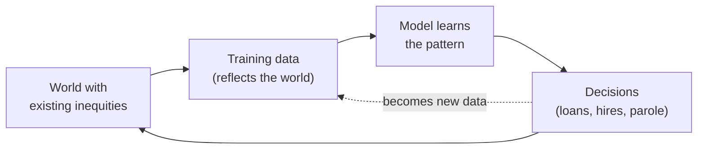
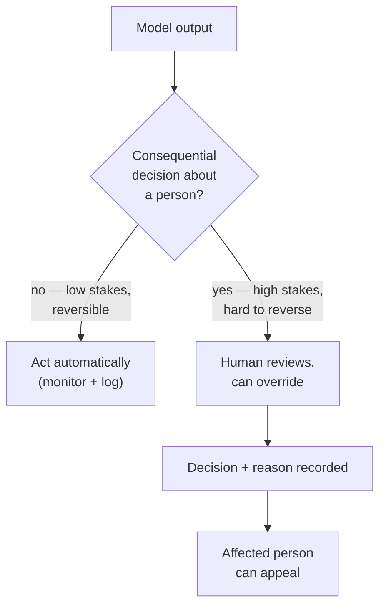

# Responsible AI

## The problem it solves

You can ship a model that is accurate, secure against attackers, and careful with personal data — and it can still be the wrong thing to have built. Picture a lending model that quietly approves one neighborhood and declines another at twice the rate. Nothing "broke": it wasn't hacked, it leaked no data, it ran inside its [guardrails](guardrails.md). It just encoded a pattern from history and turned it into thousands of decisions no one can fully explain, affecting people who never agreed to be judged this way, with no clear answer to "who is responsible when it's wrong?"

The operational controls in this category — [guardrails](guardrails.md), [security](ai-security.md), [privacy](privacy-pii.md) — all answer a *how* question: **is the system operating safely?** Responsible AI answers the questions that sit *above* them: **should we build this at all, for whom, at whose expense, and who answers when it causes harm?** Those aren't engineering questions with a right answer you can test for. They are questions about **values** — fairness, transparency, accountability — and about **governance**: the process by which an organization makes those value choices deliberately instead of by accident. This is the capstone of safety and trust because it's the lens that decides what all the operational machinery is *in service of*. (PM = product manager, ML = machine learning, LLM = large language model — a model trained on huge text corpora to predict and generate language.)

## The one analogy to remember

**The picture:** A hospital does not run on surgical skill alone. Around every powerful procedure sits an ethics board that asks "should we do this, and for whom?", an informed-consent form the patient signs, a named attending physician who is accountable if it goes wrong, and a standing duty to treat every patient fairly regardless of who they are.

**The mapping:** the surgeon's raw skill = the model's raw capability; the sterile-technique checklist = the operational [guardrails](guardrails.md); the ethics board weighing "should we, and for whom" = responsible AI (the values-and-governance lens); the informed-consent form = transparency and disclosure; the named attending physician = accountability and human oversight; the duty to treat every patient fairly = fairness and non-discrimination; "the scalpel can heal or harm" = dual-use and misuse.

**Why it holds:** in medicine as in AI, capability and safety-mechanics are necessary but not sufficient — the genuinely hard part is the *judgment about competing values* (a patient's autonomy versus their benefit versus fairness across all patients), and no checklist can automate that judgment. It has to be *governed by accountable people*. That is exactly what responsible AI is: governance over value tradeoffs, not a device you install.

**Say it like this:** "Responsible AI is to a model what a hospital's ethics board and consent rules are to a surgeon — the skill was never the hard part; deciding whether we should, for whom, and who answers when it goes wrong is."

*Where it breaks:* a hospital has centuries of settled medical ethics and law to draw on; AI governance is young, the "right" definition of fairness is genuinely contested, and much of the rulebook is still being written — so responsible AI today is less about applying a settled code and more about making tradeoffs *explicit and defensible*.

## Where bias comes from — and why it compounds

The first pillar most interviews probe is **bias**. The naive mental model is that bias is a bug someone introduced. The accurate one is that bias is the *default* — it arrives through the front door, in the data.

A model learns patterns from its training data, and that data is a record of a world with existing inequities. Train a résumé-screener on a decade of a company's past hires, and if that company historically hired mostly one kind of candidate, the model learns "that kind of candidate = good hire" — it has faithfully captured a biased history and will now project it forward. Bias also enters through the humans in the loop: the people who label data and the human preferences used to shape model behavior in [post-training](../model-behavior-training/rlhf.md) carry their own assumptions, and those get baked into the weights. (Post-training with human feedback is *where a model's values and refusals are instilled* — the mechanics of how are their own lesson; here it matters only as one entry point for bias.)

The reason this is dangerous rather than merely unfortunate is the **feedback loop**. A biased model makes biased decisions; those decisions shape the world (who gets the loan, the interview, the parole); and the record of those outcomes becomes the next round of training data — which confirms and amplifies the original bias.

Two consequences a PM must be able to say out loud. First, **you cannot fix bias by removing the sensitive attribute.** A model that never sees race or gender can still discriminate through *proxies* — a zip code, a first name, a shopping pattern that correlates with the protected trait. This is **disparate impact**: a facially neutral rule that produces unequal outcomes for a protected group. It is the outcome, not the intent, that the law and the harm turn on. Second, bias testing is not a one-time gate; because the loop keeps turning, fairness has to be *monitored*, which is why it belongs to [evaluation](../evaluation/evaluation-methods.md) as an ongoing measurement, not a launch checkbox.

## Why "fair" is not one thing

Here is the insight that separates a knowledgeable answer from a rehearsed one: **"make it fair" is under-specified, because fairness is not a single property — it is several, and they conflict.**

Consider three reasonable definitions of a fair loan model:

- **Group fairness (equal outcomes):** approve the same *proportion* of applicants in each group.
- **Equal accuracy (calibration/error parity):** the model should be equally *accurate*, or make equally-costly mistakes, for each group.
- **Individual fairness:** two applicants who are similar in every relevant way should get the same decision.

Each sounds obviously correct. The uncomfortable result — established formally, but statable at PM depth — is that **when the underlying base rates differ between groups, you cannot satisfy all of these at once.** Forcing equal approval rates will change the error rates you offer each group; forcing equal error rates will change the approval rates. There is no setting of the model that makes every fairness metric happy simultaneously. This is an *impossibility result*, not an engineering gap you can close with a better model or more data.

> [!NOTE]
> **Base rate** — the underlying frequency of the thing being predicted within a group (e.g., the true default rate among applicants). When base rates genuinely differ between groups, the fairness definitions above pull against each other mathematically; if base rates were identical, the conflict would largely disappear.

So the load-bearing takeaway: **choosing which fairness to optimize is a value judgment, not a technical decision.** A bank regulator might mandate equal-outcome fairness; a medical device might prioritize equal accuracy so no group gets worse care. There is no view-from-nowhere "fair." Responsible AI's job is to make that choice *deliberately, document it, and defend it* — not to pretend a neutral answer exists. An interviewer asking "how would you make this fair?" is usually testing whether you know there's a question hiding inside the question.

## Transparency: disclosure and the limits of explanation

The second pillar is **transparency**, and it splits into two things people conflate.

**Explainability** — being able to say *why the model produced a specific output* — is genuinely hard for LLMs and deep models. The decision lives in billions of weights with no human-readable rule; there is no line you can point to that says "declined because of X." Worse, if you *ask* the model to explain itself, it will produce a fluent, plausible rationale — but that rationale is generated the same way any other text is, and need not be the actual cause of the decision. It is a post-hoc story, and it can be confidently wrong in the same way a [hallucination](../reasoning-generation/hallucination.md) is. Treating the model's self-explanation as ground truth is a classic trap.

**Transparency in practice** is the achievable version, and it is more about *disclosure and documentation* than about cracking open the weights:

- **Disclosure that it's AI** — people have a right to know they're interacting with a machine, not a human, especially in sensitive contexts.
- **Model cards** — a short, standardized document stating what a model is for, what it was trained on at a high level, its known limitations, and the groups it was and wasn't tested on. Think of it as a nutrition label for a model.
- **Documenting the value choices** — writing down which fairness definition you chose and why, so the decision is auditable later.

The reframe worth carrying: you usually cannot deliver *explanation of an individual decision*, but you can and must deliver *transparency about the system* — what it does, its limits, and the choices behind it.

## Accountability and human oversight

The third pillar answers the "who's responsible when it's wrong" question, and the answer is blunt: **accountability cannot be delegated to an algorithm.** "The model decided" is not a defense. The organization that built and deployed the system is responsible for its outcomes, the same way a company is responsible for a defective product regardless of which machine on the line stamped it.

Operationally, this becomes a design principle: **human oversight scaled to consequence.** Low-stakes, reversible outputs (drafting a marketing email) can run autonomously; high-stakes, hard-to-reverse decisions about people (credit, hiring, medical triage, benefits eligibility) need a **human in the loop** — a person who can review, override, and be held responsible, plus a route for the affected person to contest the decision. The failure mode to name is the *rubber-stamp*: a human nominally "in the loop" who approves everything without real scrutiny, which gives the appearance of oversight while providing none.

## Harmful content, misuse, and dual-use

Responsible AI also owns the question of what the system's capability could do *to* people — including uses you never intended.

- **Harmful content** the model itself might generate (hate, self-harm encouragement, dangerous instructions). *Deciding* what counts as harmful and *where the line sits* is the responsible-AI judgment; *enforcing* that line at runtime is what [guardrails](guardrails.md) do. Don't confuse the policy with the mechanism.
- **Misuse** — a capable, well-behaved tool turned to harm by a user: generating disinformation at scale, phishing, fraud, non-consensual imagery.
- **Dual-use** — the same capability that is beneficial is inherently harmful in another frame. A model that's excellent at chemistry helps researchers and, unchanged, helps someone synthesize something dangerous. You cannot remove the harmful use without removing the beneficial one, because they are the *same* capability.

The mature stance is that responsibility extends to *reasonably foreseeable misuse*, not just the intended use. "We only built it for X" doesn't discharge the duty if Y was obvious. This is where responsible AI connects to the [adversarial security lens](ai-security.md) — but security is about attackers subverting the system, whereas misuse is about the system working exactly as designed in service of a harmful goal.

## Governance frameworks: the shape, at PM depth

Finally, these values are being turned into *obligations*. A PM should recognize the major frameworks and their shape without memorizing their clauses.

- **EU AI Act** — the European Union's AI regulation, and the first broad one. Its defining idea is **risk tiering**: applications are sorted into *unacceptable* (banned outright, e.g., social scoring), *high-risk* (heavily regulated — think hiring, credit, medical), *limited-risk* (transparency obligations, e.g., you must disclose it's AI or that content is generated), and *minimal-risk* (largely unrestricted). The obligation scales with the stakes.
- **NIST AI Risk Management Framework (NIST AI RMF)** — a *voluntary* framework from the US National Institute of Standards and Technology, organized around four functions: **Govern, Map, Measure, Manage**. It's a process for identifying and managing AI risk, not a law.

The point to internalize is not the acronyms but the pattern: **modern governance ties the level of obligation to the level of risk.** That's the same "oversight scaled to consequence" principle from the accountability section, now written into regulation.

## The takeaway

Responsible AI is **a governance and product-judgment discipline, not a feature you ship.** There is no "responsible AI" toggle, no model checkpoint that is simply fair. The work is: identify the competing values a system puts in tension, make an explicit and defensible choice among them, disclose it, put an accountable human at the consequential points, and keep measuring. It is the layer where "can we build it" meets "should we, and for whom" — which is exactly the judgment a PM is expected to own.

## Summary / Points to Remember

- The operational controls ([guardrails](guardrails.md), [security](ai-security.md), [privacy](privacy-pii.md)) ask *is it operating safely*; **responsible AI asks *should we build it, for whom, and who's accountable*** — a values-and-governance lens sitting above them.
- **Bias is the default, not a bug:** training data reflects the world's inequities, human feedback adds more, and a **feedback loop** (biased decisions become tomorrow's training data) amplifies it. Removing the sensitive attribute doesn't fix it — models discriminate via **proxies** (**disparate impact** is about the *outcome*, not the intent).
- **"Fair" isn't one thing.** Equal outcomes, equal accuracy, and individual fairness conflict — when base rates differ you provably *can't* satisfy all at once. So **choosing which fairness to optimize is a value judgment**, and the job is to make it deliberately and document it.
- **You usually can't explain an individual LLM decision** (opaque weights; a self-generated "explanation" is a plausible story, not the true cause). Deliver **transparency about the system instead**: disclose it's AI, publish a **model card**, document the value choices.
- **Accountability can't be delegated to an algorithm** — the deploying organization owns the outcome. Design **human oversight scaled to consequence**, and beware the **rubber-stamp** reviewer who approves everything.
- **Misuse and dual-use** extend responsibility to *foreseeable* harmful uses, not just intended ones; the same capability that helps can harm and can't always be separated.
- Governance frameworks (**EU AI Act** risk tiers; **NIST AI RMF**: Govern/Map/Measure/Manage) share one shape: **obligation scales with risk.** Responsible AI is a **discipline of explicit tradeoffs**, not a shippable feature.

## Interview Questions That Stump People

**Q (clarify-back): "Our hiring model needs to be fair. How would you make it fair?"**

**Interviewer:** We're building a résumé-screening model. Leadership wants it to be fair. How do you deliver that?

**You (clarify back):** Fair in which sense — do we owe equal selection rates across groups, equal accuracy across groups, or consistency between similar individuals? And what's the legal and base-rate context we're operating in? Because those pull in different directions and I can't optimize all of them at once.

**Interviewer:** Say the priority is that we don't produce discriminatory *outcomes* — regulators will look at selection rates by group.

**You:** Then I'd optimize toward group-outcome fairness — monitoring selection rates across protected groups for disparate impact — and I'd be explicit that this comes at a measurable cost to another fairness notion, likely per-group error rates, because with different base rates you can't hold both fixed. Concretely: I wouldn't just drop the protected attribute, since the model will reconstruct it from proxies like zip code or name; instead I'd test outcomes by group directly, set a disparate-impact threshold we monitor continuously, keep a human reviewing edge cases, and document the fairness definition we chose and why. The one thing I won't do is claim the result is "fair" full stop — I'll say it's fair *by the definition we committed to*, which is auditable.

> [!TIP]
> **Why this works:** "Make it fair" has no single right answer — it hides a choice among conflicting fairness definitions that can't all be satisfied when base rates differ. Answering immediately ("I'll balance the dataset") exposes you as someone who doesn't know the tradeoff exists. Clarifying pins down *which* fairness and *whose* rules govern; the final answer then shows you know fairness is a value choice to be made explicit and monitored, not a technical state you reach — and it catches the proxy trap that sinks naive answers.

---

**Q: "We removed race and gender from the model's inputs, so it can't be biased now, right?"**

**Interviewer:** The model literally never sees the protected attributes. Doesn't that solve bias?

**You:** No — that addresses *intent*, not *impact*, and impact is what harms people and what regulators measure. The model will reconstruct protected traits from correlated proxies: zip code stands in for race, first names and career gaps for gender, shopping patterns for age. So you can build a model that never "sees" gender and still declines women at twice the rate — that's disparate impact, and it's just as damaging as if you'd used the attribute directly. The fix isn't blinding the inputs; it's measuring *outcomes* by group and setting a threshold you monitor over time. Ironically, you often need the model to *know* the protected attribute at evaluation time precisely so you can check whether outcomes are skewed by it.

> [!TIP]
> **Why this answer works:** "Blind the model to fix bias" is the single most common misconception, and it feels rigorous, which is why it's dangerous. Naming the intent-versus-impact distinction and the proxy mechanism shows you understand bias operates through correlation, not just the labeled column — and the closing point (you may need the attribute to *test* for fairness) signals real depth, because it inverts the naive instinct.

---

**Q: "Just have the model explain its decision — then it's transparent. What's the problem?"**

**Interviewer:** For every declined application, we'll have the model output its reasoning. That gives us explainability, doesn't it?

**You:** It gives you *a* reasoning, but not necessarily *the* reasoning. The model's decision lives in billions of weights with no human-readable rule, and when you ask it to explain, it generates a fluent, plausible rationale the same way it generates any text — that story can be disconnected from what actually drove the output. It can confidently cite a factor that had nothing to do with it, the way a hallucination sounds authoritative and is wrong. So I'd treat the self-explanation as a UX nicety at most, never as an audit trail. Real transparency here is different: disclose that the decision was AI-assisted, publish a model card with the system's intended use and known limits, document which fairness definition we chose, and — for a consequential decision — put a human who can give a genuine, accountable reason in the loop. Transparency about the *system* is achievable; a truthful explanation of the *individual* decision usually isn't.

> [!TIP]
> **Why this answer works:** The trap is treating a generated explanation as the true cause — it sounds like accountability but is a post-hoc rationalization. Distinguishing system-level transparency (achievable, and what regulators actually want) from decision-level explanation (largely not achievable for deep models) shows you understand *why* LLMs are opaque, and connects cleanly to the hallucination failure mode without conflating the two.

---

**Q: "The AI made a bad call and a customer was harmed. Who's accountable?"**

**Interviewer:** Our system auto-denied a claim it shouldn't have. When this hits the press, where does responsibility land?

**You:** With us — the organization that built and deployed it. "The model decided" is not a defense; accountability can't be delegated to an algorithm any more than a carmaker can blame the assembly robot for a defect. That's not just a PR stance, it's a design failure we should have prevented: an auto-*denial* of a claim is a consequential, hard-to-reverse decision about a person, which is exactly the class that should never have run fully autonomously. The responsible design is human oversight scaled to consequence — a person reviewing denials with the authority to override, a recorded reason, and an appeal route for the customer. And I'd check we didn't have a *rubber-stamp* problem, where a human was nominally in the loop but approving everything unread, because that's oversight in name only. So the honest answer is: we're accountable, and the deeper failure is that the process let a high-stakes call go unreviewed.

> [!TIP]
> **Why this answer works:** The tempting deflection is to distribute blame to the vendor or the model; the strong move is to accept organizational accountability *and* pivot to the systemic fix — oversight matched to stakes. Naming the rubber-stamp failure mode shows you know that "human in the loop" is a claim that has to be real, which is precisely the nuance an interviewer probing governance is listening for.

---

**Q: "Isn't responsible AI just guardrails plus a compliance checklist — a box we tick before launch?"**

**Interviewer:** We already have content filters and a privacy review. Isn't "responsible AI" just the same stuff with a nicer name?

**You:** Those are the enforcement and the audit — necessary, but they're the *how*, not the *what*. Guardrails enforce a line; responsible AI is the judgment that *decides where the line goes* and *whether we should have built the thing at all, and for whom*. A checklist can confirm you ran a bias test; it can't make the value choice of *which* fairness definition to optimize when they conflict, which is a real tradeoff with winners and losers. And it's not a launch gate, because the bias feedback loop keeps turning after launch — fairness has to be monitored, not certified once. So I'd frame it as a discipline of making competing-value tradeoffs explicit and defensible, continuously, with an accountable owner. The checklist is evidence you did the work; it isn't the work.

> [!TIP]
> **Why this answer works:** Reducing responsible AI to guardrails-plus-compliance is the framing that lets an organization feel covered while doing none of the actual judgment. Separating enforcement (the mechanism) from governance (the value choice), and pointing out that the feedback loop makes it continuous rather than a one-time gate, shows you understand responsible AI as product judgment — which is exactly the altitude a PM is expected to operate at.
